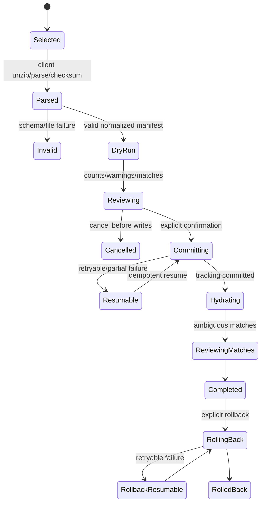
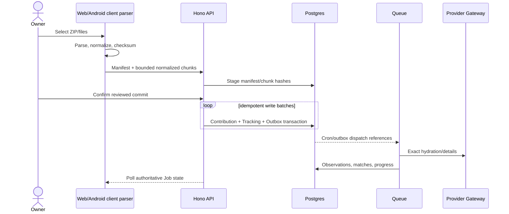
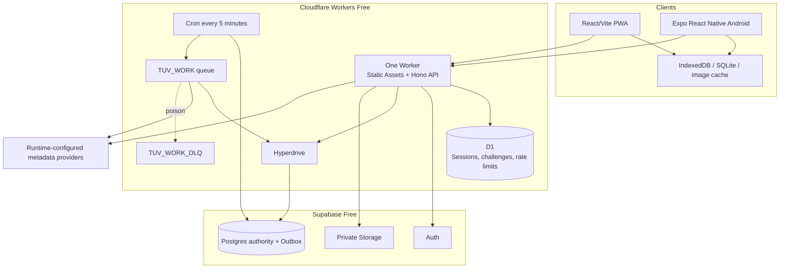
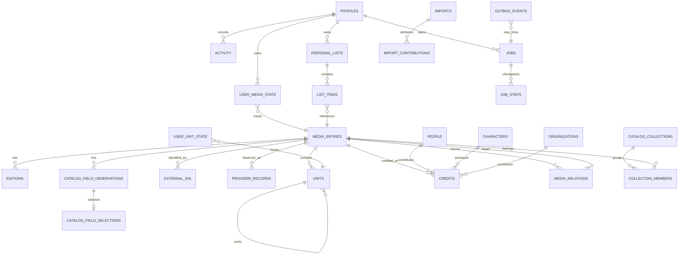
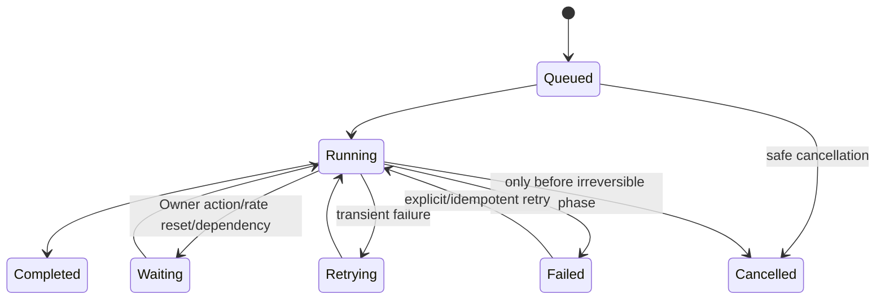
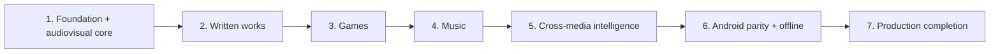

# Tuvu V1 consolidated project plan and architecture decisions

> Portable decision snapshot generated from the Tuvu repository on 2026-08-29.
> It contains the complete `docs/project_plan.md` followed by every tracked ADR from `0001` through `0129`.

## Handoff instructions for another agent

- Treat the embedded project plan and ADR bodies as the authoritative Tuvu V1 decision snapshot at the generation date.
- Preserve Tuvu domain vocabulary, privacy boundaries, permissions, provenance, degraded behavior, accessibility, compatibility, and performance requirements when transferring behavior.
- Separate product invariants from repository-specific implementation choices. Reconcile the destination application architecture before adopting Cloudflare, Supabase, Expo, queue, storage, or deployment decisions verbatim.
- When two embedded statements appear to conflict, use the more specific ADR for the decision it owns and the project plan for overall scope and milestone sequencing. Record any intentional divergence in the destination repository.
- Source-boundary comments are included so tools can split or verify the consolidated file mechanically. Source bodies are reproduced verbatim apart from line-ending normalization.

## Contents

- [Project plan](#project-plan)
- [ADR 0001 — Provider data scope follows provider terms](#adr-0001)
- [ADR 0002 — Manual media requires Catalog promotion](#adr-0002)
- [ADR 0003 — Catalog Entries have one primary Media Type](#adr-0003)
- [ADR 0004 — Release variations are Editions of one Catalog Entry](#adr-0004)
- [ADR 0005 — Current Tracking State is not event-sourced](#adr-0005)
- [ADR 0006 — Library intent is separate from calculated progress](#adr-0006)
- [ADR 0007 — Specials do not block Progress State by default](#adr-0007)
- [ADR 0008 — Completion Count is the only normalized consumption counter](#adr-0008)
- [ADR 0009 — Import rollback preserves post-import User work](#adr-0009)
- [ADR 0010 — Catalog Merges automate only lossless conflict resolution](#adr-0010)
- [ADR 0011 — V1 has no anonymous public profiles](#adr-0011)
- [ADR 0012 — Visibility vocabulary is reserved for V2](#adr-0012)
- [ADR 0013 — Shared Catalog changes are Admin-governed](#adr-0013)
- [ADR 0014 — Referenced Catalog Entries are never hard-deleted](#adr-0014)
- [ADR 0015 — Admin authority does not imply Private data access](#adr-0015)
- [ADR 0016 — Account Erasure preserves only anonymized Shared Artifacts](#adr-0016)
- [ADR 0017 — User Backups exclude secrets and opt in sensitive data](#adr-0017)
- [ADR 0018 — User Backups use server-managed private storage](#adr-0018)
- [ADR 0019 — V1 Restore is a nondestructive merge](#adr-0019)
- [ADR 0020 — Offline sync uses versioned Domain Mutations](#adr-0020)
- [ADR 0021 — Normal API access uses opaque Tuvu Sessions](#adr-0021)
- [ADR 0022 — D1 read projections are added only after measurement](#adr-0022)
- [ADR 0023 — Authoritative writes do not depend on Queue availability](#adr-0023)
- [ADR 0024 — V1 jobs use Postgres and Queues with polling](#adr-0024)
- [ADR 0025 — Catalog growth is demand-driven](#adr-0025)
- [ADR 0026 — Raw provider payloads have short retention](#adr-0026)
- [ADR 0027 — V1 is delivered through numbered production milestones](#adr-0027)
- [ADR 0028 — Deferred capabilities belong to V2](#adr-0028)
- [ADR 0029 — Written Works share one flexible tracking model](#adr-0029)
- [ADR 0030 — V1 game tracking does not require platform sync](#adr-0030)
- [ADR 0031 — Music separates Artists, Release Groups, Recordings, and tracks](#adr-0031)
- [ADR 0032 — Release and Recording completion remain independent](#adr-0032)
- [ADR 0033 — Anime classification is based on production origin](#adr-0033)
- [ADR 0034 — Standalone identity separates Catalog Entries from Special Units](#adr-0034)
- [ADR 0035 — Season progress is derived from episodes](#adr-0035)
- [ADR 0036 — Catalog Entry Completion Count spans Editions](#adr-0036)
- [ADR 0037 — V1 statistics use lazy coalesced snapshots](#adr-0037)
- [ADR 0038 — V1 consumption estimates use nonoverlapping sources](#adr-0038)
- [ADR 0039 — HowLongToBeat automation is not a V1 dependency](#adr-0039)
- [ADR 0040 — Metadata enrichment is field-aware and identity-linked](#adr-0040)
- [ADR 0041 — AniList and scraping-derived anime sources remain disabled until compliance is resolved](#adr-0041)
- [ADR 0042 — Provider Credentials are runtime-managed with User-selectable mode](#adr-0042)
- [ADR 0043 — Runtime Provider Configuration cannot expand adapter trust](#adr-0043)
- [ADR 0044 — Provider settings separate documented limits from observed health](#adr-0044)
- [ADR 0045 — V1 has one Owner Admin and no role management](#adr-0045)
- [ADR 0046 — V1 notifications are polled and comments and messaging move to V2](#adr-0046)
- [ADR 0047 — V1 social foundation is Private and noninteractive](#adr-0047)
- [ADR 0048 — V1 uses Admin-defined global Link Templates](#adr-0048)
- [ADR 0049 — Link Template logos are fetched once and stored](#adr-0049)
- [ADR 0050 — Release Events preserve Date Precision and source timezone](#adr-0050)
- [ADR 0051 — News Results are client-cached and not persisted](#adr-0051)
- [ADR 0052 — Provider artwork is referenced, not mirrored](#adr-0052)
- [ADR 0053 — V1 uses bounded client-first caching](#adr-0053)
- [ADR 0054 — V1 release notifications use configurable lead times](#adr-0054)
- [ADR 0055 — V1 allows a revocable minimal Calendar Feed](#adr-0055)
- [ADR 0056 — Release localization preference is configured per Media Type](#adr-0056)
- [ADR 0057 — V1 Recommendations are explainable and nonsocial](#adr-0057)
- [ADR 0058 — Discovery blends ranks, not provider scores](#adr-0058)
- [ADR 0059 — V1 does not upload or store TV Time source files](#adr-0059)
- [ADR 0060 — TV Time status initializes intent but never forces progress](#adr-0060)
- [ADR 0061 — Library Status is optional](#adr-0061)
- [ADR 0062 — Mobile uses Expo with development builds](#adr-0062)
- [ADR 0063 — V1 mobile acceptance targets Android](#adr-0063)
- [ADR 0064 — V1 web is offline-readable but not offline-writable](#adr-0064)
- [ADR 0065 — V1 uses Bootstrap Token and Recovery Codes, not Invitations](#adr-0065)
- [ADR 0066 — Web and Android use different Session lifetimes](#adr-0066)
- [ADR 0067 — V1 serves the SPA and API from one Worker](#adr-0067)
- [ADR 0068 — Normal API SQL uses a restricted Hyperdrive role](#adr-0068)
- [ADR 0069 — Drizzle defines schema and reviewed SQL defines migration history](#adr-0069)
- [ADR 0070 — Monorepo shares domain contracts, not UI components](#adr-0070)
- [ADR 0071 — V1 API is REST with Zod and OpenAPI](#adr-0071)
- [ADR 0072 — Search expands providers deliberately](#adr-0072)
- [ADR 0073 — Adult content visibility is a User preference](#adr-0073)
- [ADR 0074 — Unified search uses bounded multisource pagination](#adr-0074)
- [ADR 0075 — User Ratings use one to ten across media](#adr-0075)
- [ADR 0076 — V1 does not use KV](#adr-0076)
- [ADR 0077 — D1 is limited to Sessions, challenges, and rate limits](#adr-0077)
- [ADR 0078 — V1 uses one bounded five-minute scheduler](#adr-0078)
- [ADR 0079 — V1 uses one work Queue and one dead-letter Queue](#adr-0079)
- [ADR 0080 — Provider Credentials use versioned application encryption](#adr-0080)
- [ADR 0081 — Each User retains at most three completed Backups](#adr-0081)
- [ADR 0082 — Instance Backups stream to web or Android local storage](#adr-0082)
- [ADR 0083 — Metadata refresh follows volatility and User interest](#adr-0083)
- [ADR 0084 — Lyrics are on-demand client-cached Results](#adr-0084)
- [ADR 0085 — Availability Offers revalidate monthly by default](#adr-0085)
- [ADR 0086 — User and Admin images are preprocessed before storage](#adr-0086)
- [ADR 0087 — Game progress uses one active mode](#adr-0087)
- [ADR 0088 — Written Work progress uses one mode and allows a Private total](#adr-0088)
- [ADR 0089 — Private storage has a 500 MiB deployment ceiling](#adr-0089)
- [ADR 0090 — V1 has seven dependency-ordered Product Milestones](#adr-0090)
- [ADR 0091 — Operational records have bounded Retention Windows](#adr-0091)
- [ADR 0092 — Library removal is distinct from Item Data Erasure](#adr-0092)
- [ADR 0093 — V1 list visibility is saved but not effective](#adr-0093)
- [ADR 0094 — Statistics separate undated totals from dated rollups](#adr-0094)
- [ADR 0095 — Release notifications use status defaults and Entry overrides](#adr-0095)
- [ADR 0096 — Activity preserves Date Precision and occurrence timezone](#adr-0096)
- [ADR 0097 — Accessibility is a gate for every Product Milestone](#adr-0097)
- [ADR 0098 — V1 has measurable cross-client Performance Budgets](#adr-0098)
- [ADR 0099 — V1 Sensitive Confirmation is narrow and biometric-first](#adr-0099)
- [ADR 0100 — V1 uses local and ephemeral testing plus one Production Environment](#adr-0100)
- [ADR 0101 — V1 observability is first-party and content-minimized](#adr-0101)
- [ADR 0102 — Tests prove invariants with sanitized fixtures](#adr-0102)
- [ADR 0103 — Clients and portable data have explicit compatibility policies](#adr-0103)
- [ADR 0104 — Domain records use opaque UUIDv7 identifiers](#adr-0104)
- [ADR 0105 — Personal Lists contain unique ordered Catalog Entries](#adr-0105)
- [ADR 0106 — V1 notes are Private, target-specific, and safe Markdown](#adr-0106)
- [ADR 0107 — Favorites and Personal Tags are Private Entry preferences](#adr-0107)
- [ADR 0108 — User Ratings target Entries or trackable Units](#adr-0108)
- [ADR 0109 — Navigation Preferences are shared with a fixed Android selection](#adr-0109)
- [ADR 0110 — V1 separates interface, Metadata Locale, and Region](#adr-0110)
- [ADR 0111 — The compact shell centers global search and retains navigation context](#adr-0111)
- [ADR 0112 — Global search has explicit tracking filters and comparable sorts](#adr-0112)
- [ADR 0113 — Notifications record outcomes and the Job Tray shows live work](#adr-0113)
- [ADR 0114 — Long-running job cancellation stops at domain-write boundaries](#adr-0114)
- [ADR 0115 — V1 shared Catalog governance is Admin-only](#adr-0115)
- [ADR 0116 — Franchises and creative relationships use explicit Catalog graphs](#adr-0116)
- [ADR 0117 — V1 non-media entities are rich metadata without User state](#adr-0117)
- [ADR 0118 — Spoiler Protection moves entirely to V2](#adr-0118)
- [ADR 0119 — V1 registration requires email and Username](#adr-0119)
- [ADR 0120 — Email-bound Invitations and Recovery Grants are a V2 design](#adr-0120)
- [ADR 0121 — V1 has exactly one Owner Admin User](#adr-0121)
- [ADR 0122 — V1 Owner bootstrap and recovery have no paid email dependency](#adr-0122)
- [ADR 0123 — Erasing the V1 Owner unclaims the Instance](#adr-0123)
- [ADR 0124 — Sole-owner V1 retains Instance and Personal Credential scopes](#adr-0124)
- [ADR 0125 — Sole-owner V1 retains Owner Data and Full Instance Backups](#adr-0125)
- [ADR 0126 — V1 Private data remains Owner-scoped without multi-User workflows](#adr-0126)
- [ADR 0127 — Web and Android share Design Tokens, not components](#adr-0127)
- [ADR 0128 — Client domain data flows through query and repository layers](#adr-0128)
- [ADR 0129 — Routing uses stable Domain IDs and production HTTPS App Links](#adr-0129)

<a id="project-plan"></a>

## Embedded project plan

**Source:** `docs/project_plan.md`

<!-- BEGIN SOURCE: docs/project_plan.md -->
# Tuvu — Complete Product and Technical Plan

> **Status:** Consolidated V1 source of truth after product grilling
> **Decision date:** 2026-07-19
> **Scope:** Product behavior, domain model, provider strategy, import contract, web and Android clients, Cloudflare/Supabase architecture, database structures, API, jobs, caching, security, testing, operations, repository structure, V1 milestones, and V2 exclusions
> **Supersedes:** All earlier project-plan documents and assumptions. `CONTEXT.md` and `docs/adr/` preserve decision history but are not required to understand this plan.

This document is standalone. A reader should be able to understand and implement Tuvu without consulting the original TV Time export or another planning document. The supplied export remains a private local acceptance dataset and must never be committed.

## 0. Executive decisions

| Concern | V1 decision |
|---|---|
| Product | A self-hosted, sole-owner media tracker for shows, anime, movies, written works, games, and music |
| Users | Exactly one **V1 Owner**, who is also the sole Admin; multi-user membership and all social behavior are V2 |
| Catalog | One shared, provider-enriched Catalog separated from Owner-scoped library and history |
| Authority | Supabase Postgres is the only authoritative relational store |
| Web deployment | One Cloudflare Worker serves Vite static assets and Hono `/api/*` routes on the same origin; Pages is unused |
| D1 | Opaque sessions, short auth/recovery challenges, and strong bounded auth/provider rate-limit state only |
| KV | Not used in V1 |
| Durable Objects | Not used in V1 |
| Queue | One work Queue plus one DLQ, fed by a transactional Postgres Outbox; one five-minute Cron performs bounded dispatch/planning |
| Database access | Restricted Postgres roles through Hyperdrive with transaction-local Owner/role context and RLS |
| Storage | Private Supabase Storage; no R2 and no Cloudflare Images/Image Resizing |
| AI | Workers AI, AI Search, and Vectorize are V2 and have no V1 bindings or schemas |
| Auth | Supabase Auth verifies email/username plus password; Tuvu issues opaque revocable D1 sessions |
| Bootstrap/recovery | Deployment Bootstrap Token, mandatory offline Recovery Codes, and free best-effort Supabase Auth email only after verification |
| Web offline | Cached/readable PWA only; no queued web mutations in V1 |
| Mobile | React Native with Expo, Android only in V1; Android supports offline Domain Mutations and SQLite cache |
| Providers | Runtime Admin configuration and encrypted Instance/Personal credentials; no deployment-dependent provider endpoints or keys |
| Social | Private self-profile and Personal Lists only; other Users, sharing, proposals, following, comments, messaging, and Spoiler Protection are V2 |
| Delivery | Seven dependency-ordered Product Milestones; every non-deferred requirement is mandatory for V1 completion |

### 0.1 Non-negotiable principles

1. **Postgres is authoritative.** D1 and client caches never become a second Catalog or library authority.
2. **No invented facts.** Unknown, date-only, month-only, and conflicting evidence remain explicit.
3. **No silent weak merge.** Exact identity evidence may auto-link; fuzzy evidence only suggests review.
4. **Private and shared data remain structurally separate** even with one V1 Owner, so V2 adds Users without rewriting history.
5. **Provider failure cannot blank local data.** Cached/local Catalog and Owner data render first and stale state is labeled.
6. **User intent and calculated progress are separate.** Library Status never substitutes for Progress State.
7. **All long work is bounded, idempotent, resumable, and visible.** Normal writes do not depend on Queue availability.
8. **No secret leaves its boundary.** Credentials, Recovery Codes, session tokens, and master keys never enter logs, backups, or client-readable APIs.
9. **Free/cardless operation is mandatory.** A removed free allowance disables the optional feature instead of incurring charges.
10. **V2 seams are additive, not speculative.** Keep owner IDs, RLS, visibility vocabulary, and adapter interfaces; do not create dormant social workflows.

## 1. Product definition and scope

Tuvu is an app-like personal media tracker that unifies six media domains without flattening their differences. It imports a large TV Time history, enriches selected media from multiple providers, tracks progress and repeat consumption, calculates explainable statistics, surfaces upcoming releases and availability, and remains useful during provider or network failure.

### 1.1 V1 Owner outcomes

- Securely claim an Unclaimed Instance with email, inferred/editable username, password, and confirmation.
- Search all media types with relevant filters and provider expansion, then hydrate only selected results into the local Catalog.
- Import the supplied TV Time history without losing specials, repeat counts, dates, statuses, favorites, or source anomalies.
- Track shows, anime, movies, written works, games, and music with domain-appropriate progress.
- See all-time and dated statistics with explicit estimated, reported, recorded, and unknown-date contributions.
- Use a fast web PWA and an Android client; Android remains useful offline and synchronizes conflicts deliberately.
- Configure provider endpoints, capabilities, credentials, rate policies, health, and link templates at runtime.
- Create Private Personal Lists, notes, tags, ratings, favorites, calendar feeds, backups, and restore previews.
- Operate and recover the deployment through visible jobs, notifications, audit, quotas, and local Full Instance Backup.

### 1.2 V1 roles and lifecycle

- **Unclaimed Instance:** no Owner exists; only health and Bootstrap-Token-protected setup routes operate. Retained Catalog data is never exposed.
- **V1 Owner:** the only User and sole Admin. There is no invitation, membership, suspension, role-change, or other-user route/table in V1.
- **Erase Owner Data and Unclaim Instance:** deletes the Owner’s identity and private data, preserves non-personal Catalog evidence without attribution, and returns to Unclaimed state. Reclaim requires a newly configured Bootstrap Token.

### 1.3 V1 media taxonomy

Every Catalog Entry has exactly one primary `media_type`:

| Media Type | Required Formats/examples | Core tracking |
|---|---|---|
| `show` | scripted, documentary, reality, animation outside the anime-origin rule, miniseries | seasons/episodes, specials opt-in, completion counts |
| `anime` | series, movie, OVA/ONA, special when standalone; Japanese, Chinese, or South-Korean primary animation including donghua/aeni | episodes or standalone completion; dub/localized releases |
| `movie` | feature, short, documentary, concert film outside music Entry rules | Entry completion count and Edition/runtime context |
| `written_work` | prose, manga, manhwa, manhua, comic, graphic novel, webtoon | pages, percentage, units, or completion-only; Edition-specific position |
| `game` | video game and supported game formats/platform Editions | percentage, units, or completion-only plus cumulative Manual Playtime |
| `music` | release group album/EP/single/soundtrack and reusable Recording Entries | independent Release Group/Recording/track completion |

Podcasts, audiobooks-as-podcasts, and web video are V2 registry extensions. A work never has multiple primary Media Types. An anime movie is `anime` with movie Format, never both anime and movie.

### 1.4 Explicit V1 exclusions

- Additional Users/Admins, Invitations, Recovery Grants, suspension, Connections, Blocks, cross-User profiles or authorization.
- Shared/collaborative lists, shared Activity, social notifications, comments, reactions, messaging, reviews, following, Character voting, and badges.
- Spoiler Protection and persistent spoiler reveal state.
- Podcasts, web video, iOS, web offline mutation queuing, OAuth login, general passkey login, MFA, push, application email, and User webhooks.
- Personal Access/embed/download links, arbitrary URL probing, media-server hooks, scraping or protection bypass.
- Recorded Consumption Sessions; V1 uses cumulative Manual Playtime, progress changes, completion Activity, and estimates.
- Workers AI, AI Search, Vectorize, KV, Durable Objects, Pages, R2, Cloudflare Images, Containers, and Cloudflare outbound Email Sending.
- Platform sync, achievements/trophies/save files for games; exhaustive mission graphs; live player counts; unsupported budgets/revenue.

## 2. Domain model and invariants

### 2.1 Catalog identity

- **Catalog Entry:** one canonical creative work or reusable Recording.
- **Edition:** publication, translation, printing, regional release, platform port, deluxe/remaster, or substantially equivalent cut of an Entry.
- **Unit:** trackable child such as episode, chapter, volume, track, mission, or quest.
- **Container Unit:** structural season/volume/disc grouping that has no Completion Count.
- **Special:** Unit outside regular sequence; trackable and counted in history/statistics but excluded from progress by default. The Owner can opt in per Entry.
- **Catalog Candidate:** manually created, Owner-private identity trackable immediately. Exact provider identity or explicit Admin promotion moves it into the governed Catalog.
- **Catalog Alias:** permanent redirect from a retired duplicate to the merge Survivor.
- **Retired Entry:** retained when referenced; absent from ordinary discovery but never hard-deleted unless wholly unreferenced and erroneous.
- **Catalog Collection:** non-trackable franchise/universe/book series/film collection/game series.
- **Catalog Relation:** provenance-bearing typed edge: prequel/sequel, parent/side story, spin-off/source, adaptation/adapted-from, remake, reboot, compilation/contains, recap, alternative version, shared universe/related, soundtrack, based-on, or inspired-by.

Exact identity/idempotency duplicates may merge automatically. Distinct Activity is never collapsed. Conflicts require Admin review; hierarchical `contains`/`part-of` and ordered membership reject cycles, while general related graphs may cycle.

### 2.2 Metadata governance and provenance

- Provider calls create immutable/time-observed **Provider Observations** with provider identity, source URL, observation time, locale/region, payload hash, and field evidence.
- Non-User-specific fetched metadata is normalized once and reused through the shared Catalog across credentials/Users whenever provider terms permit. If terms forbid shared caching or redistribution, the Observation is Owner-scoped, never exposed to another User, and cannot silently become a shared Catalog Selection; the provider stays usable rather than being disabled solely for that limitation.
- **Catalog Selection** chooses displayed shared values field by field.
- Only the V1 Owner acting as Admin may select an observation, enter sourced/manual evidence, clear a selection back to automatic policy, suppress a field, classify, retire, or merge.
- Identity/type/format/relations/suppression/retirement/merge changes require a reason. Minor corrections may omit it.
- Provider refresh never overwrites an explicit Admin selection.
- V1 has no Catalog Proposal tables or routes.
- **Personal Display Override** privately selects a preferred title or artwork without changing shared selection.
- Successful raw provider payloads expire within seven days; unresolved matching/field-conflict payloads within 30 days or sooner if provider terms require. Remote images and article bodies are not archived.

### 2.3 People, Characters, Organizations, and Credits

- `Person`, `Character`, and `Organization` are shared searchable metadata identities, not trackable Entries.
- `Artist` is a music role held by a Person or Organization, not a duplicate identity.
- Typed Credits may target Entry, Edition, Unit, or Recording and retain contributor, role, department, credited-as name, Character, language/dub group, voice/live-action/motion-capture attributes, billing order, and provenance.
- People retain aliases, biography, birth/death dates, birthplace, professions, images, and external IDs. Age is always derived.
- Characters retain aliases, biography/in-universe text facts, appearances, images, external IDs, and portrayal/voice evidence.
- Organizations represent studios, networks, production companies, developers, publishers, distributors, labels, platforms, and roles.
- V1 supports no following, favorite, rating, tracking, or list membership for these non-Entry identities.

### 2.4 Owner tracking model

- **Library Status** is nullable intent: `planned`, `active`, `paused`, or `stopped`. Completion is not a Library Status.
- **Progress State** is calculated: `not_started`, `in_progress`, `caught_up`, or `completed`.
- **Tracking State** is authoritative for current UI; immutable Activity explains history but is not replayed to rebuild state.
- **Completion Count** is the sole stored normalized counter. `repeat_count = max(completion_count - 1, 0)`.
- `Undo Completion` decrements exactly one and appends Compensating Activity. `Reset Progress` returns current progress/count to zero but preserves history through compensation.
- Import mismatches preserve raw source values and show warnings; they do not create competing normalized counters.
- Entry Completion Count spans Editions, while Activity may attribute the Edition.
- `Remove from Library` only unsets Library Status.
- `Erase My Data for This Item` deletes the Owner’s tracking, Activity, personal metadata, list memberships, overrides, and Import Contributions for Entry/Units/Editions without touching the Catalog. Privacy erasure is the explicit exception to immutable Activity.

### 2.5 Domain-specific progress

**Shows/anime**

- Released regular episodes determine progress. Future placeholders never count.
- Specials are excluded unless the per-Entry setting includes them.
- Container seasons have no Completion Count.
- Bulk season completion applies one batch identity to released regular episodes only.
- A standalone OVA/special becomes an Entry when independently marketed with its own identity/credits/provider evidence; otherwise it is a Special Unit.

**Movies/standalone audiovisual**

- Completion Count belongs to the Entry; Edition supplies runtime/release context.

**Written works**

- One active Progress Mode: `pages`, `percentage`, `units`, or `completion_only`.
- Selected Edition owns Position Progress.
- Derived percentage is read-only.
- The Owner may set a Private Progress Total when provider page/unit total is missing. Provider disagreement is shown; it never silently overwrites the private total or becomes shared metadata.
- Switching modes preserves compatible values; completing the Entry remains authoritative.
- Reading Pace: slow `2.0`, medium `1.5` default, fast `1.0` minutes/page.

**Games**

- One active Progress Mode: `percentage`, `units`, or `completion_only`.
- Switching modes preserves prior values; Completion Count wins when completed.
- Manual Playtime is a cumulative Owner-reported statistic, not Progress State.
- Main-story, main-plus-extras, and completionist estimates are provenance-bearing metadata. An unofficial HowLongToBeat adapter stays disabled until a lawful, stable, Worker-compatible spike succeeds; manual Admin metadata remains available.

**Music**

- Release Group Entry represents album/EP/single/soundtrack; Editions represent releases; reusable Recording Entry represents a performance; track Units reference Recordings.
- Album/Release Group and Recording completion are independent. Completing an album never synthesizes track completions, preventing doubled listening time.

### 2.6 Personal organization

- **Favorite:** Private boolean on Catalog Entry only; independent of status, subscription, lists, rating, and progress.
- **User Rating:** one current integer `1..10` or unrated per Entry or trackable Unit. Five-star UI maps half-stars directly. Editions provide context, not a separate rating target. Parent/Unit ratings never derive from each other; changes append Activity.
- **Private Note:** one per Owner and Entry, selected Edition, or trackable Unit; safe CommonMark subset; 20,000 Unicode characters; no HTML, scripts, embedded media, remote images, or unsafe schemes.
- **Personal Tag:** case-insensitive normalized identity, preserved display casing, optional accessible palette color; max 200 tags, 20 per Entry, 40 characters/name.
- **Personal List:** Owner-only ordered mixed-media Catalog Entries. Entry unique per list; optional list-item note; fractional sort key; max 500 lists and 5,000 items/list. Conflicting offline moves of the same item become Sync Conflict.
- Lists store Intended Visibility (`private`, `connections`, `instance`) but remain Owner-only in V1. Non-private values say “Saved for V2” and require one-time confirmation before future activation.

### 2.7 Activity and date precision

- Activity Date Precision is `instant`, `day`, `month`, `year`, or `unknown`.
- Instant stores UTC, source/User IANA timezone when known, and stable local Occurrence Date.
- Day stores a calendar date without invented time/offset. Month/year contribute only to compatible period summaries. Unknown contributes only to all-time statistics.
- Normal live completion defaults to now; optional history control accepts past but never future Activity.
- Imports preserve source precision. Correcting a date appends compensation plus replacement.
- Later profile-timezone changes never move historical Activity between stored local days.

### 2.8 Statistics

- Mutations mark statistics dirty. One coalesced bounded Queue job per Owner refreshes snapshots lazily.
- Manual Settings recalculation is limited to one request per 15 minutes and appears in the Job Tray.
- Client may preview calculations; the server snapshot remains authoritative and stores `calculated_at`, data watermark, version, and methods.
- All-time snapshots may include undated imports, completion totals, page position, and Manual Playtime.
- Day/month/year statistics use only dated Activity or explicitly dated newly-consumed entries. Import/edit time is never fabricated as consumption time.
- Unknown-date contributions remain visible in a separate bucket.
- Labels: runtime/Reading-Pace values `Estimated`; Manual Playtime `User reported`; exact known durations `Recorded duration`.
- Rollups exist by Media Type, Format, and useful type+format combinations with total completions including repeats, unique completed Entries/Units, duration including repeats, pages, and game hours.
- Anime movie contributes to Anime and Anime+Movie Format, never the Movies Media Type.
- Human duration uses fixed 365-day years and 30-day months and exposes exact hours in details.
- Shows/anime: completed episode runtime × Completion Count. Movies: Edition runtime × Entry Completion Count. Written works: pages × Reading Pace. Games: Manual Playtime. Music: Recording runtime × Completion Count; album completion adds no time.

## 3. Application behavior and information architecture

### 3.1 Compact Android/narrow-PWA shell

```text
┌ App icon ─── Expanded global search ─── Avatar◌ ┐
│                                                  │
│                  Current route                   │
│                                                  │
│             Floating Job Tray                    │
├ Shows ─ Anime ─ Explore ─ Movies ─ Games ────────┤
```

- App icon opens Dashboard/Home. Home is hidden from bottom navigation by default.
- Center is an always-expanded global search input; results open `/explore/search`.
- Right is one 48×48 dp Profile-and-Notifications button. Its lower-right circle is outline with zero unread and red-filled with unread; the combined control opens Profile, where Notifications are first. TalkBack announces unread count.
- Default bottom order: Shows, Anime, Explore, Movies, Games.
- The Owner selects 3–7 destinations. Explore is mandatory. Choices also include Home, Books, Music, Personal Lists, and Calendar.
- No scrolling/automatic More. Icons: 24 dp for 3–5 items, 20 dp for 6, 18 dp for 7; touch height remains at least 48 dp.
- Double-tapping Explore opens `/explore/search` and focuses search.
- Active Shell Context persists through descendants. Dashboard marks app icon, Profile descendants mark avatar, Search belongs to Explore, and in-app detail navigation preserves origin where possible. Direct links choose the matching pinned type or Explore.

### 3.2 Desktop/tablet shell

- App logo at upper left opens Dashboard.
- Persistent unified search in top bar; `/` or `Ctrl/Cmd+K` focuses it.
- Selected destinations use the same relative order in collapsible sidebar.
- Profile/notification avatar stays top-right; Profile is not a sidebar/bottom slot.
- Desktop Job Tray sits at the bottom content edge.

### 3.3 Dashboard

Private ordered sections:

1. Critical offline/sync/provider/import/backup/job banners.
2. Continue/Up Next: Active first, then recently progressed Paused; Planned/Stopped excluded. Up Next is next released incomplete regular Unit respecting Specials preference.
3. Upcoming Effective Release Events.
4. Recent personal Activity.
5. Favorite and recently updated Personal List shortcuts.
6. Explainable deterministic Recommendations with dismissal.
7. Compact all-time Statistics Rollups.

Sections support Media Type/Format filter, collapse, and complete loading/stale/error/empty states. Arbitrary reordering is V2. Home performs no provider fan-out and renders client/local and maintained server data first.

### 3.4 Global search and Explore

- Local Catalog search always runs first across titles, translations, transliterations, aliases, key people, external IDs, and indexed metadata.
- If insufficient, query the selected type’s primary provider. “Search more providers” explicitly fans out to chosen providers or all six domains with bounded concurrency.
- Exact external IDs deduplicate. Strong fuzzy evidence only suggests a match. Only a selected result is hydrated/promoted into Catalog.
- Results remain relevant, cursor-paginated, source-attributed, and partial as providers arrive; external work stops after five seconds without hiding local results.
- `Tracked Entry` means non-null Library Status, Position Progress, Completion Count, completed Units, or progress/consumption Activity. Favorite/rating/note/tag/list alone does not qualify.
- Include tracked defaults on for global search, persists only for the current search session, and applies after identity dedupe.
- Filters: Media Type, Format, Library Status, Progress State, release year/range/status, genre/theme/subject, language, country, Region availability, provider, Adult Content Preference, tracked state, game platform, and Edition language/format where relevant.
- Sort: relevance, provider/list rank, title, original/Effective Release date, recently added/updated, and Owner Rating for rated local results. Provider ratings are never globally mixed across incompatible scales.
- Provider Discovery List order is preserved. Blended lists use reciprocal-rank fusion, never raw-score averaging.
- Discovery References are transient/client-cached; selected items alone enter Catalog.

### 3.5 Media detail surfaces

Canonical route: `/media/{mediaType}/{domainId}/{optional-slug}`. Domain ID is identity; slug is decorative. Alias redirects to merge Survivor. Equivalent stable routes exist for Editions, Units, People, Characters, Organizations, and Collections. Android App Links use production HTTPS.

Common tabs/surfaces: Overview, Editions/Releases, Units/Guide, Credits, Characters, Images, Videos, Relations/Collections, Availability, News, External Links, Owner Tracking, History, and metadata provenance. Tabs appear only when relevant; no comments/Access/social tabs in V1.

### 3.6 Releases, calendar, and notifications

- Release Event retains target, Date Precision, source timezone, region, language, format, source, and stable reschedule identity.
- Day-or-finer events may notify. Month/year events appear in Upcoming but do not notify until day precision exists.
- Per Media Type Release Preference selects original or preferred localized language (default English). Audiovisual uses dub, written works translated Edition, games localized region; music is unaffected. Missing preferred event visibly falls back to original.
- Per Media Type notification lead: Off, At release, 1 day default, or 7 days; per-Entry override allowed.
- Planned/Active Library Status subscribes by default; Paused/Stopped/unset does not. Entry tri-state Default/On/Off overrides. Favorite/list membership never subscribes.
- Upcoming, Calendar, iCal, and Notifications use the same Effective Release Event.
- iCal is the only V1 external share exception: opt-in revocable/rotatable token stored hashed; includes only title, type, date, and canonical link.
- Notifications cover releases, imports/rollback, backups/restores, stats recalculation, Sync Conflict, credentials, quota/Queue/scheduler failures, Recovery Code regeneration, and observable auth-email status. They coalesce, link to action, support read/dismiss/mark-all, poll with cursor+ETag/watermark, and expire after 180 days.
- No push, application email, webhook, quiet hours, or social notifications.

### 3.7 Job Tray and Job Center

- Floating above compact bottom navigation; desktop equivalent at content bottom.
- Shows authoritative queued/running/retrying/waiting progress across navigation/reload/reconnect.
- Determinate only when trustworthy; otherwise indeterminate. Multiple jobs show highest-priority plus count.
- Tap opens Job Center with active/recent jobs, warnings, errors, checkpoints, and allowed actions.
- Success briefly appears, then becomes a Notification. Failed/action-required remains until acknowledged and notifies.
- Cancel appears only at safe phases; progress is never fabricated from elapsed time.

### 3.8 Settings

Sections: Profile/Account, Appearance, Navigation, Providers, Tracking, Releases/Notifications, Data/Import, Backups/Restore, Storage, Privacy/V2 previews, and Admin/Operations.

- Appearance: light/dark/system; shared semantic Design Tokens; reduced-motion/contrast/system preferences.
- Navigation: shared ordering/labels/visibility, 20-character labels, reset, accepted Android 3–7 rule.
- Metadata Locale and Region: English/India defaults; exact locale → base language → original → English → labeled any-source fallback. Search matches all aliases. No machine translation.
- Reading Pace: slow/medium/fast.
- Per-type Release Preference and notification lead; per-Entry overrides on detail.
- Adult Content Preference: Owner-only, off by default; explicit adult results remain hidden/blurred until enabled. No Instance gate.
- News section may be hidden, but V1 has no Spoiler Protection.
- Runtime limits may be lowered below deployment ceilings but never raised above them without redeploy.

## 4. Metadata requirements by domain

### 4.1 Common metadata

Canonical/original/localized titles and aliases; synopsis/description; primary Media Type and Format; status; original language; origin countries; dates with precision; genres/themes/subjects/tags; certifications/content ratings; external IDs; official and provider URLs; remote images with dimensions/language/provenance/attribution; videos; Credits/Characters/Organizations; Collections/Relations; Provider Ratings with native scale/vote count; Availability Offers; Release Events; audit/provenance and field freshness.

Provider artwork is referenced, not mirrored. Store provider image identity/path/URL, dimensions, language, source, attribution, and selected status. Clients cache images locally. Only Owner/Admin uploads, processed manual artwork, profile assets, Link Template logos, and backups use Supabase Storage.

### 4.2 Shows and anime

Runtime per episode, start/end/status, networks/channels/platforms, airing day/time/timezone, season/episode guide, regular/special classification, next episode, regional and dubbed/localized releases, certifications, cast/crew/Characters, videos, soundtrack relations, Availability Offers, and provider recommendations/relations. Episode numbering never assumes maximum number equals count.

Anime classification requires primary animation originating in Japan, China, or South Korea; live action never qualifies. Uncertain cases require Admin decision. TMDB and exact-ID Wikimedia enrichment are the enabled automated sources after the T05 review. TVDB remains manual-only pending project authorization; Jikan/MAL remains manual-only because its documented route is scraping-derived; AniList remains manual-only without written authorization for a competing tracker.

### 4.3 Movies

Runtime, regional releases, status, budget/revenue only with currency/evidence, companies, Credits/Characters, certifications, Availability Offers, videos, soundtrack, Collections/franchise/relations, and alternate Editions/cuts.

### 4.4 Written works

Format, work versus Edition, authors/illustrators, publishers/imprints, publication dates, ISBN-10/13 and provider IDs, page totals, optional volume/chapter hierarchy, languages/translations, subjects, covers, previews, purchase/availability offers, ratings, Characters, and manual units/totals where providers lack data.

### 4.5 Games

Platform Editions/releases, developers/publishers, stores, genres/themes, game modes, perspectives, franchises/relations, age ratings, artwork/screenshots/videos/sites, requirements, main/main+extras/completionist estimates, optional missions/quests, Characters/voice Credits, and soundtrack relations. Unsupported budget/revenue/player counts/exhaustive graphs remain unknown rather than manual requirements.

### 4.6 Music

Artist identities, Release Groups, Editions/releases, Recordings, track lists, Credits, dates/duration, ISRC/barcode/catalog number, genres/tags, cover art, URL relations, Availability Offers, lyrics attribution, and soundtrack relations. Lyrics are on-demand, client-cached only, never stored in Postgres/D1/backups/search, never bulk downloaded, and failure leaves the page functional.

## 5. Provider and credential plan

### 5.1 Adapter contract

Every adapter declares code/version, enabled state, media/entity capabilities, credential type/audience, allowlisted hosts and base paths, locales/regions, attribution, documented limits with source/verification date, request cost, cache/freshness policy, normalized schemas, error mapping, and legal/redistribution constraints.

Normalized errors: `invalid_credentials`, `rate_limited`, `not_found`, `restricted`, `temporary`, `malformed`, `disabled`, and `ambiguous`. Responses include provenance and never expose secret-bearing URLs.

Runtime Provider Configuration may change enablement, base path/version, rate policy, documentation/logo, and adapter-supported capability flags without redeploy, but only inside adapter allowlisted HTTPS hosts, protocols, and credential audiences. It is not an arbitrary proxy.

### 5.2 Credentials and health

- Instance and Personal credentials are stored as versioned AES-GCM ciphertext with unique nonce and AAD containing provider/scope/Owner/key version. Worker master key is a Cloudflare secret. Plaintext is never returned or logged.
- Credential Mode: Instance, Personal, Automatic. Automatic tries Instance and retries Personal once only on explicit 429/rate-limit or invalid credential.
- Keyless providers remain Instance scoped but their endpoints/configuration are runtime Admin-managed.
- Provider Health is per credential scope: healthy, rate-limited, invalid, unavailable, degraded, or unknown. Exact remaining quota appears only from reliable headers.
- Ping calls the cheapest validation endpoint, cached/limited once per 60 seconds/scope, never fans out on page load.
- Admin UI separates documented limit/source/verification date from observed state, last success/error, reset/retry time, latency, and circuit state.
- V2 requires explicit review before any current Instance Credential is shared with another User; current Personal credentials remain private.

### 5.3 Required provider registry

| Domain | Provider | V1 role and status | Constraints |
|---|---|---|---|
| Shows/movies/anime | TMDB | Enabled primary discovery/details/images/Credits/external IDs/videos/relations/availability | Encrypted runtime Provider Credential; approved non-commercial use or written commercial agreement; attribution/image/region/cache rules |
| Shows | TVmaze | Enabled schedule, airstamps, runtimes, networks, cast/crew, next episode augment | Keyless runtime config; CC BY-SA attribution/ShareAlike; documented backoff/rate guidance |
| Cross-domain AV | TVDB | Disabled; manual external ID/fields only | Enable only after Tuvu project authorization plus current license, retention, attribution, and image-rights evidence |
| Anime/manga | Jikan/MAL | Disabled; manual MAL external ID/fields only | Documented scraping-derived route lacks upstream-use evidence; never scrape or treat it as a hard dependency |
| Anime/manga | AniList | Disabled | Enable only after written authorization/compliance evidence; inability never blocks V1 |
| Written works | Google Books | Editions/ISBN/pages/preview/sale/access | Runtime key; regional access/preview limitations |
| Written works | Open Library | Work/Edition/author/subject reconciliation | Identifying User-Agent/contact; low-volume, batched |
| Games | IGDB | Primary identity/releases/platforms/companies/media/age ratings | Twitch application token; terms/non-commercial review |
| Games | RAWG | Augment stores/images/ratings/requirements | Runtime key; backlinks/terms/monthly allowance |
| Game estimates | Admin/manual; optional HLTB adapter | Main/main+extras/completionist | Unofficial adapter disabled until lawful/stable spike |
| Music | MusicBrainz | Primary identities, releases, Recordings, relations | Identifying User-Agent; average ≤1 request/sec/IP |
| Music artwork | Cover Art Archive | MBID cover art metadata | Cache metadata/URLs; no broad mirror |
| Music augment | ListenBrainz/TheAudioDB | Optional lawful enrichment | Capability, attribution, and terms spike before enablement |
| Lyrics | LRCLIB | Optional on-demand lookup | Client cache only; attribution/copyright review; no redistribution |
| Reconciliation | Wikidata/Wikipedia/Wikimedia | Cross IDs, official sites, factual/encyclopedic/media augment | Exact/strong identity, identifying UA, batching, `maxlag`, attribution/license |
| News | GDELT → configured Guardian/NewsData/NewsAPI → Google News RSS discovery | Best-effort headline/excerpt links | Client cache only 1–6h; no DB/full body; terms/limits |
| Subtitles | OpenSubtitles | Optional availability metadata | Runtime credential and terms; no subtitle body storage |
| Community/open-source endpoints | Consumet, anime-api, AniPlaylist and similar | Disabled pending adapter spike | No scraping/protection bypass; allow only stable lawful metadata capability |

Region defaults to India where supported. Provider field-coverage matrices define primary then exact-ID enrichment. Wikidata/Wikipedia/Wikimedia are identified, batched, compressed, cached, and backed off. Manual values are last fallback, not the preferred source.

### 5.4 Request patterns for provider spike

All requests run through the gateway. Examples are patterns, not client-callable URLs:

```http
# TMDB
GET /3/search/tv?query={q}&include_adult={preference}&language={locale}&page={page}
GET /3/search/movie?query={q}&include_adult={preference}&language={locale}&page={page}
GET /3/find/{externalId}?external_source={namespace}&language={locale}
GET /3/tv/{id}?append_to_response=external_ids,aggregate_credits,content_ratings,images,videos,watch/providers,recommendations
GET /3/movie/{id}?append_to_response=external_ids,credits,release_dates,images,videos,watch/providers,recommendations

# TVmaze / Jikan
GET /search/shows?q={q}
GET /lookup/shows?thetvdb={id}
GET /shows/{id}/episodes?specials=1
GET https://api.jikan.moe/v4/anime?q={q}&sfw={adultPolicy}&page={page}&limit=20
GET https://api.jikan.moe/v4/anime/{malId}/full

# Books
GET https://www.googleapis.com/books/v1/volumes?q={q|isbn:ISBN}&country={region}&startIndex={offset}&maxResults=20&key={key}
GET https://openlibrary.org/search.json?q={q}&fields=key,title,author_key,author_name,first_publish_year,edition_key,isbn,language,cover_i&limit=20
GET https://openlibrary.org/works/{workId}/editions.json?limit=50

# IGDB / RAWG
POST https://id.twitch.tv/oauth2/token?client_id={id}&client_secret={secret}&grant_type=client_credentials
POST https://api.igdb.com/v4/games
GET https://api.rawg.io/api/games?key={key}&search={q}&search_precise=true&page={page}&page_size=20

# Music
GET https://musicbrainz.org/ws/2/artist/?query=artist:{q}&fmt=json&limit=20
GET https://musicbrainz.org/ws/2/release-group/?query=releasegroup:{q}&fmt=json&limit=20
GET https://musicbrainz.org/ws/2/recording/?query=recording:{q}%20AND%20artist:{artist}&fmt=json&limit=20
GET https://coverartarchive.org/release-group/{mbid}
GET https://lrclib.net/api/get?track_name={track}&artist_name={artist}&album_name={album}&duration={seconds}

# Reconciliation/news
GET https://www.wikidata.org/wiki/Special:EntityData/{QID}.json
GET https://api.gdeltproject.org/api/v2/doc/doc?query={quotedTitle}&mode=ArtList&format=json&maxrecords=20&sort=HybridRel
```

Spike evidence must record reachability, returned/missing fields, attribution, credentials, rate headers/observed throttling, cache headers, locale/region behavior, license/commercial constraints, Worker compatibility, and sanitized normalized fixtures. Unsupported fields remain nullable/manual rather than removed from product intent.

## 6. Supplied TV Time backup: authoritative import contract

The supplied `tv_time_backup_data.zip` is approximately 1.34 MiB compressed and its extracted files total approximately 16.8 MiB. It contains seven files. The supplied extracted `tv_time_backup_data/` folder is an equivalent convenience copy, not a runtime dependency. Import code detects schema and fields rather than hardcoding the observed filename/date or exact counts.

### 6.1 Files, roles, fields, and exact local acceptance counts

| File | Role | Fields/structure | Count |
|---|---|---|---:|
| `tvtime-series-2026-05-07.json` | Rich series authority | show `uuid`, `id.tvdb`, `id.imdb`, `created_at`, `title`, `status`, `is_favorite`, `_noEpisodeData`; nested seasons `number`, `is_specials`; episodes `id`, `number`, `name`, `special`, `is_watched`, `watched_at`, `rewatch_count`, `watched_count` | 647 shows; 2,063 seasons; 32,452 episodes |
| `tvtime-series-2026-05-07.csv` | Show fallback/cross-check | `uuid,tvdb_id,imdb_id,title,status,created_at` | 647 |
| `watched-series.csv` | Minimal show/status cross-check | `tvdb_id,title,status` | 647 |
| `tvtime-series-episodes-2026-05-07.csv` | Episode fallback/cross-check | `series_tvdb_id,series_imdb_id,series_uuid,title,season,episode,tvdb_id,is_watched,watched_at,rewatch_count,special` | 32,452 |
| `tvtime-movies-2026-05-07.json` | Rich movie authority | `id.tvdb`, `id.imdb`, `uuid`, `created_at`, `title`, `year`, `watched_at`, `is_watched`, `is_favorite`, `rewatch_count` | 1,050 |
| `tvtime-movies-2026-05-07.csv` | Movie fallback/cross-check | Common JSON fields except favorite | 1,050 |
| `tvtime-summary-2026-05-07.html` | Count/anomaly/warning reference | 647 show summaries, 1,050 movie summaries, links, computed progress, anomaly flags | 1 report |

Show JSON and both show CSVs agree on common fields; movie JSON/CSV agree; episode JSON/CSV agree exactly when keyed by TVDB episode ID. Season/episode composite alone is not unique. The client permits local raw-file inspection and warning review before commit, but raw sources never upload to or persist in Tuvu.

### 6.2 Measured facts that must remain regression assertions

| Fact | Exact value |
|---|---:|
| Series status `up_to_date` / `not_started_yet` / `watch_later` / `continuing` / `stopped` | 192 / 172 / 145 / 120 / 18 |
| Favorite shows / favorite movies | 37 / 0 |
| Regular episodes / specials | 27,760 / 4,692 |
| Watched episodes total / regular / specials | 11,646 / 11,535 / 111 |
| Episode rows with rewatches | 332: 328 with one; 4 with two; 336 total repeats |
| Episode `watched_count` distribution | 20,806 zero; 11,314 one; 328 two; 4 three; sum 11,982 |
| Watched / unwatched movies | 658 / 392 |
| Rewatched movies | 3, each one repeat |
| Series missing TVDB / IMDb | 0 / 647 |
| Episodes missing TVDB / IMDb / name | 0 / 32,452 / 12 |
| Movies missing TVDB / IMDb / year | 0 / 30 / 1 (`A New Dawn`, TVDB 356158, IMDb `tt32192760`) |
| Missing watch date on watched rows / watch date on unwatched rows | 0 / 0 for episodes and movies |
| Duplicate show UUID/TVDB and movie UUID/TVDB | 0 |
| Duplicate episode TVDB IDs | 0 |
| Duplicate `(series_uuid, season, episode, special)` | 37 groups, 61 extra rows |
| Episode `special` disagreeing with parent `is_specials` | 237 |
| Empty seasons / special seasons | 33 / 346 |
| `_noEpisodeData=true` | 0 |
| Show created range | 2020-12-09 through 2026-05-06 UTC |
| Movie created range | 2020-12-09 through 2026-04-13 UTC |

The 12 unnamed episodes are specials from `Lord of Mysteries` (S00E18–S00E26) and `Gravity Falls` (S00E69, S00E91, S00E92). Duplicate numbering includes `Ben 10`, `Anohana: The Flower We Saw That Day`, `Shameless (US)`, and `Mad Men`; distinct TVDB episode IDs prove distinct source rows.

HTML warnings: one ghost `Harry Potter` Entry (TVDB 433637, no episodes); three `up_to_date` shows with unwatched regular rows (`Ben 10`, `Don't Toy With Me, Miss Nagatoro`, `The Big Bang Theory`); one `not_started_yet` show with a watched episode (`Blue Spring Ride`). These remain warnings, never automatic corrections.

### 6.3 Required import warnings and precedence

- TV Time may contain orphaned/ghost records, stale statuses, pre-2017 missing watches, and historical inconsistencies.
- Watch timestamps are UTC and may display on another local day. Preserve source timestamp, parsed UTC, source timezone evidence, and Occurrence Date rules.
- Episode lists may contain future unaired placeholders with titles. They do not count toward Progress State until released.
- Imported aggregates cannot reconstruct repeat timestamps. Preserve Completion Count and the one known watch date; do not synthesize repeat dates.
- Preserve both episode `special` and parent `is_specials`; show all 237 disagreements.

Precedence is rich JSON → matching CSV fallback/cross-check → HTML count/warning reference. Import identity is `source=tvtime` plus show/movie UUID. Episode identity is TVDB episode ID, falling back to `(series UUID, source row ordinal, season, episode, special)`, never numbering alone.

| TV Time source value | Initial Tuvu mapping |
|---|---|
| `up_to_date` | Library Status `active`; calculated Progress State determines caught up/completed |
| `continuing` | Library Status `active` |
| `watch_later` | Library Status `planned` |
| `not_started_yet` | Library Status `planned`; warn if watched rows exist |
| `stopped` | Library Status `stopped` |

Raw Source Status remains provenance and never overrides calculated Progress State. A watched movie receives Completion Count `1 + rewatch_count` and nullable Library Status; an unwatched movie initializes `planned`. Movie watched state never invents Owner intent.

### 6.4 Client-first import workflow



1. Web or Android selects ZIP or component files. A Web Worker/native client code expands, validates, parses, checksums, and normalizes; the Worker API never parses the large raw JSON/ZIP.
2. Detect roles by schema, not filename. Present counts, missing/duplicate files, health, raw local previews, warnings, and measured anomalies.
3. Create a server Import manifest containing source kind/version, filenames, byte counts, hashes, normalized schema version, and expected counts—but no raw source body.
4. Normalize and send bounded chunks carrying `job_id`, sequence, count, checksum, and stable idempotency key. Resume compares acknowledged chunk hashes; lost local source requires reselection.
5. Dry run matches exact local external IDs, then exact provider lookup (TVDB/IMDb), then strong candidates for review. No confident match creates an Owner-private Catalog Candidate.
6. Review grouped conflicts with select/manual search/skip/defer. Commit begins only after explicit confirmation and becomes non-cancellable at the first write batch.
7. Each batch atomically writes import contributions/tracking plus Outbox Event. Queue hydration follows; provider outage never rolls back committed history.
8. Store normalized source identity, raw Source Status, source dates/counts, manifest/hash, warnings, match decisions, and contribution ownership. Do not store original ZIP/JSON/CSV/HTML.
9. Rollback removes only unchanged Import Contributions and unreferenced candidates created solely by the Import. Later Owner edits remain and are reported as retained. Rollback becomes resumable/non-cancellable after compensation begins.



Local full-dataset acceptance must equal 647 shows, 2,063 seasons, 32,452 episodes, 11,646 watched episodes, 111 watched specials, 332 repeated episode rows, 1,050 movies, and 658 watched movies. It must preserve all 61 composite-key collision rows and all 237 special-flag disagreements. Committed repository fixtures are sanitized/synthetic; the private source stays outside Git/CI.

## 7. System architecture

### 7.1 Deployment topology



- Static assets and dynamic API share one origin. Asset requests are asset-first; `/api/*`, auth callbacks, iCal, and health execute Worker code; unknown non-API GET routes use SPA fallback.
- No Pages project, Pages Function, KV namespace, Durable Object, AI binding, Vectorize index, R2 bucket, or Realtime subscription is provisioned.
- Static assets are immutable-hashed; HTML/service worker receive update-safe cache headers.

### 7.2 Responsibility boundaries

| Product | Owns | Must not own |
|---|---|---|
| Worker Static Assets | Web SPA files, headers, SPA fallback | Runtime secrets, mutable Catalog |
| Hono Worker | HTTP authz/validation, commands/queries, provider gateway, signed Storage operations, iCal | Large ZIP parsing, unbounded fan-out, durable background progress |
| Supabase Auth | Email/password verification, optional free verification/recovery email | Tuvu authorization roles, normal API sessions |
| Postgres | Catalog, observations/selections, Owner data, Activity, jobs, Outbox, audit, imports, notifications, backup manifests | Plaintext secrets, raw import archives, news/lyrics bodies |
| Hyperdrive | Pooled TLS Worker/Postgres access, safe query cache where valid | Long transactions, `LISTEN/NOTIFY`, exposed DB credentials |
| D1 | Opaque session hashes, WebAuthn/recovery/email challenges with short TTL, auth/provider rate buckets | Catalog/library projections, jobs, Activity, general cache |
| Queue + DLQ | Versioned reference-only work commands, bounded retries | Canonical state, raw payload batches, progress authority |
| Cron | Bounded claiming/dispatch/planning/checkpoints | Heavy provider work or row-by-row processing |
| Supabase Storage | Processed uploads, profile/manual assets, Link Template logos, max-three Owner Data Backups | Provider artwork mirror, import source archives, credentials |
| Client cache | Fast authorized reads, images, discovery/news/lyrics caches, Android offline mutations | Shared authority or undeclared secret persistence |

### 7.3 Authoritative write path

```mermaid
sequenceDiagram
    actor C as Web/Android
    participant API as Hono Worker
    participant PG as Postgres
    participant CR as Five-minute Cron
    participant Q as Queue
    participant P as Provider/Processor

    C->>API: Versioned command + idempotency key
    API->>PG: Begin restricted transaction
    API->>PG: SET LOCAL tuvu.user_id / role
    API->>PG: Validate base row version
    API->>PG: Domain write + Activity + Outbox Event
    PG-->>API: Commit authoritative result
    API-->>C: Success&#59; queue availability irrelevant
    CR->>PG: Claim bounded Outbox Events
    CR->>Q: Publish reference envelopes
    Q->>PG: Claim idempotent work unit
    Q->>P: Bounded external/compute work
    Q->>PG: Commit result + job counters + Outbox
```



- Each request transaction sets local Owner/role context; the application role cannot bypass RLS.
- Separate narrowly scoped Queue/maintenance operations exist; Supabase service credentials never execute ordinary Catalog/library queries.
- Every mutating authoritative row carries `row_version`. Domain commands reject incompatible base versions.
- Outbox and domain write commit together. Immediate best-effort publish may reduce latency, but Cron replay is authoritative.
- `ctx.waitUntil()` is only for noncritical bounded telemetry/cache work, never required persistence.

### 7.4 Authentication and sole-owner lifecycle

```mermaid
stateDiagram-v2
    [*] --> Unclaimed
    Unclaimed --> Claimed: valid Bootstrap Token + Owner setup
    Claimed --> Authenticated: Supabase email/username + password
    Authenticated --> Session: issue opaque Tuvu Session
    Session --> Authenticated: expiry/revocation/sign-in
    Claimed --> Recovering: verified email or Recovery Code
    Recovering --> Claimed: reset password; revoke sessions/devices
    Claimed --> Unclaiming: Sensitive Confirmation + erase
    Unclaiming --> Unclaimed: Owner data deleted
```



- Bootstrap Token is a high-entropy Cloudflare secret usable only while no Owner exists and permanently consumed after setup. After erasure, reclaim requires a newly configured token.
- Setup collects email, inferred/editable username, password, confirmation; usernames are case-insensitively unique, 3–32 `[letters,numbers,.,_,-]` characters.
- Login accepts email or username; a narrow pre-auth lookup maps username without enumeration. Failures are generic and D1-rate-limited.
- Supabase verification/recovery email uses only its included free best-effort provider, currently two emails/hour/project. No custom SMTP or paid dependency. Setup does not block on delivery; email recovery works only after verification.
- Ten single-use Recovery Codes are displayed/downloaded once, stored as keyed hashes, mandatory at setup, and regenerated only with Sensitive Confirmation. Recovery revokes all sessions and device confirmation credentials.
- Web session: 14-day idle, 30-day absolute. Android: 30-day idle, 90-day absolute. `last_seen` writes at most once per 15-minute bucket.
- Normal API access accepts only opaque Tuvu Sessions: secure HttpOnly SameSite=Lax cookie on web and OS secure storage on Android. Raw Supabase tokens do not authorize normal routes.
- Sensitive Confirmation lasts 10 minutes/current session and is required only for Owner erasure, Recovery Code regeneration, Full Instance Restore, and replace/delete Instance Credential. PWA uses WebAuthn user verification; Android uses a device-bound strong-biometric credential; password fallback exists. It cannot log in or recover.

### 7.5 One Queue, one DLQ, one scheduler

One Queue envelope is reference-only and versioned:

```json
{
  "v": 1,
  "messageId": "uuidv7",
  "kind": "provider.hydrate",
  "jobId": "uuidv7",
  "resourceId": "uuidv7",
  "attempt": 1,
  "traceId": "uuidv7"
}
```

- Kinds dispatch to isolated handlers with per-kind concurrency, timeout, retry, and circuit budgets.
- Postgres idempotency/lease state makes duplicate delivery harmless; Queue retention is not persistence.
- Retry only transient DB/network/429/5xx conditions with provider-aware backoff. Permanent validation/restricted/not-found errors become grouped job warnings. Poison messages reach DLQ and notify Owner.
- Split queues only after measured head-of-line blocking or independent throughput/retention requirements.
- Cron every five minutes has explicit budgets/checkpoints for Outbox dispatch, stale job recovery, notification planning, provider refresh planning, retention cleanup, and statistics. One subsystem cannot consume the tick.

### 7.6 Read and cache path

1. Render bounded authorized client cache immediately.
2. Revalidate Tuvu API with ETag/version/watermark.
3. Query Postgres through Hyperdrive; no broad D1 projections in V1.
4. Call providers only on explicit search/refresh or bounded stale hydration.
5. Cache credential-safe public responses at edge only when keys include provider, endpoint, locale, region, adult policy, and authorization-relevant scope.

Web uses bounded non-sensitive IndexedDB plus HTTP/image caches. Android uses SQLite and image cache. Sign-out/erasure clears private local data. Settings show budgets/clear actions. Metadata refresh target cadence:

| Catalog state | Default refresh |
|---|---|
| Ongoing or release within 14 days | 6 hours |
| Other tracked upcoming | 24 hours |
| Tracked/listed released | 7 days |
| Complete/ended | 30 days |
| Untracked | When viewed stale |

Change feeds may replace polling. Field freshness is independent; batch exact IDs. Manual Entry refresh: one active and once per 15 minutes unless explicit Admin override. Availability Offers default 30 days unless provider requires shorter; manual refresh 15 minutes. Provider/link logos are revalidated approximately monthly, not aggressively.

News Results and Lyrics Results are client-cache-only and never enter Postgres/D1/backups/indexes. News TTL is 1–6 hours. Link Template logos are the exception: one bounded SSRF-protected fetch at save, stored for reuse.

### 7.7 Storage budgets

- Deployment global high-water ceiling: **500 MiB**, changeable upward only by reviewed redeployment.
- Owner may lower global/per-class runtime limits but never exceed deployment maxima.
- Warn at 70% of effective ceiling. At ceiling, reject storage-increasing operations but permit read/download/delete/recovery.
- Processed maxima: avatar 512 KiB, banner/backdrop 2 MiB, poster 1 MiB, Link Template logo 256 KiB.
- Ordinary Owner assets: 25 MiB. Owner Data Backup: 50 MiB/archive and 100 MiB total. Admin Catalog/link assets: 100 MiB.
- Client crops/resizes/strips metadata/encodes; server rechecks signature, dimensions, type, and size. Store processed file only.
- General provider artwork remains remote. Import source archives remain client-side.

### 7.8 Current platform ceilings and internal budgets

These are verification snapshots, not timeless requirements. Release checks re-read official limits.

| Resource | Current included ceiling (2026-07) | Tuvu internal target |
|---|---|---|
| Worker | 100k dynamic requests/day; 10 ms CPU; 128 MB; 50 external subrequests; 6 simultaneous connections; 3 MB script | p95 CPU ≤10 ms; ≤8 normal subrequests; no large parsing |
| Static Assets | Requests free/unlimited; 20k files/version; 25 MiB/file | hashed route chunks; initial JS ≤250 KiB compressed |
| D1 | 500 MB/database; 5 GB/account; 5M rows read/day; 100k written/day; 50 queries/Free invocation | sessions/rates only; bounded TTL cleanup; far below row budgets |
| Queues Free | 128 KB/message; 100 batch; 15-minute consumer; 24-hour retention | envelopes ≤32 KB; reference-only; batches 25–100; Postgres recovery |
| Hyperdrive Free | 100k queries/day; ~20 origin connections/config; 60-second statement max | <20k/day target; short transactions; much lower statement timeout |
| Supabase Postgres | 500 MB and shared Free compute | target <350 MB; audit indexes; no raw archives/snapshots |
| Supabase Storage | 1 GB; 50 MB/file; 5 GB cached and 5 GB uncached egress per current Free plan | 500 MiB app ceiling; processed assets; three backups |
| Supabase Auth | 50k MAU; built-in email best-effort 2/hour | one Owner; Recovery Codes authoritative; no paid SMTP |

Official references: [Workers limits](https://developers.cloudflare.com/workers/platform/limits/), [Static Assets billing](https://developers.cloudflare.com/workers/static-assets/billing-and-limitations/), [D1 limits](https://developers.cloudflare.com/d1/platform/limits/), [D1 pricing](https://developers.cloudflare.com/d1/platform/pricing/), [Queues limits](https://developers.cloudflare.com/queues/platform/limits/), [Queues pricing](https://developers.cloudflare.com/queues/platform/pricing/), [Hyperdrive limits](https://developers.cloudflare.com/hyperdrive/platform/limits/), [Hyperdrive pricing](https://developers.cloudflare.com/hyperdrive/platform/pricing/), and [Supabase pricing](https://supabase.com/pricing).

#### 7.8.1 Complete recorded infrastructure constraint ledger

The following is the full planning-input ledger, retained even for services V1 does not provision and even when a newer vendor page reports a different allowance. A changed vendor limit never silently expands an internal budget. Revalidation at implementation/deployment chooses the stricter applicable constraint unless an ADR deliberately changes the design.

- **Workers:** 100,000 requests/day; 10 ms active CPU/request; 50 outgoing subrequests/invocation. The deployment ceiling additionally used by this plan is 128 MB memory, six simultaneous outgoing connections, and a 3 MB script.
- **Pages:** 500 builds/month; bandwidth unlimited subject to fair use; 100 custom domains; 20,000 files/site; 25 MiB/file; 100 projects/account; unlimited active preview deployments. Pages Functions consume Workers quota, including KV/DO binding calls. `_headers` supports at most 100 rules and 2,000 characters in one header. `_redirects` supports 2,000 static plus 100 dynamic redirects (2,100 total). **V1 does not create a Pages project**; equivalent applicable asset ceilings are checked against Worker Static Assets.
- **D1:** 500 MB/database and 5 GB/account; 5 million rows read/day; 100,000 rows written/day; 50 queries/Worker invocation; 100 columns/table; 2,000,000-byte string, BLOB, or row; 100,000-byte SQL statement; 100 bound parameters/query; 32 arguments/SQL function; approximately 5,000 bindings/script excluding environment variables; 30-second Cloudflare API query duration. Each statement in `db.batch()` retains its individual limits. A database is single-threaded; a theoretical 1 ms workload is roughly 1,000 QPS, while heavier concurrency queues and may return overload. One Worker invocation may hold at most six simultaneous D1 connections.
- **KV:** 100,000 reads/day; 1,000 writes to different keys/day; one write/second to one key; 1,000 external operations/Worker invocation; 1,000 namespaces/account; 1 GB account/namespace storage; 512-byte key; 1,024-byte metadata; 25 MiB value; minimum `cacheTtl` 30 seconds. **V1 has no KV namespace.**
- **Durable Objects:** Free requires SQLite storage; object count unlimited; at most 100 classes/account; recorded storage pool 5 GB/account; combined key/value ceiling 2 MB; received WebSocket message ceiling 32 MiB; CPU allowance 30 seconds/request and resets on incoming requests; six simultaneous outgoing connections; soft ceiling 1,000 requests/second/object. At the recorded 1 GB/object full condition, inserts/updates fail with `SQLITE_FULL` while reads/deletes continue. HTTP/WebSocket wall time is unlimited while connected; Cron, Queue, and Alarm handlers have a 15-minute wall-time ceiling. **V1 has no Durable Object binding or class.**
- **Queues:** the conservative planning input is 100,000 operations/month with non-configurable 24-hour Free retention. Current implementation checks also include the official daily operations allowance, 128 KB/message, maximum batch 100, and 15-minute consumer wall time. Budget against the stricter applicable allowance; a normal successfully delivered message commonly consumes write, read, and delete operations, so batching/reference envelopes are mandatory.
- **Workers AI:** recorded per-minute task ceilings are 720 for automatic speech recognition; 3,000 for image classification, object detection, and text embeddings; 720 for image-to-text, translation, and base text-to-image; 1,500–2,000 for summarization/text classification; and model-dependent 300–1,500 for text generation. A recorded Free allocation also used 10,000 neurons/day. **V1 has no Workers AI binding or core-path dependency.**
- **Vectorize:** the input records 30 million queried dimensions/month and 5 million queried vectors/month; another pricing snapshot exposes a Free allowance in stored dimensions. **V1 has no Vectorize index.** A later spike must record the then-current units before enabling it.
- **Hyperdrive:** accelerates supported Postgres/MySQL origins. The implementation snapshot is 100,000 queries/day, roughly 20 origin connections/configuration, and 60-second maximum statement duration; Tuvu uses much smaller internal limits.
- **AI Search:** supplies managed natural-language retrieval using Workers AI/Vectorize infrastructure. One recorded open-beta snapshot allowed 20,000 queries/month, 100 instances, 100,000 files/instance, 4 MB/file, and 500 crawled pages/day. **V1 has no AI Search instance.** Its presence never justifies R2 or private-data indexing.
- **Cloudflare API tokens/control plane:** recorded global limit 1,200 requests/5 minutes/User with HTTP 429 on excess; client API 1,200/5 minutes per User/token and 200/second per IP; token quotas 50 User tokens and 500 account tokens. These constrain deployment/Admin automation, not Tuvu product traffic. GitHub and Cloudflare tokens remain repo/deployment scoped and least privilege.
- **Unavailable by design in the cardless environment:** Cloudflare R2, Images/Image Resizing, Containers, and outbound Email Sending cannot be required because the recorded environment needs billing/payment for them. No critical workflow assumes them.
- **Supabase:** Postgres 500 MB and recorded shared micro/nano compute around 500 MB memory; Free projects may pause after one week of inactivity; Storage 1 GB and 50 MB/file; Auth 50,000 MAU; Realtime 200 concurrent connections and 2 million messages/month; Edge Functions 500,000 invocations/month; 5 GB uncached plus 5 GB cached egress/month; unlimited API requests; at most two active projects/account. V1 uses Postgres, Storage, and Auth only; it must show cold-start state and must not generate traffic merely to defeat Free-tier pausing.
- **Global rule:** every allowance is shared with the Owner’s other projects. Minimize compute, rows read/written, messages, connections, egress, and storage. Infrastructure must be trusted, production-grade, and usable without a card/payment method. A new equally trustworthy cardless service may be proposed only through an ADR that preserves portability and this plan’s invariants.

### 7.9 Degradation behavior

| Failure | Owner experience | Recovery |
|---|---|---|
| Supabase paused/unavailable | Cached clients remain read-only with clear banner; no false success | bounded health retry; Owner resumes project in dashboard if paused |
| Hyperdrive unavailable | Cached reads; API returns stable dependency error | direct DB fallback is not silently enabled; retry/circuit |
| D1 unavailable | Existing cached UI may render; login/session-required calls fail clearly | no bypass with raw Supabase token |
| Queue unavailable | Authoritative mutations still commit; job status queued/delayed | Outbox replay via Cron |
| Provider unavailable/rate-limited | Local/stale Catalog remains; source marked degraded | circuit/backoff, Personal fallback under Automatic, manual retry |
| Storage near/full | reads/download/deletes allowed; uploads/backups blocked with usage action | delete assets/backups or redeploy higher ceiling within platform quota |
| DLQ nonempty/scheduler late | Admin banner + Notification + Job Center action | inspect, correct, replay idempotently |
| Free email unavailable | password login and Recovery Codes continue | disable email feature; never add paid dependency |

### 7.10 Environments and deployment

- Local: local Supabase/Postgres, D1, Worker runtime, fake Storage, Mailpit, deterministic provider fixtures.
- CI: clean ephemeral Postgres/D1; migrations from zero; redacted fixtures; no production secrets.
- PR preview: Worker/static assets with preview D1, mock providers, no production DB/credentials.
- Production: one Worker, D1, Queue/DLQ, Hyperdrive, and one Supabase project. No permanent remote staging in V1.
- `main` must pass type, lint, unit, integration, migration, contract, accessibility, bundle, and build checks. Production deploy requires GitHub Environment approval by the Owner.
- Migrations are forward-only and use expand → backfill/migrate → contract, remaining compatible with previous Worker during rollout. Worker rollback redeploys prior compatible version; data correction is a forward migration or documented restore.

## 8. Data architecture

### 8.1 Conventions

- Domain primary keys are application-generated UUIDv7. Supabase Auth identity retains its supplied UUID. Provider IDs are namespace-qualified evidence, never primary keys.
- Android may generate UUIDv7 only for authorized Owner-scoped offline records and mutations. Shared/operational IDs are server-generated.
- Creation idempotency ID is separate from new entity ID.
- Postgres uses `timestamptz`, `date`, `citext` where appropriate, explicit foreign keys/checks, and `row_version bigint` on mutable sync-visible rows.
- Every Owner-private row carries `user_id` and RLS. Shared Catalog reads and Admin writes use separate policies; the application role cannot bypass RLS.
- Searchable/filterable/high-value relationships are normalized. Sparse provider-specific facts may use bounded JSONB with versioned schema; JSON arrays never replace external IDs, Credits, genres, Availability Offers, progress, or relations.
- Date Precision stores explicit precision plus only the fields justified by evidence. Money stores amount and ISO currency. Durations use integer seconds/milliseconds.
- Retired/alias state replaces soft deletion for referenced Catalog. Privacy erasure hard-deletes Owner data through a resumable job.
- Drizzle schema defines types/tables/common indexes. Drizzle Kit generates one committed reviewed SQL migration history; explicit SQL adds RLS, functions, triggers, extensions, partial indexes, and complex constraints. CI applies migrations from zero and detects drift.

### 8.2 Relationship overview



### 8.3 Instance, identity, auth support

| Table | Minimum columns and invariants | Important indexes/notes |
|---|---|---|
| `instance_state` | singleton `id=1`, `state unclaimed/claimed/unclaiming`, `owner_user_id nullable`, `bootstrap_consumed_at`, `schema_version`, timestamps | check claimed iff owner exists; retained Catalog inaccessible when unclaimed |
| `profiles` | `id PK/FK auth.users`, display name, bio, avatar/banner object IDs, Metadata Locale, Region default `IN`, timezone, Reading Pace default medium, Adult Content Preference off, theme, news visibility, timestamps, row version | V1 maximum one active profile invariant; no public visibility column required |
| `account_identifiers` | `user_id PK`, `username citext UNIQUE`, `normalized_email citext UNIQUE`, email verified time, timestamps | protected pre-auth resolver returns generic failure; email never normal profile output |
| `recovery_code_hashes` | `id`, user, keyed hash UNIQUE, created, used/revoked timestamps, generation ID | ten active per generation; plaintext never stored |
| `device_confirmation_credentials` | `id`, user, kind webauthn/android-device, credential/public key ID UNIQUE, public key, counter, transports/capabilities, created/last used/revoked | confirmation-only; not login or recovery |
| `calendar_feed_tokens` | `id`, user, token hash UNIQUE, label, created/last used/revoked | response contains narrow release fields only |

Supabase Auth owns password hashes and email verification/recovery tokens. Bootstrap Token and credential master keys exist only as Cloudflare secrets. V1 has no Invitations, Recovery Grants, memberships, roles, suspension, Connections, Blocks, collaborators, or public profiles tables.

### 8.4 Provider runtime, observations, and governance

| Table | Minimum columns and invariants | Important indexes/notes |
|---|---|---|
| `provider_definitions` | code PK, name, enabled, adapter version, entity/media capabilities JSON, allowlisted hosts, base paths/version, credential type/audience, locale/region support, attribution, logo/docs, documented limits/source/verified time, cache/freshness policy, config version | runtime editable only inside adapter schema/allowlist |
| `provider_credentials` | `id`, provider code, scope `instance/personal`, owner nullable by scope, AES-GCM ciphertext, nonce, key version, AAD version, masked metadata, created/rotated/last validated, disabled | UNIQUE provider+scope+owner; no plaintext reads |
| `provider_modes` | user+provider PK, mode `instance/personal/automatic`, row version | keyless has Instance only |
| `provider_health_observations` | id, provider, credential scope/ref, status, latency, HTTP/error class, reliable remaining/reset fields nullable, observed time | raw 30 days; daily aggregates 180 days |
| `provider_health_daily` | provider+scope+day PK, calls, successes, failures, 429s, latency aggregates | operations UI |
| `provider_records` | id, provider, entity type/provider ID, canonical kind/ID nullable, scope `shared/owner`, owner nullable by scope, normalized JSONB, raw compressed JSONB nullable, payload hash, source URL, locale/region, observed/expires times, match state/confidence | UNIQUE provider+entity type+provider ID+scope+owner+payload hash; raw retention policy; check Owner iff scoped |
| `catalog_field_observations` | id, target kind/ID, field path, scope `shared/owner`, owner nullable by scope, typed value/JSON, provider record/manual source, locale/region, confidence, observed/expires, evidence URL | target/field/scope/freshness index; Owner-scoped evidence cannot become cross-User selection |
| `catalog_field_selections` | target kind/ID+field path PK, observation ID nullable, manual typed value nullable, mode selected/automatic/suppressed, selected by/time, reason, row version | check exactly one selection mode/value; provider refresh cannot overwrite |
| `admin_catalog_changes` | id, owner/admin ID nullable after erasure, target, field paths, before/after JSON, evidence/source, reason, created | immutable audit; identity/high-impact reason required |

### 8.5 Core Catalog

| Table | Minimum columns and invariants | Important indexes/notes |
|---|---|---|
| `media_entries` | id, media type, Format, canonical/original title, synopsis, original language, origin countries, lifecycle/release status, first/last release precision+values, primary assets, adult classification/evidence, merged-into nullable, retired time/reason, created/updated, row version | type/format/status/release; merged target cannot cycle |
| `media_localized_texts` | id, media, locale/language, kind title/alias/synopsis/tagline, value, script/transliteration flag, source observation, selected flag | normalized search; UNIQUE logical source/value |
| `external_ids` | id, target kind+ID, namespace, value, provider/source, confidence | UNIQUE namespace+value per entity kind where globally safe; exact lookup |
| `editions` | id, media, Edition kind, title/label, language, region, publisher/platform/label org nullable, release precision/values, runtime/page/unit totals nullable, identifiers JSON only for rare typed facts, merged/retired state, row version | media/language/region/release; totals nonnegative |
| `units` | id, media, edition nullable, parent unit nullable, kind, sequence/season/disc/number/absolute number, title, synopsis, Special flag, container flag, release precision/values/timezone, runtime, merged/retired state, row version | media+parent+order; numbering not unique identity; no parent cycle |
| `unit_external_ids` | unit, namespace, value, source | exact episode/chapter/track identity |
| `audiovisual_details` | media PK, series/movie kind, production status, default runtime nullable, airing schedule/timezone JSON, budget/revenue amount+currency nullable | evidence remains observations |
| `written_work_details` | media PK, series label/order nullable | Work-level facts only |
| `written_edition_details` | edition PK, ISBN-10/13 nullable, physical/digital format, publisher org, page count, publication precision/date | ISBN indexes; page count evidence |
| `game_details` | media PK, main/main+extras/completionist minutes nullable, estimate source/observed time | estimates never Owner playtime |
| `game_edition_platforms` | edition+platform org PK, release precision/date, region, requirements JSON, store IDs | platform/release index |
| `release_group_details` | media PK, group kind album/EP/single/soundtrack | music Entry only |
| `music_edition_details` | edition PK, barcode/catalog number, medium/format | release identity |
| `recording_details` | media PK, duration ms nullable, ISRC nullable, recording/disambiguation text | Recording media subtype/format only |

### 8.6 Taxonomy, media graph, assets, and releases

| Table | Minimum columns and invariants | Important indexes/notes |
|---|---|---|
| `taxonomy_terms` | id, kind genre/theme/subject/provider-tag, normalized name, display name, parent nullable, source | no parent cycle; aliases separate |
| `media_taxonomy` | media+term+source PK, confidence, selected | media/term indexes |
| `catalog_collections` | id, collection kind, name, description, primary asset, source/provenance, merged/retired | searchable; never trackable |
| `collection_members` | collection+media+role PK, sequence numeric/text nullable, display order, source observation | ordered role uniqueness where applicable |
| `media_relations` | id, source media, target media, relation type, source observation, confidence, selected | no self edge; UNIQUE logical edge; hierarchy cycle trigger |
| `assets` | id, exactly one target Entry/Edition/Unit/Person/Character/Org/Collection/Link Template, kind, remote URI or Storage object, provider asset ID, language, width/height, attribution, selected/order | remote preferred; exactly-one-target check |
| `videos` | id, target Entry/Edition/Unit, kind/site/key/URL, language/region, official flag, source, order | allowlisted presentation only |
| `release_events` | id, target Entry/Edition/Unit, stable source event ID, event kind, precision, instant/day/month/year fields, source timezone, region, language, original/localized/dub flags, source, observed/superseded | target/date/region; reschedule identity UNIQUE |
| `availability_offers` | id, media, edition nullable, region, offer kind stream/rent/buy/listen/preview, provider name/ID, URL, price/currency nullable, observed/expires, source | regional/time-observed, 30-day default |
| `link_templates` | id, scope Media Type/Format/page kind, label, HTTPS template or origin, required placeholders, normalized origin, priority, logo asset, enabled, created/updated | Format before type; safe placeholder registry; no arbitrary fetch |

Generated Link behavior: URL-encode allowlisted values only; missing required value degrades to normalized HTTPS General Site Link; deduplicate origins and prefer specific Format scope; show on parent and relevant Unit pages. Saving may enqueue one bounded favicon/manifest fetch that validates DNS and every redirect, rejects private/loopback/link-local/reserved ranges, limits bytes/type/time, stores one logo, permits Admin replacement, and falls back to generated domain icon.

There is no `news_articles` or `lyrics` table in V1.

### 8.7 People, Characters, Organizations, Credits

| Table | Minimum columns and invariants |
|---|---|
| `people` | id, canonical/sort name, biography, birth/death precision+dates, birthplace, professions/departments, primary asset, merged/retired, timestamps |
| `person_aliases`, `person_external_ids` | person+alias/language/script/source; person+namespace/value/source |
| `characters` | id, canonical name, biography, in-universe birth/age/gender/height text with evidence, primary asset, merged/retired |
| `character_aliases`, `character_external_ids` | same identity/provenance pattern |
| `organizations` | id, name, organization kind, country, primary logo, merged/retired |
| `organization_aliases`, `organization_external_ids` | same identity/provenance pattern |
| `credits` | id, target Entry/Edition/Unit/Recording, person nullable, organization nullable, Character nullable, role, department, credited-as, character name fallback, language, dub group, performance kind, billing order, source observation; contributor required |
| `media_organizations` | media/edition+organization+role+source PK for studio/network/developer/publisher/distributor/label/platform relationships |

### 8.8 Owner tracking and personal data

| Table | Minimum columns and invariants | Important indexes/notes |
|---|---|---|
| `user_media_state` | user+media PK, Library Status nullable, calculated Progress State cache, active Progress Mode nullable, selected Edition/platform nullable, position pages/percent/units, Private Progress Total nullable, include Specials, Completion Count, Manual Playtime seconds, Favorite, release subscription override default/on/off, started/completed/last activity precision+values, dirty stats flag, row version | user/status/update; nonnegative/check ranges; source of current UI |
| `user_unit_state` | user+unit PK, Completion Count, progress/position nullable, last completed precision+values, row version | user/unit and user/media via unit |
| `user_ratings` | user+target Entry/Unit PK, integer 1–10, Edition context nullable, updated, row version | exactly-one target |
| `private_notes` | user+target Entry/Edition/Unit PK, safe Markdown source, rendered version/hash, updated, row version | max 20k chars; exactly-one target |
| `personal_display_overrides` | user+media+field PK, selected observation/asset/manual title, row version | private only |
| `personal_tags` | id, user, normalized name, display name, palette color, row version | UNIQUE user+normalized; max enforced service-side |
| `media_personal_tags` | user+media+tag PK, created | max 20/media |
| `personal_lists` | id, user, name, description, Intended Visibility, created/updated, row version | max 500; V1 owner RLS only |
| `list_items` | id, list, media, optional Private note, fractional sort key, added, row version | UNIQUE list+media; max 5k; sort key+ID order |
| `release_preferences` | user+Media Type PK, mode original/localized, preferred language default `en`, lead off/at/1d/7d, row version | music ignores localization mode |
| `entry_release_overrides` | user+media PK, subscription default/on/off, lead override nullable, localized language override nullable, row version | detail controls |
| `activities` | id, user, action kind, media, unit/edition nullable, batch/import/job refs nullable, Date Precision, instant/local date/month/year/timezone, numeric/text deltas, before/after summary, compensates activity nullable, created | immutable except privacy erase; user/time and user/media/time cursors |
| `statistics_snapshots` | id, user, version, state valid/building/superseded, calculated time, data watermark, methods JSON, all-time/dated unknown totals | one active valid/version |
| `statistics_rollups` | snapshot+dimension kind+Media Type+Format+period key PK, duration by method, total/unique Entry/Unit completions, pages, reported game seconds, unknown-date measures | profile cards and charts |

Completion/rating/note/status commands write current state and Activity in one transaction. Rating clearing appends Activity. No Consumption Session table exists in V1.

### 8.9 Imports, synchronization, jobs, and notifications

| Table | Minimum columns and invariants | Retention/index notes |
|---|---|---|
| `jobs` | id, user nullable for system, kind, state, phase, priority, cancellable flag, progress current/total nullable, checkpoint, warning/error summaries, created/started/updated/completed, row version | owner/state/update; successful detail 30d, failed 90d |
| `job_steps` | id, job, step key, state, attempt, checkpoint JSON, counters, error code, started/completed | UNIQUE job+step key; detail retention |
| `outbox_events` | id, aggregate kind/ID/version, event kind/version, payload reference JSON, state, available/claimed/published, attempts | pending availability index; no large bodies |
| `queue_receipts` | message ID PK, kind, job, first/last seen, terminal state/result hash | delivery idempotency |
| `idempotency_keys` | user+key PK, request hash, response status/resource/body hash, expires | ordinary 24h; request mismatch rejected |
| `imports` | id, user, source kind/version, state, manifest/hash, expected/observed counts, warning summary, created/committed/completed, row version | retained while contributions exist |
| `import_chunks` | import+sequence PK, item count, checksum, acknowledged/committed | transient 30d after terminal state |
| `import_matches` | import, source entity key, candidate/selected canonical ID, evidence, state, warning | decision provenance |
| `import_contributions` | id, import, target table/ID/field, introduced value hash, current ownership state | rollback only unchanged contribution |
| `sync_mutations` | mutation ID PK, user/device, kind/version, entity ID, base row version, payload hash, state/result, created/applied | 180d; duplicate safe |
| `sync_conflicts` | id, user, entity/field, local/remote/base summaries, state/resolution, created/resolved | unresolved index |
| `sync_tombstones` | user+entity kind+ID PK, deleted version/time | 180d then client history-expired full resync |
| `notifications` | id, user, kind, target refs, dedupe key nullable, payload summary, created, read/dismissed, superseded | UNIQUE dedupe when present; 180d |

Sync rules: commands carry Domain ID, mutation ID, base row version, and field intent. Non-overlapping changes merge; counters use explicit operations; incompatible assignments to the same field create Sync Conflict—never last-write-wins. An Android client beyond tombstone/mutation retention receives `history_expired` and performs full resync without replaying stale queued writes blindly.

### 8.10 Backups, objects, restore, and audit

| Table | Minimum columns and invariants |
|---|---|
| `storage_objects` | id, bucket/path, owner nullable, purpose, bytes, media type, sha256, created, verified, deleted, retention ref |
| `backups` | id, user, scope `user`, Format Version, state, storage object, manifest JSON, bytes/hash, created/verified/expires | max three completed; 50 MiB/archive, 100 MiB/user |
| `restore_runs` | id, user, scope user/instance, Format Version, state/phase, manifest hash, dry-run summary, approval, checkpoint, created/completed | Full Instance apply requires Sensitive Confirmation |
| `restore_contributions` | restore, target/field, prior/new hash, resolution state | explainable merge/reconciliation |
| `audit_log` | id, actor nullable after erasure, category/action, target, reason, before/after hashes/summaries, trace ID, created | immutable, content-minimized, 365d pseudonymous minimum |
| `retention_checkpoints` | subsystem PK, cursor, last started/completed/error, counts | bounded cleanup/recovery |

### 8.11 D1 schema

D1 deliberately contains only:

| Table | Columns/purpose |
|---|---|
| `sessions` | token hash PK, user ID, device kind/label, created, idle/absolute expiry, last-seen bucket, revoked, auth version |
| `auth_challenges` | challenge/token hash PK, purpose bootstrap-email/webauthn/recovery, user nullable, payload hash, attempts, expires, consumed |
| `rate_limit_buckets` | bucket key PK, window start/end, count/tokens, blocked-until, expires; strong bounded auth/provider controls |

No Catalog projections, job mirrors, news, statistics, general response cache, or provider payloads enter D1.

### 8.12 Critical constraints and indexes

- One active V1 profile; `instance_state.owner_user_id` matches it when claimed.
- Nonnegative counts/durations/totals; percentage `0..100`; rating `1..10`; end never precedes start.
- Exactly-one-target checks for assets, notes, ratings, observations, and Credits where applicable.
- No self relations, cyclic merge aliases, Unit parent cycles, or hierarchical Collection cycles.
- Unique provider identity constraints and exact-ID indexes; fuzzy title never a uniqueness rule.
- Hot indexes: media type/format/status/release; localized normalized title/trigram/search vector; external IDs; Units by media/parent/release; Owner state by status/update; Unit state; Activity cursors; releases by date/region/language; unread notifications; pending Outbox/jobs; unresolved conflicts; provider health/freshness.
- RLS tests cover every Owner-private table and restricted shared write. Queue/maintenance roles have explicit narrow policies/functions, not global bypass.

## 9. Module seams and HTTP API

### 9.1 Backend deep modules

| Module | Public responsibility | Hidden complexity |
|---|---|---|
| `identity` | bootstrap, authenticate, recover, issue/revoke/check Tuvu Session, Sensitive Confirmation | Supabase exchange, D1 session/challenge/rate state, username resolver, Recovery Code hashing |
| `catalog` | query Entries/Editions/Units/entities; Admin changes, merge/retire/alias | field evidence/selection, identity constraints, provenance, graph cycles |
| `tracking` | typed commands and Item Data Erasure | invariants, Activity/compensation, stats dirtiness, Outbox |
| `search-discovery` | local search, provider expansion, filters/sorts/lists/recommendations | RRF, provider cursors, dedupe, transient references, adult policy |
| `providers` | search/hydrate/refresh/Ping/config/credential mode | encryption, runtime allowlists, rate state, circuits, attribution, normalization |
| `imports` | manifest, chunks, dry run, review, commit, rollback | client schema versions, contribution ownership, matching, resumability |
| `jobs` | start/poll/cancel/acknowledge/replay | checkpoints, scheduler, Outbox, Queue/DLQ idempotency |
| `lists-personal` | lists, tags, ratings, notes, favorites, overrides | Owner RLS, offline versions, fractional ordering |
| `releases` | Effective Release Events, calendar/iCal, subscriptions, notifications | localization fallback, reschedules, dedupe/planning |
| `statistics` | snapshots, rollups, preview/recalc | dirty watermark, estimation methods, coalescing |
| `backups` | Owner Backup, Full Instance export/restore | format versions, streaming, object manifests, merge/conflict, secret exclusion |
| `operations` | health, usage, audit, DLQ/scheduler/provider state, erasure/unclaim | privileged narrow queries, retention, redaction |

Provider/database/storage details are injected through interfaces and never imported by UI/route handlers directly.

### 9.2 HTTP conventions

- Base `/api/v1`; JSON except streamed/signed backup/object endpoints and iCal.
- Hono routes validate Zod request/response schemas; the same schemas generate OpenAPI and a shared TypeScript client.
- Collections use stable cursor pagination (`limit` default 25, max 100). Composite provider search cursors encode per-source continuation and are signed/opaque.
- Mutations require `Idempotency-Key`; offline commands additionally carry mutation ID and base row version.
- ETag/version/watermark supports conditional reads. Cache-Control is private unless a response is proven credential-safe and fully keyed.
- CSRF token plus exact Origin validation protects cookie mutations. CORS is exact-origin only.
- Stable error envelope:

```json
{
  "error": {
    "code": "sync_conflict",
    "message": "This field changed on another device.",
    "requestId": "uuidv7",
    "retryable": false,
    "retryAfterSeconds": null,
    "fieldErrors": [],
    "details": { "conflictId": "uuidv7" }
  }
}
```

No SQL, stack, raw provider body, secret, or existence oracle reaches User-safe errors. Unknown additive response fields are ignored; unknown commands/enums are rejected, never guessed.

### 9.3 Route inventory

```http
# Health, bootstrap, auth, sessions
GET  /api/v1/health
GET  /api/v1/bootstrap/status
POST /api/v1/bootstrap/claim
POST /api/v1/auth/login
POST /api/v1/auth/logout
POST /api/v1/auth/logout-all
POST /api/v1/auth/recovery/email/request
POST /api/v1/auth/recovery/code/verify
POST /api/v1/auth/recovery/complete
GET  /api/v1/auth/sessions
DELETE /api/v1/auth/sessions/:sessionId
POST /api/v1/auth/sensitive-confirmation/{options,verify}
POST /api/v1/auth/device-credentials
DELETE /api/v1/auth/device-credentials/:id
POST /api/v1/auth/recovery-codes/regenerate

# Profile/settings/navigation
GET/PATCH /api/v1/profile
GET/PATCH /api/v1/settings
GET/PATCH /api/v1/settings/navigation
GET/PATCH /api/v1/settings/releases
GET/POST/DELETE /api/v1/profile/assets[/:id]

# Catalog and governed metadata
GET  /api/v1/catalog/media/:id
GET  /api/v1/catalog/media/:id/{editions,units,credits,characters,organizations,images,videos,relations,collections,release-events,availability,provenance,links}
GET  /api/v1/catalog/editions/:id
GET  /api/v1/catalog/units/:id
GET  /api/v1/catalog/{people,characters,organizations,collections}/:id
POST /api/v1/catalog/candidates
PATCH/DELETE /api/v1/catalog/candidates/:id
POST /api/v1/admin/catalog/candidates/:id/promote
POST /api/v1/admin/catalog/changes
POST /api/v1/admin/catalog/merges/dry-run
POST /api/v1/admin/catalog/merges/:id/commit
POST /api/v1/admin/catalog/media/:id/{retire,refresh}

# Search/discovery
GET  /api/v1/search
POST /api/v1/search/providers
GET  /api/v1/discovery/lists
GET  /api/v1/discovery/recommendations
POST /api/v1/discovery/recommendations/:id/dismiss
POST /api/v1/discovery/references/:id/hydrate

# Owner tracking and personal data
GET  /api/v1/library
GET  /api/v1/library/:mediaId
POST /api/v1/library/:mediaId/commands
POST /api/v1/library/:mediaId/erase
POST /api/v1/units/:unitId/commands
GET/PUT/DELETE /api/v1/ratings/:targetKind/:targetId
GET/PUT/DELETE /api/v1/notes/:targetKind/:targetId
GET/POST/PATCH/DELETE /api/v1/tags[/:id]
PUT/DELETE /api/v1/library/:mediaId/tags/:tagId
GET/POST/PATCH/DELETE /api/v1/lists[/:id]
POST /api/v1/lists/:id/items
PATCH/DELETE /api/v1/lists/:id/items/:itemId
POST /api/v1/lists/:id/items/:itemId/move
GET  /api/v1/activity

# Releases/calendar/notifications/statistics
GET  /api/v1/releases/upcoming
GET  /api/v1/calendar
POST /api/v1/calendar-feed
POST /api/v1/calendar-feed/rotate
DELETE /api/v1/calendar-feed
GET  /calendar/:token.ics
GET  /api/v1/notifications
POST /api/v1/notifications/{read-all}
PATCH/DELETE /api/v1/notifications/:id
GET  /api/v1/statistics
POST /api/v1/statistics/recalculate

# Providers and external gateway
GET  /api/v1/providers
GET/PATCH /api/v1/admin/providers/:code
POST/DELETE /api/v1/providers/:code/credentials/:scope
PUT  /api/v1/providers/:code/mode
POST /api/v1/providers/:code/ping/:scope
POST /api/v1/providers/:code/search
POST /api/v1/catalog/media/:id/providers/:code/refresh
GET  /api/v1/catalog/media/:id/news
GET  /api/v1/catalog/recordings/:id/lyrics

# Imports/jobs/sync/backups
POST /api/v1/imports
PUT  /api/v1/imports/:id/chunks/:sequence
POST /api/v1/imports/:id/dry-run
POST /api/v1/imports/:id/decisions
POST /api/v1/imports/:id/commit
POST /api/v1/imports/:id/rollback
GET  /api/v1/jobs
GET  /api/v1/jobs/:id
POST /api/v1/jobs/:id/{cancel,acknowledge,retry}
POST /api/v1/sync/pull
POST /api/v1/sync/push
POST /api/v1/sync/conflicts/:id/resolve
GET/POST /api/v1/backups
GET/DELETE /api/v1/backups/:id
POST /api/v1/backups/:id/restore/dry-run
POST /api/v1/backups/:id/restore/commit
POST /api/v1/admin/instance-backup/manifests
GET  /api/v1/admin/instance-backup/:id/pages/:resource
POST /api/v1/admin/instance-restore/dry-run
POST /api/v1/admin/instance-restore/commit

# Operations
GET /api/v1/admin/{health,usage,jobs,dlq,audit,retention}
POST /api/v1/admin/dlq/:messageId/replay
POST /api/v1/admin/retention/run
POST /api/v1/admin/owner-erasure/dry-run
POST /api/v1/admin/owner-erasure/commit
```

`POST /library/:mediaId/commands` accepts bounded typed commands such as `set_status`, `set_progress_mode`, `set_position`, `set_private_total`, `set_specials`, `complete`, `undo_completion`, `reset_progress`, `set_manual_playtime`, `set_favorite`, `set_release_subscription`, and `select_edition`. The domain module enforces invariants once.

### 9.4 Compatibility and versions

- Current and immediately previous Android production releases remain compatible for at least 90 days unless a communicated critical-security exception applies.
- Version endpoint returns API, min/latest client, sync protocol, and feature flags.
- Unsupported Android may read local cache and export pending data, but server reads/writes require upgrade.
- SQLite migrations are transactional and preserve queued mutations; failure returns to prior usable DB or recoverable export.
- PWA offers reload only after mutations/import/export checkpoints; never force reload mid-operation.
- API, sync, Owner/User Backup, Full Instance Backup, and normalized import have independent Format Versions and adapters.
- Every V1 backup format remains readable throughout V1; removing a reader requires migration tooling and a new major product version.

## 10. Long-running jobs

### 10.1 State machine



Job rows, steps, counters, and checkpoints in Postgres are authoritative. Clients poll incrementally; V1 has no WebSocket/DO progress channel. UI may optimistically display the queued job returned by the start command.

### 10.2 Cancellation boundaries

| Job | Cancellable phase | Irreversible/resumable phase |
|---|---|---|
| Import | parse/match/dry run/review | first commit batch onward; use later Import Rollback |
| Import Rollback | before first compensation | compensation batches to terminal result |
| Owner Data Backup | until final checksum verification | finalization is brief; incomplete artifacts cleaned |
| Full Instance Backup | client may cancel download/assembly anytime | no completed server archive exists |
| Owner/Full Instance Restore | dry run/conflict review | first approved write onward |
| Statistics recalculation | between batches | old valid snapshot stays until atomic replacement |
| Provider refresh | between provider/Entry batches | accepted observations remain valid |

Immediate explicit confirmation precedes each irreversible phase. `cancel_requested` prevents new supported batches; it never terminates an in-flight transaction.

### 10.3 Primary job types

`import.parse-client`, `import.commit`, `import.rollback`, `provider.hydrate`, `provider.refresh`, `provider.health`, `catalog.merge`, `catalog.logo-fetch`, `stats.recalculate`, `notifications.plan`, `backup.owner`, `restore.owner`, `backup.instance-export`, `restore.instance`, `retention.cleanup`, `outbox.reconcile`, `sync.reconcile`, and `owner.erase`.

Jobs process reference IDs and bounded pages, not raw files or large row arrays. One message may process 25–100 logical records within CPU/subrequest limits and checkpoint before continuing.

## 11. Client caching and offline synchronization

### 11.1 Web PWA

- Service worker caches immutable shell/assets and carefully selected GET responses; IndexedDB stores bounded non-sensitive domain responses with version/Owner scope.
- Offline is read-only in V1. Mutations disable clearly and never pretend to queue.
- Search/news/lyrics/image caches have separate budgets and clear controls.
- Sign-out, recovery, or erasure clears private IndexedDB and cache namespaces.

### 11.2 Android

- Expo Router, `expo-sqlite`, secure session storage, local image cache, network status, and versioned sync repository.
- Offline-readable: cached Catalog details for used media, library, Unit progress, Personal Lists, notes/tags/ratings, Activity summaries, release/calendar, statistics, settings, and Job status snapshot.
- Offline-writable: Library Status, Favorite, Rating, Private Note, Personal Tag, Edition/platform selection, Position Progress, Completion Count operations, Manual Playtime, released Unit completion, list create/edit/reorder, and compatible settings.
- Online-only: provider/global search expansion, new Candidate hydration, TV Time provider matching, import server commit/review, backups/restores, Admin Catalog operations, provider credentials/configuration/Ping, statistics recalculation start, and all operations requiring Sensitive Confirmation.
- Local mutation queue persists UUIDv7 mutation ID, entity ID, base version, command version/payload, dependency IDs, attempt/error, and created time. It never stores Provider Credential plaintext.
- Pull uses watermark/version and tombstones; push is idempotent and ordered per entity. Non-overlapping changes merge; counter operations commute when valid; same-field assignments create Sync Conflict.
- After 180-day history expiry, perform full resync. Export unresolved pending mutations before destructive local recovery; never resurrect erased items.

### 11.3 Cache invalidation

- Domain commands return changed entity versions and invalidation tags.
- Client repositories update local rows/queries optimistically with rollback/base version.
- Outbox-derived version watermarks make other-client refresh targeted.
- Provider refresh changes Catalog field versions, not every Owner tracking row.
- Link/provider logos and stable artwork do not revalidate aggressively; approximately monthly unless broken/provider policy requires sooner.

## 12. Backup, restore, retention, and erasure

### 12.1 Owner Data Backup (`User Backup` format)

Stored privately, at most three completed archives. A verified fourth evicts the oldest; failed/incomplete never evict valid data and expire after seven days. Each archive max 50 MiB; total 100 MiB.

```text
tuvu-user-backup/
  manifest.json
  profile.ndjson
  settings.ndjson
  library.ndjson
  unit-state.ndjson
  activity.ndjson
  ratings.ndjson
  favorites-tags.ndjson
  lists.ndjson
  personal-overrides.ndjson
  notes.ndjson                 # only when explicitly opted in
  import-provenance.ndjson
  checksums.json
```

Manifest records Format Version, created time, Owner ID as portable subject reference, counts, hashes, included/excluded categories, and app/schema versions. Never include Provider Credentials, Recovery Codes, Bootstrap Token, session/device credentials, iCal plaintext token, Worker/DB secrets, raw TV Time files, news, or lyrics.

Restore is mandatory dry-run-first nondestructive merge: exact facts dedupe; later/current Owner edits win; conflicts require review; no replace-all V1 mode. Restore verifies hashes, version, counts, target ownership, and Catalog reconnection before approved resumable apply.

### 12.2 Full Instance Backup

- Works from web PWA and Android through the same manifest/page/checksum protocol with client-specific file APIs.
- Server emits stable paginated NDJSON/object streams; client assembles bounded streaming archive without loading whole file. Unsupported browsers may download numbered parts.
- Contains Catalog, Editions/Units/entities, provider definitions and non-secret configuration, observations/selections/provenance, Owner portable data, audit minimum, object manifests/objects, and schema/format metadata.
- Completed archive is never stored by Tuvu. Provider secrets, Recovery Codes, Bootstrap Token, session tokens, master keys, Hyperdrive/DB credentials, and Supabase service role are excluded. After restore, unavailable encryption master keys require credential re-entry.
- Restore has dry run, counts/hashes, compatibility, conflict report, Sensitive Confirmation, and resumable non-cancellable apply after first batch.

### 12.3 Retention matrix

| Data | Retention |
|---|---|
| Library, Tracking State, Activity, settings | Until Item Data Erasure or Owner erasure |
| Notifications | 180 days |
| Successful job details | 30 days |
| Failed job details | 90 days |
| Durable import manifest/provenance/rollback summary | While imported data depends on it |
| Transient import chunk acknowledgements | 30 days after terminal job |
| Provider Health raw / daily aggregates | 30 / 180 days |
| Admin/security audit minimum | 365 days; pseudonymized after erasure |
| Ordinary API idempotency response | 24 hours |
| Applied offline mutation IDs / sync tombstones | 180 days |
| Failed/incomplete backup artifacts | 7 days |
| Owner Backup manifest | While archive exists |
| Successful raw provider payload / unresolved conflict payload | ≤7 / ≤30 days, provider terms may shorten |

Admins may shorten operational windows at runtime; extending storage/security-sensitive maxima requires reviewed redeploy. One bounded scheduler category performs cleanup.

### 12.4 Erase Owner Data and Unclaim Instance

- Dry run lists identity, profile, library, Activity, statistics, personal organization, both credential scopes, sessions/device credentials/Recovery Codes, backups/assets, jobs, Notifications, and Storage objects to delete.
- Require Sensitive Confirmation, typed confirmation, impact summary, and optional fresh Full Instance Backup.
- Commit durable deletion plan, revoke active session, and resume through failures.
- Preserve provider-derived Catalog and accepted Admin selections without attribution plus minimum pseudonymous audit for retention.
- Set Instance `unclaimed`; expose only health/bootstrap. Reclaim needs a new deployment Bootstrap Token.
- Complete destruction of Postgres/D1/Storage/Worker is a control-plane teardown, never an app button.

## 13. Proposed DRY repository structure

```text
tuvu/
├─ apps/
│  ├─ web/
│  │  ├─ src/
│  │  │  ├─ app/                    # providers, router, shell, error boundaries
│  │  │  ├─ routes/                 # route composition only
│  │  │  ├─ features/               # vertical slices
│  │  │  │  ├─ auth/ catalog/ tracking/ search/
│  │  │  │  ├─ dashboard/ releases/ statistics/
│  │  │  │  ├─ lists/ imports/ backups/ jobs/ admin/
│  │  │  ├─ components/             # repository-owned web primitives
│  │  │  ├─ repositories/           # HTTP/IndexedDB Client Repositories
│  │  │  ├─ lib/                    # query keys, cache, telemetry, safe links
│  │  │  └─ styles/
│  │  ├─ public/
│  │  └─ vite.config.ts
│  ├─ mobile/
│  │  ├─ app/                        # Expo Router files/layouts only
│  │  ├─ src/
│  │  │  ├─ features/               # same domain slice names, native UI
│  │  │  ├─ components/             # React Native primitives
│  │  │  ├─ repositories/           # SQLite/API/sync Client Repositories
│  │  │  ├─ db/                     # SQLite schema/migrations
│  │  │  ├─ sync/                   # mutation queue/pull/conflicts
│  │  │  └─ lib/                    # secure storage, images, telemetry
│  │  └─ app.config.ts
│  └─ worker/
│     ├─ src/
│     │  ├─ index.ts                 # Hono/static-assets entry
│     │  ├─ routes/                  # transport adapters only
│     │  ├─ middleware/              # auth, RLS context, CSRF, errors, limits
│     │  ├─ modules/
│     │  │  ├─ identity/ catalog/ tracking/ search-discovery/
│     │  │  ├─ providers/ imports/ jobs/ statistics/ releases/
│     │  │  ├─ lists-personal/ backups/ operations/
│     │  ├─ queue/                   # one dispatcher + isolated handlers
│     │  ├─ scheduled/               # one bounded scheduler dispatcher
│     │  └─ platform/                # D1, Hyperdrive, Storage, Auth bindings
│     └─ wrangler.jsonc
├─ packages/
│  ├─ domain/                        # pure entities, commands, invariants, methods
│  ├─ contracts/                     # Zod, OpenAPI, cursors, errors, route builders
│  ├─ api-client/                    # generated typed client + thin adapters
│  ├─ database/
│  │  ├─ src/schema/                 # Drizzle tables by domain
│  │  ├─ migrations/                 # single reviewed SQL history
│  │  ├─ src/repositories/           # backend repository interfaces/queries
│  │  └─ src/rls/                    # policy/session-context helpers
│  ├─ providers/
│  │  ├─ core/                       # adapter/gateway/errors/provenance/rate policy
│  │  └─ adapters/                   # tmdb, tvmaze, tvdb, jikan, books, games, music...
│  ├─ importers/
│  │  ├─ core/                       # manifest/chunk/normalization interfaces
│  │  └─ tv-time/                    # browser/native-compatible pure parser logic
│  ├─ design-tokens/                 # semantic colors/type/space/radius/motion
│  ├─ config/                        # TS/ESLint/Prettier/Vitest shared config
│  └─ test-fixtures/                 # sanitized provider/import fixtures only
├─ infra/
│  ├─ cloudflare/                    # bindings, deployment checks, environment examples
│  └─ supabase/                      # local config, Storage policies, seed helpers
├─ scripts/                          # checks, fixture sanitation, backup/restore verification
├─ docs/
│  ├─ project_plan.md
│  ├─ adr/
│  └─ agents/
├─ AGENTS.md
├─ CONTEXT.md
├─ pnpm-workspace.yaml
├─ package.json
└─ README.md
```

Rules:

- pnpm workspaces. Add Turborepo only after task-graph/cache need is measured.
- Feature folders own presentation, query keys, commands, cache invalidation, and tests. They depend inward on contracts/domain, never directly on platform adapters.
- `domain` imports no framework/database/provider/client code.
- `contracts` owns stable transport schemas, not domain behavior.
- `database` and `providers` are backend-only packages and cannot enter web/mobile bundles.
- Web and Android share Design Tokens, Zod contracts, route builders, formatting/view-model functions, and fixtures—not UI components.
- A shared abstraction requires two real consumers and a deeper interface than its implementation; otherwise keep thin duplication at presentation edges.
- No barrel exporting entire provider/database packages; public entry points are explicit.

## 14. Technology choices

| Layer | V1 choice |
|---|---|
| Language/workspace | Strict TypeScript, pnpm workspaces |
| Web | React, Vite, React Router, TanStack Query, IndexedDB cache layer, Zustand ephemeral UI only, React Hook Form, Tailwind CSS, accessible headless primitives, Lucide |
| Android | React Native with Expo/CNG/dev builds, Expo Router, `expo-sqlite`, secure storage, TanStack Query, React Hook Form, native theme primitives, Lucide React Native |
| Worker | Cloudflare Workers, Hono, Workers Static Assets, Web Crypto, standard `fetch` |
| API/contracts | Zod, generated OpenAPI, generated TypeScript client, opaque signed cursors |
| SQL | Supabase Postgres, Hyperdrive, Drizzle schema/query, Drizzle Kit + reviewed SQL migrations |
| Async | Cloudflare Queue + DLQ, Postgres jobs/Outbox/checkpoints, one Cron |
| Edge state | D1 only for sessions/challenges/rate limits |
| Import | Web Worker/native parser, bounded ZIP/stream library, incremental checksum, schema-based detection |
| Tests | Vitest, Cloudflare Workers integration pool/Miniflare where applicable, React Testing Library, React Native Testing Library, Playwright, Android device automation, provider contracts |
| Quality | ESLint, Prettier, strict TS, secret/dependency audit, bundle report, migration drift, Mermaid render/lint |

### 14.1 Client state rule

- TanStack Query owns remote lifecycle. Web persists approved bounded cache to IndexedDB.
- Android Client Repositories read/write SQLite first for offline domains; Query observes repository results and is not the offline database.
- Zustand is only ephemeral shell state (sheets, temporary filter panels, Job Tray collapse).
- URL parameters are authoritative for shareable web search/filter/sort/pagination; Android uses typed route params and saved local UI state.
- Components call generated client/Client Repository only. No direct `fetch`, SQL, D1, or provider access.
- Optimistic updates retain base version and rollback or create Sync Conflict.

## 15. Configuration and secrets

Committed examples contain names/safe defaults only. Provider definitions/endpoints/keys are database runtime configuration, not environment variables.

```dotenv
# Public web build
VITE_APP_ORIGIN=
VITE_SUPABASE_URL=
VITE_SUPABASE_ANON_KEY=

# Worker non-secret config/bindings
APP_ORIGIN=
ENVIRONMENT=production
HYPERDRIVE_BINDING=DB
D1_BINDING=EDGE_STATE
QUEUE_BINDING=TUV_WORK
DLQ_BINDING=TUV_WORK_DLQ

# Worker secrets
SUPABASE_URL=
SUPABASE_ANON_KEY=
SUPABASE_SERVICE_ROLE_KEY=        # Auth/Storage administrative operations only
SESSION_HMAC_KEY=
CREDENTIAL_MASTER_KEY_V1=
RECOVERY_CODE_PEPPER=
TUV_BOOTSTRAP_TOKEN=              # consumed only on Unclaimed Instance
```

- Database credentials live in Hyperdrive configuration, never `.env` committed/client bundles.
- Instance/Personal Provider Credentials are encrypted rows, never Wrangler secrets or deployment environment keys.
- Key rotation stores version, supports lazy/batched re-encryption, and retains old master only during controlled migration.
- Full Instance Backup cannot export Worker secrets; restore prompts credential re-entry if original master unavailable.
- Any accidentally exposed token is rotated immediately and audit records only the incident metadata.

## 16. Security, privacy, content, and legal boundaries

### 16.1 Application security

- Exact-origin CORS, secure HttpOnly SameSite cookies, session rotation/fixation defense, CSRF token+Origin, generic login failures, D1 rate limits, and logout-all/recovery revocation.
- Zod at every external boundary. Body/chunk/file limits far below platform maxima.
- Parameterized SQL only; restricted Hyperdrive role; transaction-local RLS context; explicit privileged functions for narrow operations.
- CSP, safe outbound links, escaped/sanitized safe Markdown, no raw HTML rendering, no secret-bearing URL logs.
- ZIP/file handling rejects traversal, encrypted unsupported archives, decompression bombs, excessive files/ratios, type/signature mismatch, and schema ambiguity.
- Logo fetch SSRF protection re-resolves every redirect and rejects private/loopback/link-local/reserved IP ranges; caps redirects, bytes, MIME, and time.
- Provider endpoint runtime editing stays inside adapter allowlists; it cannot target arbitrary Owner URLs.
- Dependency/secret scanning, lockfile review, security headers, least-privilege GitHub/Cloudflare/Supabase tokens, and documented rotation/incident runbooks.
- High-impact Admin changes have reasoned immutable audit; Sensitive Confirmation is narrow, biometric-first, and server-verified.

### 16.2 Privacy

- All V1 Owner data is Private; no anonymous or other-user profile route exists.
- Logs/telemetry exclude bodies, credentials, search text, notes, backups, secret URLs, and raw provider payloads.
- Provider Credential plaintext is never returned after save. Both scopes disappear on Owner erasure.
- News/Lyrics remain client cache only. Remote provider artwork is not mirrored.
- Owner can Item-Erase one Entry or erase/unclaim entire Instance through explicit summaries.
- Saved list Intended Visibility has no V1 authorization effect and requires future one-time confirmation.
- iCal token is the sole narrow external share and can be revoked/rotated.

### 16.3 Provider/content obligations

- Each enabled provider has a terms/attribution/license/cache/redistribution record and Admin-facing verification date.
- Never scrape, bypass bot/protection controls, redistribute full news/lyrics/subtitle bodies, or fabricate provider authorization.
- TMDB/RAWG/etc attribution/backlinks appear where required. MusicBrainz/Open Library/Wikimedia calls identify the application and respect batching/rate etiquette.
- AniList and unofficial/scraping-derived adapters remain disabled until explicit compliance/lawful stability evidence.
- Adult Content Preference applies to provider queries and surfaces; unknown classification warns rather than assuming safe/adult. No Admin-wide gate is needed with one Owner.
- V1 displays sourced metadata normally and has no Spoiler Protection.
- Terms changes can disable an adapter at runtime without redeploy or breaking local tracking.

## 17. Accessibility, performance, and observability

### 17.1 Accessibility Baseline

Every milestone targets WCAG 2.2 AA on web and equivalent Android TalkBack/text scaling behavior:

- Full keyboard operation, visible/logical focus, skip navigation, no traps, zoom/reflow.
- Correct names/roles/states/actions; async/offline/error/conflict announcements.
- Minimum 44×44 CSS px web and 48×48 dp Android targets where practical. Bottom icons may shrink as accepted, hit target does not.
- Color never carries status/progress/health/conflict alone; reduced motion/contrast/system theme respected.
- Charts expose textual summaries and readable table/list data; documentation visuals have prose equivalents.
- Adult blur is labeled and withheld from assistive tech until intentional reveal.
- Automated checks supplement manual keyboard, TalkBack, text-scale, and contrast checks at every gate.

### 17.2 Performance Budgets

Measured under documented representative mid-range Android/4G conditions:

| Measure | Budget |
|---|---:|
| Web p75 LCP / INP / CLS | ≤2.5 s / ≤200 ms / ≤0.1 |
| Initial web JS compressed | ≤250 KiB |
| Ordinary route chunk compressed | ≤150 KiB; heavy import/export loads on demand |
| Cached navigation to visible content | ≤100 ms |
| Android cached-shell cold launch | target ≤2.5 s |
| Non-provider API p95 elapsed / Worker CPU | ≤500 ms / ≤10 ms |
| Normal backend subrequests | ≤8 |
| Collection default/max page | 25 / 100 |
| External provider search budget | local immediate; partial arrivals; stop remaining at 5 s |

Every milestone records bundle/CWV/API CPU+latency/slow query/cache hit/Android timing evidence. Regression blocks release unless explicitly approved with rationale.

Early implementation tickets may establish reproducible local
production-build baselines when provisioning remote services or producing an
installable client solely for evidence would consume bounded deployment/build
capacity. Those baselines must be labelled as proxies, must not be presented as
representative field measurements, and do not waive the table above. The first
substantial authorized deployment or installable build records the
corresponding representative evidence, and every value must pass no later than
its Product Milestone gate.

### 17.3 Operational Telemetry

- First-party Cloudflare/Supabase/Tuvu only; no Sentry, product analytics, ads, cross-site tracking, or session replay.
- Structured logs: request/trace ID, route template, pseudonymous Owner ID, status, elapsed/CPU, query/subrequest counts, cache result, provider code, job/message ID, stable error code. Errors/security/Admin actions 100%; success may sample.
- Admin UI: Worker/API health, Postgres/Storage use, Queue age/retries/DLQ, jobs, provider latency/429/circuit, scheduler checkpoints, cache effectiveness, stats lag.
- Warnings: any DLQ; Queue oldest >10 min; scheduler >15 min late; five-minute API errors >2%; effective Storage/Postgres 70%; repeated provider 429/invalid; failed backup/restore/reconciliation.
- Cloudflare/Supabase account-native alerts may operate outside Tuvu; no Tuvu email/SMS/push operations channel.

## 18. Verification strategy

### 18.1 Test layers

- **Pure domain:** status/progress, Completion Counts, repeats, Specials, mode switches, Activity precision, statistics, release fallback, Catalog identity/relations/merges, item erasure.
- **Database integration:** migrations from zero, constraints/triggers, transactions+Outbox, RLS/restricted roles, idempotency, query plans, retention.
- **API:** authz/CSRF/rates, validation/error envelopes, cursors/ETags, commands/base versions, partial provider failures, Storage signatures.
- **Provider contract:** small redacted recorded normalized fixtures; manual/conservative live smoke tests, never every PR.
- **Importer golden:** sanitized synthetic fixture preserving every schema/anomaly class; local private full dataset verifies exact counts.
- **Property/model:** offline ordering, duplicate delivery, commutative counters, same-field conflicts, tombstone expiry/full resync, merge alias graph.
- **Queue:** Outbox replay, duplicate messages, per-kind retry, poison DLQ, bounded checkpoint/resume, scheduler fairness.
- **UI/component:** loading/stale/partial/offline/empty/error/optimistic/conflict states, shell, Job Tray, forms, charts, accessibility.
- **E2E web:** bootstrap/login/recovery, shell/search/add/track, import review/commit/rollback, lists/notes/tags, releases, backup/restore dry run, erasure dry run.
- **Android:** device launch/cache, offline mutations, reconnect/conflicts/full resync, deep links, import/local backup, biometric confirmation.
- **Operational:** preview isolation, build/dry-run deploy, bundle/performance budgets, dependency/secret audit, Mermaid render, Owner and Full Instance backup round-trip/restore drills.

Coverage percentage is diagnostic, not proof. Every invariant and milestone criterion names automated or manual Acceptance Evidence.

### 18.2 Required regression assertions

- Exact TV Time counts/anomalies from section 6; no private titles/history in committed fixtures.
- Watched/repeat/import mapping never conflates Library Status and Progress State.
- Specials/future placeholders never inflate default progress.
- Album completion never double-counts Recording time.
- Unknown dates never enter dated charts.
- Provider outage/rate limit never destroys local data or triggers unbounded fallback.
- Queue outage never rolls back an authoritative mutation; replay is idempotent.
- D1 contains no private Catalog/library projection and normal API rejects raw Supabase token.
- Owner-only RLS denies missing/wrong context even with one profile.
- Backups exclude all secrets/recovery/session values; three-backup and 500 MiB ceilings hold.
- Unclaimed state exposes neither retained Catalog nor normal API.
- No V1 route/table/binding for social, proposals, Invitations, Spoiler Protection, KV, DO, Pages, or AI.

## 19. V1 delivery plan: seven mandatory product milestones

All seven milestones below are part of **V1**. A milestone may defer work only to a later numbered V1 milestone where explicitly stated; it may not silently turn a required capability, metadata family, or relevant provider into an optional feature. “Foundation” means production-shaped vertical slices, not throwaway scaffolding. Each milestone ends with demonstrable Acceptance Evidence and leaves the repository deployable.



### Milestone 1 — Foundation and audiovisual core

**Deliver**

- Establish the monorepo, shared contracts/domain/provider/test packages, web PWA, Android shell, Worker/Hono API, Postgres migrations/RLS, D1 control plane, Storage, Queue/DLQ, Cron, CI, preview deployment, and production configuration.
- Implement the Unclaimed Instance state; Bootstrap Token claim; sole Owner registration with email, editable inferred username, password confirmation; login by email or username; session lifecycle; Supabase built-in email verification/recovery; ten one-time Recovery Codes; biometric-first Sensitive Confirmation; Owner erasure/unclaim.
- Implement Admin-managed Provider Registry, encrypted Instance and Personal Provider Credentials, scope toggle, endpoint configuration, exact documented rate-limit display, observations, health/ping, circuit breaking, provenance, terms/attribution records, and runtime disablement.
- Implement Catalog identity, aliases, canonical merge foundations, formats/types/subtypes, genres/tags, titles/translations, media relations, collections/franchises, people/characters/organizations/credits, artwork references, release records, and source provenance.
- Deliver Shows, Anime, and Movies end to end: relevant provider search/hydration, episode/season/unit hierarchy, runtime metadata, specials, editions/versions, original/dub release data where available, tracking, repeat counts, ratings, notes, favorites, tags, Library Status, Progress State, Activity, private lists and intended visibility, media detail pages, basic releases, basic statistics, and global fan-out search.
- Implement the accepted shell: mobile top bar, five-item default bottom bar, customizable three-to-seven navigation, desktop sidebar, active context, Dashboard, Explore/search, Profile, notification indicator, floating Job Tray, and Job Center.
- Implement client-first TV Time import review/commit/rollback with the exact contract in section 6, Owner Data Backup and Full Instance Backup foundations, stats rollups/recalculation, jobs/outbox, first-party observability, security baseline, accessibility baseline, and automated test harnesses.

**Gate / Acceptance Evidence**

- A fresh production-like preview can be claimed exactly once, recovered using both verified free email and a Recovery Code, and returned to Unclaimed without leaking retained Catalog data.
- At least one enabled provider per audiovisual domain passes search → normalize → deduplicate → persist → display; source outages demonstrate cached/local degradation and no data loss.
- The complete supplied TV Time backup passes dry-run assertions, commits the reviewed result, creates traceable Import Provenance, and rolls back only import-owned changes.
- Web keyboard/accessibility checks, route/bundle/API budgets, migration-from-zero, RLS denial, Queue replay/DLQ, backup round-trip, and critical audiovisual E2E flows pass.

### Milestone 2 — Written works

**Deliver**

- Add Books and subtype/format handling including novels, novellas, comics, manga, manhwa, manhua, light novels, and other data-driven formats without schema forks.
- Hydrate all obtainable common and written-work metadata from Open Library, Google Books, ISBN sources, Wikidata/Wikimedia/Wikipedia, Comic Vine or approved alternatives, and other compliant configured sources. Include editions, ISBNs/identifiers, authors/contributors, publishers/imprints, languages, release dates, covers, descriptions, genres/themes, series/volume relationships, and page counts with provenance.
- Support current page, percentage or unit/volume progress as applicable; optional manually entered total page/order count when provider data is absent or the Owner wants a known physical-edition total; total pages read; Completion Counts; ratings; private notes/tags/favorites/lists; Activity date precision.
- Estimate reading time as pages read × the Owner’s per-media reading-speed setting (`slow`, `medium`, `fast`; default `medium`), label it Estimated, and never present it as recorded elapsed time.
- Add written-work pages, search/filter/sort, releases/calendar/dub-or-localized preference where provider data supports it, Link Templates by type/subtype, and category/subcategory statistics.

**Gate / Acceptance Evidence**

- Representative ISBN-known, ISBN-unknown, series, multi-edition, manga/manhwa, and incomplete-provider examples normalize without duplicating canonical Works or overwriting higher-quality facts.
- Page/order progress, total override provenance, reading-speed changes, repeat completions, Activity, and Estimated Time have deterministic domain tests and readable UI labels.
- Search, detail, tracking, list, release, backup/restore, and statistics E2E paths pass for written works.

### Milestone 3 — Games

**Deliver**

- Add Games with platforms, releases/regions, editions, developers/publishers, franchises, engines where available, modes, genres/themes, age ratings, screenshots/artwork, stores/availability, people/organizations/credits, and provider provenance.
- Integrate approved configured game sources such as IGDB and RAWG, Wikidata/Wikimedia/Wikipedia enrichment, and a compliant completion-time source if the provider/legal spike approves one. HowLongToBeat-derived integration remains disabled until its access method and terms are acceptable.
- Support main progress by percentage or manual/provider Mission/Unit completion. Manual Playtime is a separate statistics-only total, never inferred as progress.
- Store Estimated Completion Times as metadata for Main Story, Main + Extras, and Completionist, including source and observation time; never overwrite manual Playtime.
- Add game pages, search/filter/sort, releases/calendar/notifications, lists/tags/notes/favorites/ratings, Link Templates, and game/platform/type statistics.

**Gate / Acceptance Evidence**

- Multi-platform releases remain one Work with resolvable versions; platform-specific availability/date facts are retained.
- Percentage, mission/unit, manual Playtime, and three estimated completion fields remain semantically distinct in tests, API, backup, and UI.
- Provider-disabled and provider-rate-limited game flows still support local tracking and manual facts without unbounded fallback.

### Milestone 4 — Music

**Deliver**

- Add Music for artists, groups, releases/albums/EPs/singles, recordings/tracks, release groups, editions, labels, genres, languages, credits, identifiers, cover art, runtimes, dates/regions, relationships, and availability, led by MusicBrainz and Cover Art Archive with compliant enrichment sources.
- Track releases and recordings without double-counting Recording runtime through albums/editions. Support appropriate Library/Progress states, Completion Counts, ratings, private notes/tags/favorites/lists, and Activity.
- Calculate listening-time statistics by recording duration × Completion Count when duration exists, with explicit missing-runtime coverage. Artist Following is not implemented in V1.
- Add music pages, search/filter/sort, releases/calendar/notifications, Link Templates, and artist/release/format statistics.

**Gate / Acceptance Evidence**

- Release-group/release/recording identity and alternate editions are tested against representative compilations, singles, multi-disc releases, and recordings appearing on multiple releases.
- Aggregates count a completed Recording once per completion event, not once per parent album occurrence.
- Music provider attribution/rate etiquette, cached degradation, backup/restore, and complete user journeys pass.

### Milestone 5 — Cross-media intelligence and utilities

**Deliver**

- Complete cross-media discovery, recommendations based on local data and transparent deterministic/provider signals, related works/collections/franchises, rich metadata gaps, and relevant required provider integrations across every V1 media type.
- Complete Release Calendar, upcoming/recent views, per-media-type notification settings, and per-media-type preference for dub/localized dates. Use dub dates when enabled and known, otherwise visibly fall back to original-audio dates. Support Android in-app/local notifications and revocable secret-token iCal feed; no V1 web push.
- Complete availability, region/language behavior, news links/headlines with client-only caching, lyrics links/lookup with client-only caching, and Admin Link Templates. Resolve subtype templates before type templates; use allowlisted safe placeholders; if required data is missing, show the template’s main domain as a General Site link; fetch/cache site logos safely.
- Complete exact and lazy statistics: totals by category and subcategory/type/format; calendar-time display using fixed 365-day years and 30-day months; total versus unique Work/Unit counts; watched/listened Estimated Time; manual Game Playtime; estimated Book Reading Time; missing-runtime/date coverage; batched/rate-limited resumable recalculation.
- Complete global fan-out relevance, pagination, media type/subtype filters, tracked-item include/exclude toggle, remaining search facets/sorts, local-immediate results, partial-provider arrival, and graceful provider timeout.

**Gate / Acceptance Evidence**

- Cross-media fixtures prove deterministic deduplication/relevance, correct pagination, type filtering, and tracked/untracked behavior under partial provider failure.
- Calendar/notifications/iCal prove original/dub fallback independently for each applicable media type and preserve timezone/date precision.
- Link Templates reject unsafe schemes/placeholders/SSRF, fall back to General Site correctly, and appear on applicable Work and Unit pages.
- Full statistics reconcile against event/entry sources within documented lazy tolerance and show missing-data coverage rather than false precision.

### Milestone 6 — Android parity and resilient offline operation

**Deliver**

- Bring the React Native Android client to functional parity for all V1 tracking, catalog, search, lists, activity, calendar, notifications, settings, provider status, jobs, import, locally downloaded backups/restores, and Owner lifecycle flows appropriate to mobile.
- Make SQLite the Android local authority; cache normalized entities/query projections; enqueue idempotent mutations; sync through commands/cursors; handle optimistic versions, per-field conflict rules, tombstones, replay, and full resync after cursor expiry.
- Support App Links to canonical HTTPS Domain ID routes, platform sharing, biometric confirmation for the narrow Sensitive Confirmation set, adaptive navigation, TalkBack, dynamic text, and the floating Job Tray.
- Web remains an online-first PWA with client caching but no offline mutation queue. Long tasks and backup/import artifacts execute/download in the active web or Android client where specified rather than being retained unnecessarily in cloud storage.

**Gate / Acceptance Evidence**

- Device tests demonstrate cold launch, cached reads, multiple offline mutations, process restart, reconnect, duplicate delivery, same-field conflict, tombstone expiry/full resync, and no silent loss.
- Android and web produce the same normalized commands/contracts and converge to the same Postgres state for a shared golden scenario.
- TalkBack/text scaling, three-to-seven bottom navigation, double-tap Explore focus, notification indicator, active context, and Job Tray pass on representative phone/tablet sizes.

### Milestone 7 — Production completion and hardening

**Deliver**

- Close every non-optional V1 metadata/provider/feature gap documented in this plan; validate attribution and provider terms; remove mocks, dormant controls, and placeholder data except explicitly labeled V2 preview UI.
- Complete data migration/runbooks, preview/production isolation, deploy/rollback, dependency and secret hygiene, credential rotation, rate/cost/storage dashboards, degraded-mode exercises, DLQ recovery, reconciliation, retention cleanup, Owner erasure, and backup/restore disaster drills.
- Tune indexes, queries, caches, provider batching, Worker CPU/subrequests, Queue concurrency, bundle splitting, media loading, and Android sync against the budgets in sections 7 and 17.
- Complete usability/accessibility review, error/empty/offline states, content attribution, privacy/terms documentation, operational handbook, schema/API/backup compatibility documentation, and release checklist.

**Gate / Acceptance Evidence**

- The V1 requirements traceability matrix maps every requirement in this document to implementation, automated/manual evidence, and milestone; no required row is waived by hiding UI or disabling a relevant provider without a documented compliance blocker.
- Full web and Android journeys, all domain/regression suites, migration/restore drills, security checks, accessibility review, performance budgets, provider degradation tests, and production dry-run deploy pass.
- The Owner can understand and operate provider health/rate limits, jobs, storage, backups, recalculation, retention, credentials, and recovery using only the product and this source-of-truth plan.

## 20. V2 and later: explicitly excluded from V1

V2 is a separate authorization/design phase. V1 schemas use stable Owner scoping and deep module seams so these capabilities can be added without rewriting the Catalog or personal-tracking core, but V1 must not ship dormant authorization paths, inaccessible tables, pretend interactions, or misleading controls. Clearly labeled visual previews are allowed only where they help communicate future direction.

- Multiple Users/Admins, invitations, membership/role administration, suspension, user switching, and organization/household concepts.
- All nonessential social capability: connection requests/acceptance/removal/blocking; public/connection profiles; opt-in public statistics, favorites, library, lists, or Activity; list collaboration; social/connection/collaboration notifications.
- Comments, messaging, reviews, reactions, feeds, presence, moderation/reporting, and user-to-user notification delivery.
- Catalog change proposals/approval workflows. V1 shared Catalog edits remain sole Owner/Admin operations.
- Artist/person/organization following and follow-derived feeds.
- Spoiler Protection.
- Consumption Sessions / Recorded Time. V1 uses provider runtime aggregation, manual Game Playtime, and Estimated Book Reading Time as specified.
- Game platform/account synchronization; V1 game progress and Playtime are manual/provider metadata as specified.
- Personal streaming/media-server integration and direct embedding/download links. V1 has Admin-managed external Link Templates only.
- Podcasts, general web video, and any unlisted top-level media domain.
- iOS client.
- Web offline mutation queue; V1 web is cached online-first and Android owns offline writes.
- OAuth/social login, passkeys as a login method, MFA/TOTP, custom/paid email, application-sent transactional email, web push, SMS, or application operational email alerts.
- Public APIs, third-party API keys, incoming/outgoing webhooks, and external automation integrations beyond the narrow read-only iCal feed.
- Workers AI, AI Search, Vectorize, KV, Durable Objects, Cloudflare Pages, Agents SDK, Hyperdrive replicas, or other additional platform services unless a later measured need and ADR justify them. V1 uses Worker Static Assets, Worker API, D1, Hyperdrive, one Queue/DLQ, Cron, and Supabase Postgres/Storage.
- Advanced bulk Catalog automation that bypasses normal provenance/conflict/audit rules.

## 21. Definition of done and governance

### 21.1 Feature definition of done

A feature is done only when:

1. Domain vocabulary, invariants, permissions, privacy, provenance, and degraded behavior are explicit.
2. Schema migration, constraints/indexes/RLS, API contract, compatibility impact, and client/offline behavior are implemented where relevant.
3. Success, loading, stale, partial, empty, validation, permission, rate-limit, offline, conflict, cancellation, and recovery states are intentional.
4. Unit/integration/contract/UI/E2E evidence is proportional to its risk, and accessibility/performance/security budgets pass.
5. Operational telemetry, retention, backup/restore/export/erasure behavior, attribution, and documentation are complete.
6. No secret/private fixture, unbounded query/job, provider-specific concept leakage, or unexplained platform binding is introduced.

### 21.2 Change control

- This file is the product and architecture source of truth. Requirements, milestone moves, platform changes, or new exclusions update this file in the same change as their implementation decision.
- An ADR records a consequential choice and rationale; this plan records the current result. If they conflict, stop and reconcile the plan before implementation.
- Database migrations and API/backup schemas are append-only/forward-migrated; never edit an applied production migration.
- Provider capability/terms records are operational data. Runtime endpoint/key changes do not require deployment, but adapter code and allowlists do.
- Any future multi-user work begins with a threat/RLS/data-sharing review of Instance credentials, Catalog governance, Intended Visibility, and retained Owner-scoped tables.

## 22. Requirements traceability checklist

Before declaring V1 complete, the implementation tracker must contain one row for every group below with milestone, owning module, ticket/spec, test or manual evidence, and status:

- Sole Owner bootstrap/auth/recovery/erasure/unclaim and free-email constraint.
- Every media type, subtype/format, metadata family, identity relation, people/character/org/credit relation, and relevant provider in sections 1–5.
- Library/Progress/Activity/Completion Counts/ratings/notes/tags/favorites/lists and domain-specific progress in section 2.
- Shell, Dashboard, search, details, calendar, notifications, settings, Job Tray, and accessibility in section 3.
- TV Time exact import facts, warnings, review, commit, provenance, and rollback in section 6.
- Every deployed service/binding, platform ceiling, cache layer, failure mode, and environment in section 7.
- Every table family, critical constraint/index, RLS rule, API route family, version rule, job, offline rule, retention rule, backup, restore, and erasure path in sections 8–12.
- Repository/module ownership, security/privacy/legal obligations, performance/telemetry budgets, and verification assertions in sections 13–18.
- Each deliverable and Gate / Acceptance Evidence item in all seven milestones.
- Each V2 exclusion verified absent or clearly inert/preview-only in V1.

## 23. External specifications and reference index

This plan is understandable without opening any other local document. External specifications remain authoritative for volatile implementation limits, protocols, and provider terms; verify them during setup and before production launch.

### Platform and framework

- Cloudflare Workers platform and limits: <https://developers.cloudflare.com/workers/>
- Workers Static Assets: <https://developers.cloudflare.com/workers/static-assets/>
- D1: <https://developers.cloudflare.com/d1/>
- Hyperdrive: <https://developers.cloudflare.com/hyperdrive/>
- Queues: <https://developers.cloudflare.com/queues/>
- Cron Triggers: <https://developers.cloudflare.com/workers/configuration/cron-triggers/>
- Supabase Auth: <https://supabase.com/docs/guides/auth>
- Supabase Auth email/password and SMTP behavior: <https://supabase.com/docs/guides/auth/auth-email-password>
- Supabase Postgres, Row Level Security, and Storage: <https://supabase.com/docs/guides/database>, <https://supabase.com/docs/guides/database/postgres/row-level-security>, <https://supabase.com/docs/guides/storage>
- Hono: <https://hono.dev/>
- React Router: <https://reactrouter.com/>
- Expo Router and Android App Links: <https://docs.expo.dev/router/introduction/>, <https://developer.android.com/training/app-links>
- TanStack Query: <https://tanstack.com/query/latest>

### Metadata and discovery sources

- TMDB: <https://developer.themoviedb.org/>
- TVDB: <https://thetvdb.com/api-information>
- OMDb: <https://www.omdbapi.com/>
- AniList: <https://docs.anilist.co/> — disabled after T05; enable only with written authorization for Tuvu's competing tracker use.
- Jikan/MyAnimeList-derived API: <https://docs.api.jikan.moe/> — disabled after T05 because the documented service is scraping-derived and upstream-use permission was not established.
- Open Library: <https://openlibrary.org/developers/api>
- Google Books: <https://developers.google.com/books>
- Wikidata/Wikimedia/Wikipedia APIs: <https://www.wikidata.org/wiki/Wikidata:Data_access>, <https://api.wikimedia.org/wiki/Main_Page>, <https://www.mediawiki.org/wiki/API:Main_page>
- Comic Vine: <https://comicvine.gamespot.com/api/>
- IGDB: <https://api-docs.igdb.com/>
- RAWG: <https://rawg.io/apidocs>
- HowLongToBeat-derived source candidate: <https://github.com/Berkanktk/HowLongToBeatAPI> — disabled until legal/access review.
- MusicBrainz and Cover Art Archive: <https://musicbrainz.org/doc/MusicBrainz_API>, <https://musicbrainz.org/doc/Cover_Art_Archive/API>
- ListenBrainz: <https://listenbrainz.readthedocs.io/>

### Standards

- WCAG 2.2: <https://www.w3.org/TR/WCAG22/>
- iCalendar: <https://www.rfc-editor.org/rfc/rfc5545>
- UUIDv7: <https://www.rfc-editor.org/rfc/rfc9562>
- CommonMark: <https://spec.commonmark.org/>

Provider names are candidates and capability sources, not a license to violate their terms. The implemented Provider Registry must record the precise production endpoints, authentication mode, quotas, attribution, caching/redistribution rules, enabled state, and last verification date.

---

**Final source-of-truth rule:** this document replaces the earlier split project plans and the supplied backup inspection notes. Those inputs remain historical evidence only; implementation planning, specifications, tickets, and acceptance reviews must begin from this file.
<!-- END SOURCE: docs/project_plan.md -->

<a id="adr-0001"></a>

## ADR 0001 — Provider data scope follows provider terms

**Source:** `docs/adr/0001-provider-data-scope-follows-provider-terms.md`

<!-- BEGIN SOURCE: docs/adr/0001-provider-data-scope-follows-provider-terms.md -->
# Provider data scope follows provider terms

Tuvu prefers to reuse non-User-specific metadata fetched with any valid Provider Credential across the Instance because this reduces duplicate calls and makes the shared Catalog faster and more consistent. When a provider’s terms do not permit Instance-wide reuse, its observations remain User-scoped instead of disabling the provider; credentials and User-specific provider data are always private.
<!-- END SOURCE: docs/adr/0001-provider-data-scope-follows-provider-terms.md -->

<a id="adr-0002"></a>

## ADR 0002 — Manual media requires Catalog promotion

**Source:** `docs/adr/0002-manual-media-requires-catalog-promotion.md`

<!-- BEGIN SOURCE: docs/adr/0002-manual-media-requires-catalog-promotion.md -->
# Manual media requires Catalog promotion

The V1 Owner may track a manually created Catalog Candidate immediately, but it remains outside the governed shared Catalog until an exact provider match or the Owner performs an explicit Admin promotion. This preserves the Candidate-versus-Catalog boundary needed for V2 without allowing incomplete or duplicate manual data into discovery merely because V1 has one User.
<!-- END SOURCE: docs/adr/0002-manual-media-requires-catalog-promotion.md -->

<a id="adr-0003"></a>

## ADR 0003 — Catalog Entries have one primary Media Type

**Source:** `docs/adr/0003-catalog-entries-have-one-primary-media-type.md`

<!-- BEGIN SOURCE: docs/adr/0003-catalog-entries-have-one-primary-media-type.md -->
# Catalog Entries have one primary Media Type

Every Catalog Entry has exactly one Media Type, with Format representing subtypes; an anime film is therefore anime with movie Format rather than both anime and movie. Adaptations in other media remain separate related entries, keeping tracking behavior and provider matching unambiguous while preserving franchise and adaptation relationships.
<!-- END SOURCE: docs/adr/0003-catalog-entries-have-one-primary-media-type.md -->

<a id="adr-0004"></a>

## ADR 0004 — Release variations are Editions of one Catalog Entry

**Source:** `docs/adr/0004-release-variations-are-editions-of-one-catalog-entry.md`

<!-- BEGIN SOURCE: docs/adr/0004-release-variations-are-editions-of-one-catalog-entry.md -->
# Release variations are Editions of one Catalog Entry

Tuvu models one creative work as one Catalog Entry and represents translations, printings, regional releases, platform ports, deluxe releases, remasters, and substantially equivalent cuts as Editions. Remakes, reboots, sequels, re-recordings, and materially different adaptations remain separate related Catalog Entries; Users track the Entry and may select an Edition when its Units or progress differ.
<!-- END SOURCE: docs/adr/0004-release-variations-are-editions-of-one-catalog-entry.md -->

<a id="adr-0005"></a>

## ADR 0005 — Current Tracking State is not event-sourced

**Source:** `docs/adr/0005-current-tracking-state-is-not-event-sourced.md`

<!-- BEGIN SOURCE: docs/adr/0005-current-tracking-state-is-not-event-sourced.md -->
# Current Tracking State is not event-sourced

Current Tracking State is authoritative for the UI, while immutable Activity records preserve factual history without being the sole source from which state must be rebuilt. Corrections update current state and append compensating Activity, and imports may preserve aggregate completion counts without inventing historical events whose dates are unknown.
<!-- END SOURCE: docs/adr/0005-current-tracking-state-is-not-event-sourced.md -->

<a id="adr-0006"></a>

## ADR 0006 — Library intent is separate from calculated progress

**Source:** `docs/adr/0006-library-intent-is-separate-from-calculated-progress.md`

<!-- BEGIN SOURCE: docs/adr/0006-library-intent-is-separate-from-calculated-progress.md -->
# Library intent is separate from calculated progress

Tuvu stores User-chosen Library Status—planned, active, paused, or stopped—separately from calculated Progress State—not started, in progress, caught up, or completed. New releases and completed Units may change Progress State but never silently overwrite deliberate intent; imported raw statuses remain preserved and initialize intent only where their meaning is compatible.
<!-- END SOURCE: docs/adr/0006-library-intent-is-separate-from-calculated-progress.md -->

<a id="adr-0007"></a>

## ADR 0007 — Specials do not block Progress State by default

**Source:** `docs/adr/0007-specials-do-not-block-progress-by-default.md`

<!-- BEGIN SOURCE: docs/adr/0007-specials-do-not-block-progress-by-default.md -->
# Specials do not block Progress State by default

Caught-up and completed Progress State use released regular Units as their default denominator; future or unaired placeholders never count. Specials remain individually trackable and contribute to Activity and statistics, while a per-entry User preference may explicitly include them in progress.
<!-- END SOURCE: docs/adr/0007-specials-do-not-block-progress-by-default.md -->

<a id="adr-0008"></a>

## ADR 0008 — Completion Count is the only normalized consumption counter

**Source:** `docs/adr/0008-completion-count-is-the-only-normalized-consumption-counter.md`

<!-- BEGIN SOURCE: docs/adr/0008-completion-count-is-the-only-normalized-consumption-counter.md -->
# Completion Count is the only normalized consumption counter

Tuvu stores one authoritative Completion Count for each User and trackable target, deriving Repeat Count as `max(Completion Count - 1, 0)` with a medium-specific label. Imports retain raw completion and repeat fields as provenance but normalize them into this invariant and warn when the source values disagree.
<!-- END SOURCE: docs/adr/0008-completion-count-is-the-only-normalized-consumption-counter.md -->

<a id="adr-0009"></a>

## ADR 0009 — Import rollback preserves post-import User work

**Source:** `docs/adr/0009-import-rollback-preserves-post-import-user-work.md`

<!-- BEGIN SOURCE: docs/adr/0009-import-rollback-preserves-post-import-user-work.md -->
# Import rollback preserves post-import User work

Import rollback reverses only Import Contributions that remain unchanged since the Import. A post-import User edit makes the affected current value User-owned, so rollback retains it, removes import ownership where appropriate, and reports it as preserved rather than deleting work performed after migration.
<!-- END SOURCE: docs/adr/0009-import-rollback-preserves-post-import-user-work.md -->

<a id="adr-0010"></a>

## ADR 0010 — Catalog Merges automate only lossless conflict resolution

**Source:** `docs/adr/0010-catalog-merges-automate-only-lossless-conflict-resolution.md`

<!-- BEGIN SOURCE: docs/adr/0010-catalog-merges-automate-only-lossless-conflict-resolution.md -->
# Catalog Merges automate only lossless conflict resolution

A Catalog Merge deduplicates Activity only by stable source identity or idempotency key, preserves distinct Activity, and combines identical scalar state automatically. Conflicting ratings, notes, statuses, or uncertain Completion Counts require review rather than summing or choosing a value silently, and the retired identity remains a permanent Catalog Alias to the Survivor.
<!-- END SOURCE: docs/adr/0010-catalog-merges-automate-only-lossless-conflict-resolution.md -->

<a id="adr-0011"></a>

## ADR 0011 — V1 has no anonymous public profiles

**Source:** `docs/adr/0011-v1-has-no-anonymous-public-profiles.md`

<!-- BEGIN SOURCE: docs/adr/0011-v1-has-no-anonymous-public-profiles.md -->
# V1 has no anonymous public profiles

V1 has one Owner and exposes no profile, identity, library, Activity, statistics, Favorites, or Personal Lists to another User or anonymous visitor. The Owner’s profile exists only as a Private account and settings surface. V2 may add authenticated profile visibility and narrowly scoped revocable External Share Links, but no stored preference becomes effective without explicit confirmation.
<!-- END SOURCE: docs/adr/0011-v1-has-no-anonymous-public-profiles.md -->

<a id="adr-0012"></a>

## ADR 0012 — Visibility vocabulary is reserved for V2

**Source:** `docs/adr/0012-user-content-has-three-v1-visibility-levels.md`

<!-- BEGIN SOURCE: docs/adr/0012-user-content-has-three-v1-visibility-levels.md -->
# Visibility vocabulary is reserved for V2

All V1 Owner data is effectively Private because V1 has no other Users or functional social access. Private, Connections-visible, and Instance-visible remain future-facing vocabulary for V2 design and saved Intended Visibility, but no V1 authorization path implements Connections, Blocks, shared profiles, or cross-User reads. This decision is superseded for V1 behavior by ADR-0121 while preserving the three-level vocabulary for additive V2 work.
<!-- END SOURCE: docs/adr/0012-user-content-has-three-v1-visibility-levels.md -->

<a id="adr-0013"></a>

## ADR 0013 — Shared Catalog changes are Admin-governed

**Source:** `docs/adr/0013-shared-catalog-changes-are-admin-governed.md`

<!-- BEGIN SOURCE: docs/adr/0013-shared-catalog-changes-are-admin-governed.md -->
# Shared Catalog changes are Admin-governed

The V1 Owner acts as Admin and directly performs versioned Admin Catalog Changes, while Personal Display Overrides remain Private presentation choices. V1 has no Catalog Proposal workflow; proposals move to V2. Explicit Catalog Selections remain authoritative until deliberately revised, and provider refresh contributes observations without silently replacing governed values. ADR-0115 supersedes the earlier V1 proposal path.
<!-- END SOURCE: docs/adr/0013-shared-catalog-changes-are-admin-governed.md -->

<a id="adr-0014"></a>

## ADR 0014 — Referenced Catalog Entries are never hard-deleted

**Source:** `docs/adr/0014-referenced-catalog-entries-are-never-hard-deleted.md`

<!-- BEGIN SOURCE: docs/adr/0014-referenced-catalog-entries-are-never-hard-deleted.md -->
# Referenced Catalog Entries are never hard-deleted

An invalid Catalog Entry referenced by User libraries or Activity must be merged into a Survivor or marked Retired and hidden from search and discovery. Hard deletion is permitted only for an unreferenced Catalog Candidate or never-used erroneous Catalog Entry, ensuring catalog maintenance cannot erase User history.
<!-- END SOURCE: docs/adr/0014-referenced-catalog-entries-are-never-hard-deleted.md -->

<a id="adr-0015"></a>

## ADR 0015 — Admin authority does not imply Private data access

**Source:** `docs/adr/0015-admin-authority-does-not-imply-private-data-access.md`

<!-- BEGIN SOURCE: docs/adr/0015-admin-authority-does-not-imply-private-data-access.md -->
# Admin authority does not imply Private data access

V1 has no other User whose Private data an Admin could inspect, and Provider Credential plaintext is never revealed even to the V1 Owner after saving. In V2, Admin authority governs membership, shared Catalog quality, moderation, and operations without routine access to another User’s Private library, messages, notes, links, or credentials; exceptional access still requires an explicit, reasoned, expiring Break-glass action recorded immutably.
<!-- END SOURCE: docs/adr/0015-admin-authority-does-not-imply-private-data-access.md -->

<a id="adr-0016"></a>

## ADR 0016 — Account Erasure preserves only anonymized Shared Artifacts

**Source:** `docs/adr/0016-account-erasure-preserves-only-anonymized-shared-artifacts.md`

<!-- BEGIN SOURCE: docs/adr/0016-account-erasure-preserves-only-anonymized-shared-artifacts.md -->
# Account Erasure preserves only anonymized Shared Artifacts

V1 Account Erasure is Erase Owner Data and Unclaim Instance under ADR-0123: it deletes identity, credentials, sessions, Recovery Codes, library state, Activity, backups, settings, Private data, assets, jobs, and Notifications, while provider-derived Catalog data and accepted Admin Catalog Selections remain without personal attribution and minimum pseudonymous security evidence survives only its Retention Window. Deleted User message tombstones, comment handling, proposal cleanup, and collaborative-list transfer are V2 concerns rather than V1 schema requirements.
<!-- END SOURCE: docs/adr/0016-account-erasure-preserves-only-anonymized-shared-artifacts.md -->

<a id="adr-0017"></a>

## ADR 0017 — User Backups exclude secrets and opt in sensitive data

**Source:** `docs/adr/0017-user-backups-exclude-secrets-and-opt-in-sensitive-data.md`

<!-- BEGIN SOURCE: docs/adr/0017-user-backups-exclude-secrets-and-opt-in-sensitive-data.md -->
# User Backups exclude secrets and opt in sensitive data

Provider Credential secrets and Recovery Codes are never exported in a User Backup. Library and Tracking State, Activity, Personal Lists, settings, Favorites, Personal Tags, User Ratings, and Personal Display Overrides are included normally, while Private Notes require explicit opt-in disclosed in the manifest. Access links, messages, and webhook URLs are V2 categories and create no V1 backup fields.
<!-- END SOURCE: docs/adr/0017-user-backups-exclude-secrets-and-opt-in-sensitive-data.md -->

<a id="adr-0018"></a>

## ADR 0018 — User Backups use server-managed private storage

**Source:** `docs/adr/0018-user-backups-use-server-managed-private-storage.md`

<!-- BEGIN SOURCE: docs/adr/0018-user-backups-use-server-managed-private-storage.md -->
# User Backups use server-managed private storage

Tuvu stores User Backups in access-controlled private storage and authorizes creation, download, and restore through the owning User’s session. It deliberately does not add client-side passphrase encryption because the recovery and implementation complexity is disproportionate to the data sensitivity; sensitive categories remain opt-in and Provider Credential secrets remain excluded.
<!-- END SOURCE: docs/adr/0018-user-backups-use-server-managed-private-storage.md -->

<a id="adr-0019"></a>

## ADR 0019 — V1 Restore is a nondestructive merge

**Source:** `docs/adr/0019-v1-restore-is-a-nondestructive-merge.md`

<!-- BEGIN SOURCE: docs/adr/0019-v1-restore-is-a-nondestructive-merge.md -->
# V1 Restore is a nondestructive merge

Restoring a User Backup into a non-empty library always begins with a dry run, deduplicates exact identities and Activity, preserves later or User-modified current values, and presents genuine conflicts for review. V1 does not offer replace-everything restore; erasing a library is a separate explicit operation.
<!-- END SOURCE: docs/adr/0019-v1-restore-is-a-nondestructive-merge.md -->

<a id="adr-0020"></a>

## ADR 0020 — Offline sync uses versioned Domain Mutations

**Source:** `docs/adr/0020-offline-sync-uses-versioned-domain-mutations.md`

<!-- BEGIN SOURCE: docs/adr/0020-offline-sync-uses-versioned-domain-mutations.md -->
# Offline sync uses versioned Domain Mutations

Web and mobile mutations carry a base state version and idempotency key; non-overlapping fields merge, while completion increments and undos remain operations rather than absolute counter replacements. Incompatible changes to the same scalar field become a User-visible Sync Conflict, so server arrival order never silently discards valid offline intent.
<!-- END SOURCE: docs/adr/0020-offline-sync-uses-versioned-domain-mutations.md -->

<a id="adr-0021"></a>

## ADR 0021 — Normal API access uses opaque Tuvu Sessions

**Source:** `docs/adr/0021-normal-api-access-uses-opaque-tuvu-sessions.md`

<!-- BEGIN SOURCE: docs/adr/0021-normal-api-access-uses-opaque-tuvu-sessions.md -->
# Normal API access uses opaque Tuvu Sessions

Supabase Auth verifies credentials and Auth Identity, after which Tuvu exchanges that result for an opaque session whose hash, User identity, expiries, and revocation state live in D1. Web keeps the token in a secure HTTP-only SameSite cookie and mobile in OS secure storage; normal API routes do not accept raw Supabase tokens, providing immediate revocation and one authorization boundary across clients.
<!-- END SOURCE: docs/adr/0021-normal-api-access-uses-opaque-tuvu-sessions.md -->

<a id="adr-0022"></a>

## ADR 0022 — D1 read projections are added only after measurement

**Source:** `docs/adr/0022-d1-read-projections-are-added-only-after-measurement.md`

<!-- BEGIN SOURCE: docs/adr/0022-d1-read-projections-are-added-only-after-measurement.md -->
# D1 read projections are added only after measurement

Tuvu initially serves authoritative catalog and library reads from Supabase Postgres through Hyperdrive, using D1 only for opaque sessions, bounded rate-limit state, and lightweight job-status fallback. Repository interfaces preserve a path to rebuildable D1 projections, but each projection is introduced only after measurements demonstrate a concrete latency, cold-start, quota, or query-cost problem that justifies projection, lag, outbox, and rebuild complexity.
<!-- END SOURCE: docs/adr/0022-d1-read-projections-are-added-only-after-measurement.md -->

<a id="adr-0023"></a>

## ADR 0023 — Authoritative writes do not depend on Queue availability

**Source:** `docs/adr/0023-authoritative-writes-do-not-depend-on-queue-availability.md`

<!-- BEGIN SOURCE: docs/adr/0023-authoritative-writes-do-not-depend-on-queue-availability.md -->
# Authoritative writes do not depend on Queue availability

Each authoritative Postgres transaction commits both the User-visible state change and an Outbox Event. The request succeeds when that transaction commits; a dispatcher retries Queue publication and idempotent consumers perform notifications, hydration, statistics, and projections later, so asynchronous-service failure may create visible lag but never rolls back valid Tracking State.
<!-- END SOURCE: docs/adr/0023-authoritative-writes-do-not-depend-on-queue-availability.md -->

<a id="adr-0024"></a>

## ADR 0024 — V1 jobs use Postgres and Queues with polling

**Source:** `docs/adr/0024-v1-jobs-use-postgres-and-queues-with-polling.md`

<!-- BEGIN SOURCE: docs/adr/0024-v1-jobs-use-postgres-and-queues-with-polling.md -->
# V1 jobs use Postgres and Queues with polling

V1 stores authoritative job state, steps, checkpoints, warnings, and retry evidence in Postgres while Queues execute bounded idempotent work and clients poll a lightweight status endpoint. `JobCoordinatorDO` and WebSocket progress are deferred until concurrent coordination, update frequency, or multi-client measurements demonstrate that polling is inadequate.
<!-- END SOURCE: docs/adr/0024-v1-jobs-use-postgres-and-queues-with-polling.md -->

<a id="adr-0025"></a>

## ADR 0025 — Catalog growth is demand-driven

**Source:** `docs/adr/0025-catalog-growth-is-demand-driven.md`

<!-- BEGIN SOURCE: docs/adr/0025-catalog-growth-is-demand-driven.md -->
# Catalog growth is demand-driven

Tuvu creates or hydrates catalog identities only when a User imports, tracks, manually proposes, or explicitly selects media. Provider search results and bounded Explore rows remain temporary Discovery References until selected, and background refresh targets only tracked, listed, upcoming, or recently viewed entries rather than crawling external catalogs.
<!-- END SOURCE: docs/adr/0025-catalog-growth-is-demand-driven.md -->

<a id="adr-0026"></a>

## ADR 0026 — Raw provider payloads have short retention

**Source:** `docs/adr/0026-raw-provider-payloads-have-short-retention.md`

<!-- BEGIN SOURCE: docs/adr/0026-raw-provider-payloads-have-short-retention.md -->
# Raw provider payloads have short retention

Tuvu persists normalized Provider Observations with source identity, timestamps, source URL, and payload hash rather than retaining complete provider responses indefinitely. Successful raw payloads expire within seven days, unresolved match or metadata-conflict payloads within thirty days, and provider terms may require shorter retention; remote images and article bodies are never mirrored merely for archival purposes.
<!-- END SOURCE: docs/adr/0026-raw-provider-payloads-have-short-retention.md -->

<a id="adr-0027"></a>

## ADR 0027 — V1 is delivered through numbered production milestones

**Source:** `docs/adr/0027-v1-is-delivered-through-numbered-production-milestones.md`

<!-- BEGIN SOURCE: docs/adr/0027-v1-is-delivered-through-numbered-production-milestones.md -->
# V1 is delivered through numbered production milestones

V1 remains the complete non-optional product scope in `docs/project_plan.md`, but it is delivered through dependency-ordered numbered Product Milestones rather than one release event. Milestone 1 is the Foundation Release for the sole-Owner web app, Bootstrap-Token setup and Recovery Codes, shows, movies, anime, shared Catalog, Tracking State, TV Time import, backup and restore, governance, deployment, observability, and tests; later V1 milestones add every remaining required media type, provider, client, metadata surface, and feature not explicitly moved to V2.
<!-- END SOURCE: docs/adr/0027-v1-is-delivered-through-numbered-production-milestones.md -->

<a id="adr-0028"></a>

## ADR 0028 — Deferred capabilities belong to V2

**Source:** `docs/adr/0028-deferred-capabilities-belong-to-v2.md`

<!-- BEGIN SOURCE: docs/adr/0028-deferred-capabilities-belong-to-v2.md -->
# Deferred capabilities belong to V2

V2 contains additional Users and Admins, Invitations and Recovery Grants, membership and suspension, cross-User authorization and profiles, Connections and Blocks, list sharing and collaboration, shared Activity, social notifications, comments, reactions, messaging, reviews, following, Spoiler Protection, podcasts, web video, Workers AI, AI Search, Vectorize-powered features, media-server hooks, realtime delivery, push notifications, character voting, badges, anonymous External Share Links, open registration, and automatic interaction with arbitrary Access links or embeds. V1 still requires its sole-Owner profile, six primary media domains, web PWA and Android clients, Private Personal Lists, calendar and iCal, in-app operational and release Notifications, deterministic recommendations, imports, backups, provider metadata, and all other capabilities not explicitly deferred by a later ADR.
<!-- END SOURCE: docs/adr/0028-deferred-capabilities-belong-to-v2.md -->

<a id="adr-0029"></a>

## ADR 0029 — Written Works share one flexible tracking model

**Source:** `docs/adr/0029-written-works-share-one-flexible-tracking-model.md`

<!-- BEGIN SOURCE: docs/adr/0029-written-works-share-one-flexible-tracking-model.md -->
# Written Works share one flexible tracking model

Prose books, manga, manhwa, manhua, comics, graphic novels, and webtoons share the book Media Type and vary by Format. The creative work is the Catalog Entry, publication and localization differences are Editions, volumes and chapters are optional hierarchical Units, Position Progress belongs to the selected Edition, and contributor differences are represented through typed Credits rather than format-specific duplicate columns.
<!-- END SOURCE: docs/adr/0029-written-works-share-one-flexible-tracking-model.md -->

<a id="adr-0030"></a>

## ADR 0030 — V1 game tracking does not require platform sync

**Source:** `docs/adr/0030-v1-game-tracking-does-not-require-platform-sync.md`

<!-- BEGIN SOURCE: docs/adr/0030-v1-game-tracking-does-not-require-platform-sync.md -->
# V1 game tracking does not require platform sync

Required V1 game tracking covers Library Status, Progress State, selected platform and Edition, Completion Count, manual Consumption Sessions, ratings, notes, tags, favorites, and optional mission or quest Units when reliable data exists. Platform-account synchronization, achievements, trophies, save files, live player counts, and exhaustive mission trees are deferred because they depend on restricted APIs or inconsistent provider data.
<!-- END SOURCE: docs/adr/0030-v1-game-tracking-does-not-require-platform-sync.md -->

<a id="adr-0031"></a>

## ADR 0031 — Music separates Artists, Release Groups, Recordings, and tracks

**Source:** `docs/adr/0031-music-separates-artists-release-groups-recordings-and-tracks.md`

<!-- BEGIN SOURCE: docs/adr/0031-music-separates-artists-release-groups-recordings-and-tracks.md -->
# Music separates Artists, Release Groups, Recordings, and tracks

An Artist is a Person or Organization that Users may follow, while albums, EPs, singles, and soundtracks are Release Group Catalog Entries, their regional or format releases are Editions, and each recorded performance is a reusable Recording Catalog Entry. Edition track lists contain Units that reference Recordings, allowing listening Activity and Completion Count to target the performance without duplicating it across releases.
<!-- END SOURCE: docs/adr/0031-music-separates-artists-release-groups-recordings-and-tracks.md -->

<a id="adr-0032"></a>

## ADR 0032 — Release and Recording completion remain independent

**Source:** `docs/adr/0032-release-and-recording-completion-remain-independent.md`

<!-- BEGIN SOURCE: docs/adr/0032-release-and-recording-completion-remain-independent.md -->
# Release and Recording completion remain independent

Completing a Release Group increments only its own Completion Count and does not manufacture completion history for each Recording. Track-level state changes only through explicit User action or a supported listening integration; complete regular-track coverage may derive Edition progress without inventing Release Group Activity, and bonus tracks are excluded by default like Specials.
<!-- END SOURCE: docs/adr/0032-release-and-recording-completion-remain-independent.md -->

<a id="adr-0033"></a>

## ADR 0033 — Anime classification is based on production origin

**Source:** `docs/adr/0033-anime-classification-is-based-on-production-origin.md`

<!-- BEGIN SOURCE: docs/adr/0033-anime-classification-is-based-on-production-origin.md -->
# Anime classification is based on production origin

Tuvu classifies animated works primarily produced in Japan, China, or South Korea as Anime, including Japanese anime, Chinese donghua, and Korean aeni regardless of spoken language. Other animation remains show or movie, live action never qualifies, and co-productions use primary production origin plus provider evidence with uncertain cases resolved through Catalog Proposals or Admin review.
<!-- END SOURCE: docs/adr/0033-anime-classification-is-based-on-production-origin.md -->

<a id="adr-0034"></a>

## ADR 0034 — Standalone identity separates Catalog Entries from Special Units

**Source:** `docs/adr/0034-standalone-identity-separates-catalog-entries-from-special-units.md`

<!-- BEGIN SOURCE: docs/adr/0034-standalone-identity-separates-catalog-entries-from-special-units.md -->
# Standalone identity separates Catalog Entries from Special Units

An OVA, TV special, holiday special, or bonus production becomes a separate Catalog Entry when it has an independently marketed identity through its own title, release, provider identity, credits, or meaningful standalone tracking. Otherwise it remains a Special Unit attached to its parent series; provider nesting is evidence rather than absolute authority and may be corrected through Catalog governance.
<!-- END SOURCE: docs/adr/0034-standalone-identity-separates-catalog-entries-from-special-units.md -->

<a id="adr-0035"></a>

## ADR 0035 — Season progress is derived from episodes

**Source:** `docs/adr/0035-season-progress-is-derived-from-episodes.md`

<!-- BEGIN SOURCE: docs/adr/0035-season-progress-is-derived-from-episodes.md -->
# Season progress is derived from episodes

A season is a Container Unit with no independent Completion Count; its Progress State derives from child episodes. “Mark season complete” is a confirmed bulk Domain Mutation that increments each currently released regular episode once under one batch identity for audit and undo, excluding future episodes and Specials unless explicitly included.
<!-- END SOURCE: docs/adr/0035-season-progress-is-derived-from-episodes.md -->

<a id="adr-0036"></a>

## ADR 0036 — Catalog Entry Completion Count spans Editions

**Source:** `docs/adr/0036-catalog-entry-completion-spans-editions.md`

<!-- BEGIN SOURCE: docs/adr/0036-catalog-entry-completion-spans-editions.md -->
# Catalog Entry Completion Count spans Editions

A User has one authoritative Completion Count for a Catalog Entry across every Edition. Completion Activity and Consumption Sessions retain the Edition when known so per-Edition statistics remain derivable, while Edition-specific Units and Position Progress stay distinct where their structures differ.
<!-- END SOURCE: docs/adr/0036-catalog-entry-completion-spans-editions.md -->

<a id="adr-0037"></a>

## ADR 0037 — V1 statistics use lazy coalesced snapshots

**Source:** `docs/adr/0037-v1-statistics-use-lazy-coalesced-snapshots.md`

<!-- BEGIN SOURCE: docs/adr/0037-v1-statistics-use-lazy-coalesced-snapshots.md -->
# V1 statistics use lazy coalesced snapshots

V1 defers recorded Consumption Sessions to V2 and derives statistics from authoritative Tracking State, provider runtimes, Position Progress plus Reading Pace, and Manual Playtime. Mutations only mark a User snapshot dirty; one coalesced, bounded Queue job per User rebuilds the server snapshot, clients may preview already-loaded data locally, and manual recalculation is limited to once per fifteen minutes while exposing normal lag through `calculated_at`.
<!-- END SOURCE: docs/adr/0037-v1-statistics-use-lazy-coalesced-snapshots.md -->

<a id="adr-0038"></a>

## ADR 0038 — V1 consumption estimates use nonoverlapping sources

**Source:** `docs/adr/0038-v1-consumption-estimates-use-nonoverlapping-sources.md`

<!-- BEGIN SOURCE: docs/adr/0038-v1-consumption-estimates-use-nonoverlapping-sources.md -->
# V1 consumption estimates use nonoverlapping sources

V1 estimates show and Anime time from episode runtime times Completion Count, movie time from Edition runtime times Catalog Entry Completion Count, book time from pages read times Reading Pace, game time from Manual Playtime, and music time from Recording runtime times Completion Count. Release Group Completion Count does not add listening time, preventing album- and track-level totals from counting the same consumption twice.
<!-- END SOURCE: docs/adr/0038-v1-consumption-estimates-use-nonoverlapping-sources.md -->

<a id="adr-0039"></a>

## ADR 0039 — HowLongToBeat automation is not a V1 dependency

**Source:** `docs/adr/0039-howlongtobeat-automation-is-not-a-v1-dependency.md`

<!-- BEGIN SOURCE: docs/adr/0039-howlongtobeat-automation-is-not-a-v1-dependency.md -->
# HowLongToBeat automation is not a V1 dependency

V1 supports provenance-bearing main-story, main-plus-extras, and completionist Game Completion Estimates, including Admin-entered corrections. The referenced unofficial [HowLongToBeatAPI](https://github.com/Berkanktk/HowLongToBeatAPI) adapter remains disabled unless the provider spike confirms a lawful, stable, Worker-compatible request method; inability to automate the site does not block the game milestone.
<!-- END SOURCE: docs/adr/0039-howlongtobeat-automation-is-not-a-v1-dependency.md -->

<a id="adr-0040"></a>

## ADR 0040 — Metadata enrichment is field-aware and identity-linked

**Source:** `docs/adr/0040-metadata-enrichment-is-field-aware-and-identity-linked.md`

<!-- BEGIN SOURCE: docs/adr/0040-metadata-enrichment-is-field-aware-and-identity-linked.md -->
# Metadata enrichment is field-aware and identity-linked

Each media domain maintains a field-by-field provider coverage matrix: Tuvu queries its primary provider first, then enriches missing or stale high-value fields through exact external identifiers or other strong identity evidence. TVDB requires an approved project credential, license compliance, and attribution; Wikidata, Wikipedia, and Wikimedia requests are identified, batched, cached, and provenance-bearing; heuristic encyclopedia matches require review and manual values remain the final fallback.
<!-- END SOURCE: docs/adr/0040-metadata-enrichment-is-field-aware-and-identity-linked.md -->

<a id="adr-0041"></a>

## ADR 0041 — AniList and scraping-derived anime sources remain disabled until compliance is resolved

**Source:** `docs/adr/0041-anilist-remains-disabled-until-compliance-is-resolved.md`

<!-- BEGIN SOURCE: docs/adr/0041-anilist-remains-disabled-until-compliance-is-resolved.md -->
# AniList and scraping-derived anime sources remain disabled until compliance is resolved

Anime support in V1 uses authorized TMDB access plus bounded exact-ID Wikimedia enrichment without depending on AniList, Jikan/MAL, or TVDB. Manual external IDs and Owner-entered fields remain available when an automated source is disabled.

The T05 review verified on 2026-08-03 that AniList's API terms prohibit competing non-complementary tracker use without specific authorization, and that Jikan documents its service as scraping MyAnimeList without establishing upstream-use permission for Tuvu. Production calls to both providers therefore remain disabled. TVDB also remains disabled until a Tuvu project credential and applicable license, retention, attribution, and media-rights evidence are recorded.

Mappings and sanitized adapter-contract fixtures may exist for these disabled outcomes, but they must not trigger an outbound request. AniList may be reconsidered after written authorization for Tuvu; Jikan/MAL may be reconsidered only after a new dated primary-source review establishes a lawful non-scraping access and redistribution basis.
<!-- END SOURCE: docs/adr/0041-anilist-remains-disabled-until-compliance-is-resolved.md -->

<a id="adr-0042"></a>

## ADR 0042 — Provider Credentials are runtime-managed with User-selectable mode

**Source:** `docs/adr/0042-provider-credentials-are-runtime-managed-with-user-selectable-mode.md`

<!-- BEGIN SOURCE: docs/adr/0042-provider-credentials-are-runtime-managed-with-user-selectable-mode.md -->
# Provider Credentials are runtime-managed with User-selectable mode

The V1 Owner stores encrypted Instance Credentials and separate encrypted Personal Credentials at runtime so rotation never requires deployment and either scope can act as a provider-specific fallback. The Owner chooses Instance, Personal, or Automatic mode; Automatic retries once with Personal only after an explicit Instance-credential rate-limit or invalid response, while keyless providers operate solely at Instance scope. V2 preserves Personal privacy and requires explicit review before new Users may consume any existing Instance Credential.
<!-- END SOURCE: docs/adr/0042-provider-credentials-are-runtime-managed-with-user-selectable-mode.md -->

<a id="adr-0043"></a>

## ADR 0043 — Runtime Provider Configuration cannot expand adapter trust

**Source:** `docs/adr/0043-runtime-provider-configuration-cannot-expand-adapter-trust.md`

<!-- BEGIN SOURCE: docs/adr/0043-runtime-provider-configuration-cannot-expand-adapter-trust.md -->
# Runtime Provider Configuration cannot expand adapter trust

Admins may enable providers and update supported base paths, API versions, rate policies, and approved endpoint variants without redeployment. Adapter code still fixes allowed HTTPS hosts, credential audiences, response-size limits, and parsing contracts for both credentialed and keyless providers, so a new host or protocol requires reviewed code rather than turning the gateway into an arbitrary proxy.
<!-- END SOURCE: docs/adr/0043-runtime-provider-configuration-cannot-expand-adapter-trust.md -->

<a id="adr-0044"></a>

## ADR 0044 — Provider settings separate documented limits from observed health

**Source:** `docs/adr/0044-provider-settings-separate-documented-limits-from-observed-health.md`

<!-- BEGIN SOURCE: docs/adr/0044-provider-settings-separate-documented-limits-from-observed-health.md -->
# Provider settings separate documented limits from observed health

Provider settings show documented limits with source and verification date separately from per-credential-scope Provider Health. Exact remaining quota appears only when reliable headers expose it; Ping uses the cheapest adapter validation call, is cached and limited to once per sixty seconds per scope, and never fans out on page load. V1 shows all relevant scopes to the sole Owner; V2 may reveal only general Instance availability rather than another User’s credential health.
<!-- END SOURCE: docs/adr/0044-provider-settings-separate-documented-limits-from-observed-health.md -->

<a id="adr-0045"></a>

## ADR 0045 — V1 has one Owner Admin and no role management

**Source:** `docs/adr/0045-an-instance-must-retain-at-least-one-admin.md`

<!-- BEGIN SOURCE: docs/adr/0045-an-instance-must-retain-at-least-one-admin.md -->
# V1 has one Owner Admin and no role management

V1 permits exactly one Owner who is necessarily the sole Admin and provides no promotion, demotion, delegation, suspension, or additional membership workflow. Erasing that Owner follows ADR-0123 and deliberately produces an Unclaimed Instance rather than being rejected. Multiple Admins and last-Admin invariants move to V2. This decision is superseded for V1 by ADR-0121 through ADR-0123.
<!-- END SOURCE: docs/adr/0045-an-instance-must-retain-at-least-one-admin.md -->

<a id="adr-0046"></a>

## ADR 0046 — V1 notifications are polled and comments and messaging move to V2

**Source:** `docs/adr/0046-v1-notifications-are-polled-and-comments-and-messaging-move-to-v2.md`

<!-- BEGIN SOURCE: docs/adr/0046-v1-notifications-are-polled-and-comments-and-messaging-move-to-v2.md -->
# V1 notifications are polled and comments and messaging move to V2

V1 persists and incrementally polls coalesced in-app Notifications for the sole Owner’s media releases, imports, backups, restores, jobs, synchronization, credentials, and operations; notification failure never rolls back its source action. There is no social activity, and comments, reactions, messaging, application email, push, realtime delivery, quiet hours, and outbound webhooks move to V2. Free best-effort Supabase Auth verification and recovery email under ADR-0122 is the only V1 email exception.
<!-- END SOURCE: docs/adr/0046-v1-notifications-are-polled-and-comments-and-messaging-move-to-v2.md -->

<a id="adr-0047"></a>

## ADR 0047 — V1 social foundation is Private and noninteractive

**Source:** `docs/adr/0047-v1-social-foundation-is-private-and-noninteractive.md`

<!-- BEGIN SOURCE: docs/adr/0047-v1-social-foundation-is-private-and-noninteractive.md -->
# V1 social foundation is Private and noninteractive

V1 has one Owner and supports a Private self-profile, Private Personal Lists, and saved Intended Visibility that has no effective sharing behavior. There is no other-User discovery, profile viewing, Connections, Blocks, collaboration, shared Activity, social Notifications, comments, reactions, reviews, following, or messaging. Clearly disabled V2 previews may appear, while ownership columns, visibility vocabulary, authorization seams, and feature flags keep V2 additive without speculative dormant social workflow schemas. ADR-0121 further narrows the earlier private multi-User foundation.
<!-- END SOURCE: docs/adr/0047-v1-social-foundation-is-private-and-noninteractive.md -->

<a id="adr-0048"></a>

## ADR 0048 — V1 uses Admin-defined global Link Templates

**Source:** `docs/adr/0048-v1-uses-admin-defined-global-link-templates.md`

<!-- BEGIN SOURCE: docs/adr/0048-v1-uses-admin-defined-global-link-templates.md -->
# V1 uses Admin-defined global Link Templates

V1 replaces Private per-title Access links with Admin-defined, Instance-visible HTTPS Link Templates scoped to Media Type, optional Format, and page level. Templates substitute only allowlisted, URL-encoded catalog values; Format-specific links precede type links, Unit pages inherit parent links, and a missing required value degrades to a deduplicated General Site Link rather than hiding the destination. Personal links, embeds, download handling, probing, and automated interaction move to V2.
<!-- END SOURCE: docs/adr/0048-v1-uses-admin-defined-global-link-templates.md -->

<a id="adr-0049"></a>

## ADR 0049 — Link Template logos are fetched once and stored

**Source:** `docs/adr/0049-link-template-logos-are-fetched-once-and-stored.md`

<!-- BEGIN SOURCE: docs/adr/0049-link-template-logos-are-fetched-once-and-stored.md -->
# Link Template logos are fetched once and stored

Saving a Link Template may enqueue one bounded favicon or manifest-logo discovery job that revalidates redirects, rejects private or reserved destinations, and accepts only small supported images. Tuvu stores the result for reuse, permits an Admin-uploaded replacement, and falls back to a generated domain icon, avoiding external favicon requests from every client.
<!-- END SOURCE: docs/adr/0049-link-template-logos-are-fetched-once-and-stored.md -->

<a id="adr-0050"></a>

## ADR 0050 — Release Events preserve Date Precision and source timezone

**Source:** `docs/adr/0050-release-events-preserve-date-precision-and-source-timezone.md`

<!-- BEGIN SOURCE: docs/adr/0050-release-events-preserve-date-precision-and-source-timezone.md -->
# Release Events preserve Date Precision and source timezone

Every Release Event records timestamp, day, month, year, or unknown Date Precision plus region, language, and source timezone when known. Calendar grids and notifications require day precision, month/year events remain in Upcoming, day-only events are all-day source-region dates, and stable event identity turns provider changes into one reschedule rather than duplicate releases.
<!-- END SOURCE: docs/adr/0050-release-events-preserve-date-precision-and-source-timezone.md -->

<a id="adr-0051"></a>

## ADR 0051 — News Results are client-cached and not persisted

**Source:** `docs/adr/0051-news-results-are-client-cached-and-not-persisted.md`

<!-- BEGIN SOURCE: docs/adr/0051-news-results-are-client-cached-and-not-persisted.md -->
# News Results are client-cached and not persisted

Clients request news through the credential-protecting provider gateway, which normalizes results without writing Postgres or D1. Each client keeps a bounded one-to-six-hour cache per Catalog Entry; News Results are not synchronized, backed up, or guaranteed offline, and refresh respects gateway rate-limit state even though another device may repeat the request.
<!-- END SOURCE: docs/adr/0051-news-results-are-client-cached-and-not-persisted.md -->

<a id="adr-0052"></a>

## ADR 0052 — Provider artwork is referenced, not mirrored

**Source:** `docs/adr/0052-provider-artwork-is-referenced-not-mirrored.md`

<!-- BEGIN SOURCE: docs/adr/0052-provider-artwork-is-referenced-not-mirrored.md -->
# Provider artwork is referenced, not mirrored

Tuvu stores provider image identity, remote URL or path, dimensions, language, provenance, attribution, and Catalog Selection without copying general provider artwork into Supabase Storage. Clients use documented provider delivery URLs and local image caches; Storage is reserved for User/Admin uploads, profile assets, generated assets, backups, and Link Template logos, with alternate observations or placeholders handling broken remote images.
<!-- END SOURCE: docs/adr/0052-provider-artwork-is-referenced-not-mirrored.md -->

<a id="adr-0053"></a>

## ADR 0053 — V1 uses bounded client-first caching

**Source:** `docs/adr/0053-v1-uses-bounded-client-first-caching.md`

<!-- BEGIN SOURCE: docs/adr/0053-v1-uses-bounded-client-first-caching.md -->
# V1 uses bounded client-first caching

Web persists bounded non-sensitive catalog, library, query, and setting data in IndexedDB, while React Native uses SQLite for its offline scope and a bounded native image cache. APIs expose ETags and versions, mutations update and invalidate only affected keys, sign-out clears User data, cache controls are visible in settings, and any shared edge cache is restricted to public credential-safe responses keyed by provider, locale, region, and credential scope.
<!-- END SOURCE: docs/adr/0053-v1-uses-bounded-client-first-caching.md -->

<a id="adr-0054"></a>

## ADR 0054 — V1 release notifications use configurable lead times

**Source:** `docs/adr/0054-v1-release-notifications-use-configurable-lead-times.md`

<!-- BEGIN SOURCE: docs/adr/0054-v1-release-notifications-use-configurable-lead-times.md -->
# V1 release notifications use configurable lead times

Each User chooses Off, At release, One day before, or Seven days before per Media Type, with One day before as the default and optional Catalog Entry overrides. Month/year-only Release Events cannot notify until day precision exists, and quiet hours move to V2 because V1 notifications are passive in-app polling rather than active push or email delivery.
<!-- END SOURCE: docs/adr/0054-v1-release-notifications-use-configurable-lead-times.md -->

<a id="adr-0055"></a>

## ADR 0055 — V1 allows a revocable minimal Calendar Feed

**Source:** `docs/adr/0055-v1-allows-a-revocable-minimal-calendar-feed.md`

<!-- BEGIN SOURCE: docs/adr/0055-v1-allows-a-revocable-minimal-calendar-feed.md -->
# V1 allows a revocable minimal Calendar Feed

A Calendar Feed is disabled until a User creates a labeled token and exposes only opted-in Release Event title, Media Type, date or time, and canonical Tuvu link. Token values appear only at creation while hashes are stored, rotation and revocation are immediate, and no progress, rating, note, profile, or credential data enters the feed; it is a narrow V1 exception to the general V2 deferral of External Share Links.
<!-- END SOURCE: docs/adr/0055-v1-allows-a-revocable-minimal-calendar-feed.md -->

<a id="adr-0056"></a>

## ADR 0056 — Release localization preference is configured per Media Type

**Source:** `docs/adr/0056-release-localization-preference-is-configured-per-media-type.md`

<!-- BEGIN SOURCE: docs/adr/0056-release-localization-preference-is-configured-per-media-type.md -->
# Release localization preference is configured per Media Type

Each User configures original or preferred-language release timing separately for shows, Anime, movies, Written Works, and games. Audiovisual media selects dubbed-audio events, Written Works select translated Editions, games select localized regional releases, and every Upcoming, calendar, Calendar Feed, and notification surface uses the same Effective Release Event with a visible original-release fallback and at most one labeled future schedule-update notification.
<!-- END SOURCE: docs/adr/0056-release-localization-preference-is-configured-per-media-type.md -->

<a id="adr-0057"></a>

## ADR 0057 — V1 Recommendations are explainable and nonsocial

**Source:** `docs/adr/0057-v1-recommendations-are-explainable-and-nonsocial.md`

<!-- BEGIN SOURCE: docs/adr/0057-v1-recommendations-are-explainable-and-nonsocial.md -->
# V1 Recommendations are explainable and nonsocial

V1 Recommendations use bounded provider relationships, shared Catalog similarity, regional availability, and only the requesting User’s ratings, favorites, completions, stopped items, and Dismissals. They exclude already tracked items where appropriate, display human-readable reasons, cache client-side, and use neither other Users’ Private behavior nor AI or collaborative filtering, which remain V2 concerns.
<!-- END SOURCE: docs/adr/0057-v1-recommendations-are-explainable-and-nonsocial.md -->

<a id="adr-0058"></a>

## ADR 0058 — Discovery blends ranks, not provider scores

**Source:** `docs/adr/0058-discovery-blends-ranks-not-provider-scores.md`

<!-- BEGIN SOURCE: docs/adr/0058-discovery-blends-ranks-not-provider-scores.md -->
# Discovery blends ranks, not provider scores

Tuvu preserves provider-attributed Trending, Popular, New, Upcoming, and Top Rated Discovery Lists, deduplicates only exact matched identities, and uses deterministic reciprocal-rank fusion for an optional Blended Discovery List. It never averages incompatible provider scores, retains badges and placement reasons, client-caches results, and hydrates only User-selected media.
<!-- END SOURCE: docs/adr/0058-discovery-blends-ranks-not-provider-scores.md -->

<a id="adr-0059"></a>

## ADR 0059 — V1 does not upload or store TV Time source files

**Source:** `docs/adr/0059-v1-does-not-upload-or-store-tv-time-source-files.md`

<!-- BEGIN SOURCE: docs/adr/0059-v1-does-not-upload-or-store-tv-time-source-files.md -->
# V1 does not upload or store TV Time source files

The client parses, validates, and checksums TV Time files before sending bounded normalized chunks; the server stores manifests, hashes, source identities, warnings, match decisions, and import provenance but not the original ZIP, JSON, CSV, or HTML. Resume uses acknowledged chunk hashes, loss of unrecoverable client state requires reselecting the source, and User Backups contain normalized imported data rather than raw archives.
<!-- END SOURCE: docs/adr/0059-v1-does-not-upload-or-store-tv-time-source-files.md -->

<a id="adr-0060"></a>

## ADR 0060 — TV Time status initializes intent but never forces progress

**Source:** `docs/adr/0060-tv-time-status-initializes-intent-but-never-forces-progress.md`

<!-- BEGIN SOURCE: docs/adr/0060-tv-time-status-initializes-intent-but-never-forces-progress.md -->
# TV Time status initializes intent but never forces progress

TV Time `up_to_date` and `continuing` initialize active Library Status, `watch_later` and `not_started_yet` initialize planned, and `stopped` initializes stopped, while the Source Status remains preserved. Progress State is calculated from imported released regular-episode facts regardless of the label, contradictory records become warnings, and movie watched state affects Completion Count rather than masquerading as intent.
<!-- END SOURCE: docs/adr/0060-tv-time-status-initializes-intent-but-never-forces-progress.md -->

<a id="adr-0061"></a>

## ADR 0061 — Library Status is optional

**Source:** `docs/adr/0061-library-status-is-optional.md`

<!-- BEGIN SOURCE: docs/adr/0061-library-status-is-optional.md -->
# Library Status is optional

Library Status may be planned, active, paused, stopped, or absent when a User has history or interest but no current intent. A watched imported movie therefore has completed Progress State with no forced status, an unwatched movie begins planned, and completion never silently changes intent, allowing a completed work to remain planned or active when the User intends to revisit it.
<!-- END SOURCE: docs/adr/0061-library-status-is-optional.md -->

<a id="adr-0062"></a>

## ADR 0062 — Mobile uses Expo with development builds

**Source:** `docs/adr/0062-mobile-uses-expo-with-development-builds.md`

<!-- BEGIN SOURCE: docs/adr/0062-mobile-uses-expo-with-development-builds.md -->
# Mobile uses Expo with development builds

The React Native client uses Expo, Expo Router, `expo-sqlite`, `expo-secure-store`, and development builds with Continuous Native Generation when native projects are needed. Local builds remain supported and EAS is optional rather than a paid or cloud dependency, following React Native’s recommended framework path without coupling Tuvu to hosted build infrastructure.
<!-- END SOURCE: docs/adr/0062-mobile-uses-expo-with-development-builds.md -->

<a id="adr-0063"></a>

## ADR 0063 — V1 mobile acceptance targets Android

**Source:** `docs/adr/0063-v1-mobile-acceptance-targets-android.md`

<!-- BEGIN SOURCE: docs/adr/0063-v1-mobile-acceptance-targets-android.md -->
# V1 mobile acceptance targets Android

The Expo client keeps shared React Native code and configuration portable, but V1 requires Android builds, offline behavior, secure Tuvu Sessions, synchronization, testing, and distribution only. iOS-specific signing, build validation, device acceptance, and App Store delivery move to V2.
<!-- END SOURCE: docs/adr/0063-v1-mobile-acceptance-targets-android.md -->

<a id="adr-0064"></a>

## ADR 0064 — V1 web is offline-readable but not offline-writable

**Source:** `docs/adr/0064-v1-web-is-offline-readable-but-not-offline-writable.md`

<!-- BEGIN SOURCE: docs/adr/0064-v1-web-is-offline-readable-but-not-offline-writable.md -->
# V1 web is offline-readable but not offline-writable

The V1 web app ships an installable PWA shell and shows previously persisted library and Catalog data from IndexedDB while offline, but disables server mutations instead of queueing them. Android is the only V1 client with queued offline Domain Mutations; web mutation queuing moves to V2 and reconnect simply revalidates versions and affected queries.
<!-- END SOURCE: docs/adr/0064-v1-web-is-offline-readable-but-not-offline-writable.md -->

<a id="adr-0065"></a>

## ADR 0065 — V1 uses Bootstrap Token and Recovery Codes, not Invitations

**Source:** `docs/adr/0065-v1-invitations-and-recovery-use-out-of-band-single-use-links.md`

<!-- BEGIN SOURCE: docs/adr/0065-v1-invitations-and-recovery-use-out-of-band-single-use-links.md -->
# V1 uses Bootstrap Token and Recovery Codes, not Invitations

V1 has no Invitations or Admin-issued Recovery Grants. An Unclaimed Instance accepts one Bootstrap-Token-protected Owner setup with email, editable inferred Username, password, and confirmation, then permanently disables that token. Sole-owner recovery uses mandatory offline Recovery Codes plus optional verified-email recovery through Supabase’s included best-effort provider, and recovery revokes all Tuvu Sessions and device confirmation credentials. Invitations, Recovery Grants for other Users, general passkey login, and application email move to V2. ADR-0121 and ADR-0122 supersede the original link workflow.
<!-- END SOURCE: docs/adr/0065-v1-invitations-and-recovery-use-out-of-band-single-use-links.md -->

<a id="adr-0066"></a>

## ADR 0066 — Web and Android use different Session lifetimes

**Source:** `docs/adr/0066-web-and-android-use-different-session-lifetimes.md`

<!-- BEGIN SOURCE: docs/adr/0066-web-and-android-use-different-session-lifetimes.md -->
# Web and Android use different Session lifetimes

Web Tuvu Sessions expire after fourteen idle days or thirty absolute days, while Android Sessions expire after thirty idle days or ninety absolute days. Activity updates `last_seen` at most once per fifteen-minute bucket, and logout-all, password recovery, suspension, or Account Erasure revokes immediately; expiry requires normal Supabase authentication again.
<!-- END SOURCE: docs/adr/0066-web-and-android-use-different-session-lifetimes.md -->

<a id="adr-0067"></a>

## ADR 0067 — V1 serves the SPA and API from one Worker

**Source:** `docs/adr/0067-v1-serves-the-spa-and-api-from-one-worker.md`

<!-- BEGIN SOURCE: docs/adr/0067-v1-serves-the-spa-and-api-from-one-worker.md -->
# V1 serves the SPA and API from one Worker

V1 deploys the Vite SPA through Workers Static Assets and runs Hono only for `/api/*` in the same Worker and origin, with asset-first routing and SPA fallback. This supersedes the Pages topology, keeps static requests out of Worker execution, simplifies first-party opaque Session cookies, removes production CORS and coordinated deploys, and leaves Pages unused until a concrete future need appears.
<!-- END SOURCE: docs/adr/0067-v1-serves-the-spa-and-api-from-one-worker.md -->

<a id="adr-0068"></a>

## ADR 0068 — Normal API SQL uses a restricted Hyperdrive role

**Source:** `docs/adr/0068-normal-api-sql-uses-a-restricted-hyperdrive-role.md`

<!-- BEGIN SOURCE: docs/adr/0068-normal-api-sql-uses-a-restricted-hyperdrive-role.md -->
# Normal API SQL uses a restricted Hyperdrive role

Hono repositories access Supabase Postgres directly through Hyperdrive using a dedicated role that cannot bypass row-level security. Each request transaction sets a local Tuvu User and role context enforced by policies and ownership checks, while Queue/Admin maintenance uses separate narrowly scoped operations; Supabase service credentials are excluded from ordinary Catalog and library queries, with Auth and Storage accessed through supported APIs.
<!-- END SOURCE: docs/adr/0068-normal-api-sql-uses-a-restricted-hyperdrive-role.md -->

<a id="adr-0069"></a>

## ADR 0069 — Drizzle defines schema and reviewed SQL defines migration history

**Source:** `docs/adr/0069-drizzle-defines-schema-and-reviewed-sql-defines-migration-history.md`

<!-- BEGIN SOURCE: docs/adr/0069-drizzle-defines-schema-and-reviewed-sql-defines-migration-history.md -->
# Drizzle defines schema and reviewed SQL defines migration history

Drizzle schema modules define typed tables, relationships, and common indexes, while Drizzle Kit generates the single committed SQL migration history. Migrations may add explicit RLS, extensions, functions, triggers, partial indexes, and complex constraints; complex queries may use parameterized SQL, and CI applies all migrations to a clean Postgres database and checks drift without maintaining a duplicate Supabase schema definition.
<!-- END SOURCE: docs/adr/0069-drizzle-defines-schema-and-reviewed-sql-defines-migration-history.md -->

<a id="adr-0070"></a>

## ADR 0070 — Monorepo shares domain contracts, not UI components

**Source:** `docs/adr/0070-monorepo-shares-domain-contracts-not-ui-components.md`

<!-- BEGIN SOURCE: docs/adr/0070-monorepo-shares-domain-contracts-not-ui-components.md -->
# Monorepo shares domain contracts, not UI components

The pnpm workspace contains separate web, mobile, and Worker applications plus domain, contracts, database, providers, importers, design-token, configuration, and test-fixture packages. Web and React Native share schemas, commands, rules, formatting, clients, and tokens but retain separate components and navigation; Turborepo is deferred until orchestration needs justify it.
<!-- END SOURCE: docs/adr/0070-monorepo-shares-domain-contracts-not-ui-components.md -->

<a id="adr-0071"></a>

## ADR 0071 — V1 API is REST with Zod and OpenAPI

**Source:** `docs/adr/0071-v1-api-is-rest-with-zod-and-openapi.md`

<!-- BEGIN SOURCE: docs/adr/0071-v1-api-is-rest-with-zod-and-openapi.md -->
# V1 API is REST with Zod and OpenAPI

Hono exposes domain-oriented REST endpoints whose Zod request and response schemas generate OpenAPI and a shared TypeScript client for web and mobile. Collections use cursor pagination, detail shape is explicit, mutations carry idempotency keys and row versions, and GraphQL is excluded because it would add a second query and caching model without improving Tuv’s bounded commands or offline synchronization.
<!-- END SOURCE: docs/adr/0071-v1-api-is-rest-with-zod-and-openapi.md -->

<a id="adr-0072"></a>

## ADR 0072 — Search expands providers deliberately

**Source:** `docs/adr/0072-search-expands-providers-deliberately.md`

<!-- BEGIN SOURCE: docs/adr/0072-search-expands-providers-deliberately.md -->
# Search expands providers deliberately

Search checks the local Catalog first, then the selected Media Type’s primary provider only when local results are insufficient, and requires explicit User expansion to additional providers. Exact external identifiers deduplicate automatically, fuzzy evidence remains a suggestion, Discovery References are client-cached rather than persisted, and only selected results enter Catalog promotion and Hydration.
<!-- END SOURCE: docs/adr/0072-search-expands-providers-deliberately.md -->

<a id="adr-0073"></a>

## ADR 0073 — Adult content visibility is a User preference

**Source:** `docs/adr/0073-adult-content-visibility-is-a-user-preference.md`

<!-- BEGIN SOURCE: docs/adr/0073-adult-content-visibility-is-a-user-preference.md -->
# Adult content visibility is a User preference

Each User has an independent Adult Content Preference that is Off by default and controls adult provider queries, search, discovery, details, and artwork without an Instance-level gate. Explicit content stays hidden and artwork blurred unless enabled, unknown classification remains visible with available warnings, and shared classification corrections still follow Admin-governed Catalog Proposals.
<!-- END SOURCE: docs/adr/0073-adult-content-visibility-is-a-user-preference.md -->

<a id="adr-0074"></a>

## ADR 0074 — Unified search uses bounded multisource pagination

**Source:** `docs/adr/0074-unified-search-uses-bounded-multisource-pagination.md`

<!-- BEGIN SOURCE: docs/adr/0074-unified-search-uses-bounded-multisource-pagination.md -->
# Unified search uses bounded multisource pagination

Local search covers all Media Types by default and supports type, Format, language, country, year, status, and provider filters. Explicit external expansion queries primary providers for the selected domains with bounded concurrency, merges normalized relevance ranks with exact deduplication and attribution, and uses an opaque composite cursor that preserves each source’s pagination state while results remain Discovery References until selected.
<!-- END SOURCE: docs/adr/0074-unified-search-uses-bounded-multisource-pagination.md -->

<a id="adr-0075"></a>

## ADR 0075 — User Ratings use one to ten across media

**Source:** `docs/adr/0075-user-ratings-use-one-to-ten-across-media.md`

<!-- BEGIN SOURCE: docs/adr/0075-user-ratings-use-one-to-ten-across-media.md -->
# User Ratings use one to ten across media

Catalog Entries and trackable Units use one optional integer User Rating from one through ten across every Media Type. Interfaces may display ten points or five stars with half-star steps, while Provider Ratings retain native scale and vote count and never populate or overwrite the User’s value.
<!-- END SOURCE: docs/adr/0075-user-ratings-use-one-to-ten-across-media.md -->

<a id="adr-0076"></a>

## ADR 0076 — V1 does not use KV

**Source:** `docs/adr/0076-v1-does-not-use-kv.md`

<!-- BEGIN SOURCE: docs/adr/0076-v1-does-not-use-kv.md -->
# V1 does not use KV

D1 owns opaque Sessions and bounded rate-limit state, Postgres owns Provider Configuration and jobs, clients own query caches, and static provider descriptors ship with adapter code. KV is omitted to avoid another invalidation path and preserve shared write allowance, and may be introduced only after a measured read-heavy, infrequently changing global value demonstrates a concrete edge-distribution benefit.
<!-- END SOURCE: docs/adr/0076-v1-does-not-use-kv.md -->

<a id="adr-0077"></a>

## ADR 0077 — D1 is limited to Sessions, challenges, and rate limits

**Source:** `docs/adr/0077-d1-is-limited-to-sessions-challenges-and-rate-limits.md`

<!-- BEGIN SOURCE: docs/adr/0077-d1-is-limited-to-sessions-challenges-and-rate-limits.md -->
# D1 is limited to Sessions, challenges, and rate limits

V1 D1 stores opaque Tuvu Sessions, short-lived auth and recovery challenges, and bounded auth/provider rate-limit state only. Postgres remains the sole job authority and polling source; this supersedes the job-status fallback in ADR-0022 because stale mirrored progress is misleading when Postgres is unavailable and the job cannot continue.
<!-- END SOURCE: docs/adr/0077-d1-is-limited-to-sessions-challenges-and-rate-limits.md -->

<a id="adr-0078"></a>

## ADR 0078 — V1 uses one bounded five-minute scheduler

**Source:** `docs/adr/0078-v1-uses-one-bounded-five-minute-scheduler.md`

<!-- BEGIN SOURCE: docs/adr/0078-v1-uses-one-bounded-five-minute-scheduler.md -->
# V1 uses one bounded five-minute scheduler

One Cloudflare Cron Trigger runs every five minutes and claims bounded due work for Outbox publication, release notifications, stale-job recovery, provider-refresh planning, retention cleanup, and statistics. It enqueues references rather than performing heavy work, maintains per-subsystem checkpoints and budgets, and supplements immediate best-effort publication without allowing one category to consume the full tick.
<!-- END SOURCE: docs/adr/0078-v1-uses-one-bounded-five-minute-scheduler.md -->

<a id="adr-0079"></a>

## ADR 0079 — V1 uses one work Queue and one dead-letter Queue

**Source:** `docs/adr/0079-v1-uses-one-work-queue-and-one-dead-letter-queue.md`

<!-- BEGIN SOURCE: docs/adr/0079-v1-uses-one-work-queue-and-one-dead-letter-queue.md -->
# V1 uses one work Queue and one dead-letter Queue

V1 publishes versioned reference-only messages to one work Queue, dispatches by message kind to handlers with bounded per-kind concurrency and retry policy, and enforces idempotency in Postgres. Exhausted work enters one Admin-visible dead-letter Queue; dedicated Queues are introduced only if measurements show starvation or incompatible concurrency or retention requirements.
<!-- END SOURCE: docs/adr/0079-v1-uses-one-work-queue-and-one-dead-letter-queue.md -->

<a id="adr-0080"></a>

## ADR 0080 — Provider Credentials use versioned application encryption

**Source:** `docs/adr/0080-provider-credentials-use-versioned-application-encryption.md`

<!-- BEGIN SOURCE: docs/adr/0080-provider-credentials-use-versioned-application-encryption.md -->
# Provider Credentials use versioned application encryption

Tuvu encrypts each Provider Credential with AES-GCM using a fresh nonce and authenticated provider, User, and Instance scope, stores ciphertext plus key version in Postgres, and holds master keys only as Worker secrets. Older values re-encrypt lazily or through a bounded rotation job, while plaintext is never logged, returned after submission, or revealed through Admin or Break-glass access.
<!-- END SOURCE: docs/adr/0080-provider-credentials-use-versioned-application-encryption.md -->

<a id="adr-0081"></a>

## ADR 0081 — Each User retains at most three completed Backups

**Source:** `docs/adr/0081-each-user-retains-at-most-three-completed-backups.md`

<!-- BEGIN SOURCE: docs/adr/0081-each-user-retains-at-most-three-completed-backups.md -->
# Each User retains at most three completed Backups

After a new User Backup passes checksum verification, Tuvu deletes the oldest completed backup beyond three; failed or incomplete artifacts expire independently and never evict valid data. Users may inspect, download, or delete backups, Account Erasure removes all of them, and V1 provides neither pinning nor unlimited retention.
<!-- END SOURCE: docs/adr/0081-each-user-retains-at-most-three-completed-backups.md -->

<a id="adr-0082"></a>

## ADR 0082 — Instance Backups stream to web or Android local storage

**Source:** `docs/adr/0082-instance-backups-stream-to-web-or-android-local-storage.md`

<!-- BEGIN SOURCE: docs/adr/0082-instance-backups-stream-to-web-or-android-local-storage.md -->
# Instance Backups stream to web or Android local storage

An Admin creates and restores a versioned logical Instance Backup through either the web PWA or Android app using one manifest, paginated-record, object, and checksum protocol with client-specific local file APIs. Clients assemble bounded streaming archives without holding the whole file in memory, unsupported web browsers may download numbered parts, the server never stores the completed archive, and unavailable Worker master secrets require Provider Credential re-entry after restore.
<!-- END SOURCE: docs/adr/0082-instance-backups-stream-to-web-or-android-local-storage.md -->

<a id="adr-0083"></a>

## ADR 0083 — Metadata refresh follows volatility and User interest

**Source:** `docs/adr/0083-metadata-refresh-follows-volatility-and-user-interest.md`

<!-- BEGIN SOURCE: docs/adr/0083-metadata-refresh-follows-volatility-and-user-interest.md -->
# Metadata refresh follows volatility and User interest

Ongoing media and releases within fourteen days refresh every six hours, other tracked upcoming media daily, tracked or listed released media weekly, completed or ended media monthly, and untracked Catalog Entries only when viewed stale. Change feeds may replace polling, refresh targets stale fields and batches exact identifiers, and manual refresh permits one active job per Entry with a fifteen-minute limit unless an Admin explicitly overrides.
<!-- END SOURCE: docs/adr/0083-metadata-refresh-follows-volatility-and-user-interest.md -->

<a id="adr-0084"></a>

## ADR 0084 — Lyrics are on-demand client-cached Results

**Source:** `docs/adr/0084-lyrics-are-on-demand-client-cached-results.md`

<!-- BEGIN SOURCE: docs/adr/0084-lyrics-are-on-demand-client-cached-results.md -->
# Lyrics are on-demand client-cached Results

V1 requests attributed plain or synchronized lyrics through the provider gateway only when a User opens a Recording’s lyrics panel. Lyrics remain in bounded client cache and never enter Postgres, D1, backups, search indexes, bulk download, or redistribution; provider failure or ambiguous matching leaves the Recording page functional.
<!-- END SOURCE: docs/adr/0084-lyrics-are-on-demand-client-cached-results.md -->

<a id="adr-0085"></a>

## ADR 0085 — Availability Offers revalidate monthly by default

**Source:** `docs/adr/0085-availability-offers-revalidate-monthly-by-default.md`

<!-- BEGIN SOURCE: docs/adr/0085-availability-offers-revalidate-monthly-by-default.md -->
# Availability Offers revalidate monthly by default

Shared regional Availability Offers revalidate every thirty days by default, while provider-mandated shorter retention overrides that interval and a detail-page refresh is limited to once per fifteen minutes. Offers show region and `last_checked`, prices and subscription presence are explicitly non-guaranteed, and permanent Admin Link Templates remain separate from expiring provider evidence.
<!-- END SOURCE: docs/adr/0085-availability-offers-revalidate-monthly-by-default.md -->

<a id="adr-0086"></a>

## ADR 0086 — User and Admin images are preprocessed before storage

**Source:** `docs/adr/0086-user-and-admin-images-are-preprocessed-before-storage.md`

<!-- BEGIN SOURCE: docs/adr/0086-user-and-admin-images-are-preprocessed-before-storage.md -->
# User and Admin images are preprocessed before storage

Web and Android crop, resize, strip unnecessary metadata, and encode uploads before sending bounded avatar, banner, poster, backdrop, or logo assets. The server independently verifies signature, dimensions, and size, only the processed asset enters Supabase Storage, and Admin replacement cannot bypass safety or quota limits, avoiding reliance on Cloudflare Images.
<!-- END SOURCE: docs/adr/0086-user-and-admin-images-are-preprocessed-before-storage.md -->

<a id="adr-0087"></a>

## ADR 0087 — Game progress uses one active mode

**Source:** `docs/adr/0087-game-progress-uses-one-active-mode.md`

<!-- BEGIN SOURCE: docs/adr/0087-game-progress-uses-one-active-mode.md -->
# Game progress uses one active mode

Each tracked game selects Percentage, eligible mission/quest Units, or Completion-only as its active Progress Mode. Switching preserves previously entered values but only the selected mode drives Progress State and statistics, while a positive Completion Count always establishes completed state without attempting to blend incompatible progress measures.
<!-- END SOURCE: docs/adr/0087-game-progress-uses-one-active-mode.md -->

<a id="adr-0088"></a>

## ADR 0088 — Written Work progress uses one mode and allows a Private total

**Source:** `docs/adr/0088-written-work-progress-uses-one-mode-and-allows-a-private-total.md`

<!-- BEGIN SOURCE: docs/adr/0088-written-work-progress-uses-one-mode-and-allows-a-private-total.md -->
# Written Work progress uses one mode and allows a Private total

Each Written Work selects Pages, Percentage, eligible volume/chapter Units, or Completion-only as its active Progress Mode, with page-derived percentage remaining read-only. A User may supply a Private Progress Total for the selected Edition, which constrains current pages and drives completion without changing shared metadata; a conflicting provider count is surfaced, and sharing the correction requires a Catalog Proposal.
<!-- END SOURCE: docs/adr/0088-written-work-progress-uses-one-mode-and-allows-a-private-total.md -->

<a id="adr-0089"></a>

## ADR 0089 — Private storage has a 500 MiB deployment ceiling

**Source:** `docs/adr/0089-private-storage-has-a-500-mib-deployment-ceiling.md`

<!-- BEGIN SOURCE: docs/adr/0089-private-storage-has-a-500-mib-deployment-ceiling.md -->
# Private storage has a 500 MiB deployment ceiling

Tuvu initially stops storage-increasing operations when private Supabase Storage reaches 500 MiB, leaving the remainder of the platform quota as operational headroom. Admins may lower the global ceiling and the fixed per-class limits at runtime but cannot raise them above deployment-configured maxima; raising a maximum requires a reviewed redeployment. Processed defaults are 512 KiB for avatars, 2 MiB for banners or backdrops, 1 MiB for posters, and 256 KiB for link logos; ordinary User assets are limited to 25 MiB per User, User Backups to 50 MiB each and 100 MiB total per User while retaining at most three, and Admin-managed catalog and link assets to 100 MiB Instance-wide. Tuvu warns Admins at seventy percent of the effective global ceiling, rejects only operations that would increase storage once the ceiling is reached, and continues to permit downloads, deletions, and other recovery operations. Original import archives remain client-side and do not consume this budget.
<!-- END SOURCE: docs/adr/0089-private-storage-has-a-500-mib-deployment-ceiling.md -->

<a id="adr-0090"></a>

## ADR 0090 — V1 has seven dependency-ordered Product Milestones

**Source:** `docs/adr/0090-v1-has-seven-dependency-ordered-product-milestones.md`

<!-- BEGIN SOURCE: docs/adr/0090-v1-has-seven-dependency-ordered-product-milestones.md -->
# V1 has seven dependency-ordered Product Milestones

V1 is delivered through seven production-quality milestones: (1) Foundation and audiovisual core, including the monorepo, Worker-hosted web PWA, mobile shell, auth, runtime provider administration, shared Catalog, shows, movies, anime, Tracking State, private lists, search, TV Time import and rollback, backups, statistics foundations, jobs, observability, security, and tests; (2) Written works and their Editions, flexible progress, estimates, and providers; (3) Games, progress modes, Manual Playtime, completion estimates, and providers; (4) Music, Artists, Release Groups, Recordings, independent tracking, statistics, providers, and client-cached lyrics; (5) cross-media discovery, deterministic recommendations, releases, localized or dubbed dates, calendar and iCal, notifications, Availability Offers, client-cached news, Link Templates, and complete statistics; (6) full Android parity, offline cache and Domain Mutations, synchronization, conflict resolution, mobile import, and local Instance Backup; and (7) production completion through accessibility, performance, provider-field audits, restore drills, quota and retention enforcement, Account Erasure, security, privacy, licensing, operations, deployment, rollback, and release verification. The Android structure, shared contracts, and basic navigation exist from Milestone 1, each required provider belongs to its domain milestone, and Milestone 7 may not silently defer missing V1 functionality.
<!-- END SOURCE: docs/adr/0090-v1-has-seven-dependency-ordered-product-milestones.md -->

<a id="adr-0091"></a>

## ADR 0091 — Operational records have bounded Retention Windows

**Source:** `docs/adr/0091-operational-records-have-bounded-retention-windows.md`

<!-- BEGIN SOURCE: docs/adr/0091-operational-records-have-bounded-retention-windows.md -->
# Operational records have bounded Retention Windows

Tuvu retains User library data, Tracking State, Activity, and settings until explicit User deletion or Account Erasure, while scheduled cleanup bounds operational records as follows: all in-app notifications for 180 days; successful job execution details for 30 days and failed details for 90; transient import chunk acknowledgements for 30 days while durable import manifests, provenance, and rollback summaries remain as long as imported data depends on them; raw Provider Health observations for 30 days and daily aggregates for 180; administrative and security audit evidence for 365 days, reduced to the minimum pseudonymous evidence after Account Erasure; ordinary API idempotency responses for 24 hours; applied offline Domain Mutation identifiers and synchronization tombstones for 180 days, after which an old client must perform a full resynchronization; and failed or incomplete backup artifacts for seven days, while a User Backup manifest exists only with its completed archive. Existing seven-day successful and thirty-day unresolved-conflict raw provider-payload limits still apply. Admins may shorten operational windows at runtime but extending security- or storage-sensitive maxima requires reviewed redeployment.
<!-- END SOURCE: docs/adr/0091-operational-records-have-bounded-retention-windows.md -->

<a id="adr-0092"></a>

## ADR 0092 — Library removal is distinct from Item Data Erasure

**Source:** `docs/adr/0092-library-removal-is-distinct-from-item-data-erasure.md`

<!-- BEGIN SOURCE: docs/adr/0092-library-removal-is-distinct-from-item-data-erasure.md -->
# Library removal is distinct from Item Data Erasure

Remove from Library only unsets a User’s Library Status and leaves independent progress, Activity, completion counts, rating, notes, tags, favorite state, list memberships, and Personal Display Overrides intact, so the Catalog Entry may still appear in the User’s history or other collections. Erase My Data for This Item is a separately labeled, confirmed privacy operation that previews its impact and permanently deletes that User’s Tracking State, Activity, personal metadata, list memberships, overrides, and Import Contributions for the Entry and its Units and Editions without changing the shared Catalog Entry. Privacy erasure is an intentional exception to immutable-Activity and Import-rollback preservation, and it marks statistics and authorized client caches for bounded recomputation or invalidation. Reset Progress remains a compensating correction that preserves history and is not a deletion operation.
<!-- END SOURCE: docs/adr/0092-library-removal-is-distinct-from-item-data-erasure.md -->

<a id="adr-0093"></a>

## ADR 0093 — V1 list visibility is saved but not effective

**Source:** `docs/adr/0093-v1-list-visibility-is-saved-but-not-effective.md`

<!-- BEGIN SOURCE: docs/adr/0093-v1-list-visibility-is-saved-but-not-effective.md -->
# V1 list visibility is saved but not effective

Every V1 Personal List is authorized owner-only even though its owner may save an Intended Visibility of Private, Connections-visible, or Instance-visible, with Private as the default. Choosing a future-visible value clearly states that the list remains private until V2, collaborator controls are a disabled Coming in V2 preview, and server authorization—not route hiding—enforces the V1 boundary. When V2 introduces cross-User list access, Tuvu requires a one-time owner confirmation before activating any previously saved non-Private Intended Visibility, preventing a historical preference from unexpectedly exposing content.
<!-- END SOURCE: docs/adr/0093-v1-list-visibility-is-saved-but-not-effective.md -->

<a id="adr-0094"></a>

## ADR 0094 — Statistics separate undated totals from dated rollups

**Source:** `docs/adr/0094-statistics-separate-undated-totals-from-dated-rollups.md`

<!-- BEGIN SOURCE: docs/adr/0094-statistics-separate-undated-totals-from-dated-rollups.md -->
# Statistics separate undated totals from dated rollups

All-time Statistics Snapshots use authoritative current totals and may include undated imports, Completion Counts, page progress, and Manual Playtime, while day, month, and year statistics use only dated Activity or an explicitly dated User entry. Importing historical completions or replacing a cumulative total never fabricates consumption on the import or edit date; undated values remain visible as Unknown-date Contributions, and only an explicit newly-consumed amount on a selected date enters a period. Runtime- and Reading-Pace-derived duration is labeled Estimated, game Manual Playtime is User reported, and known exact duration is Recorded duration. Each snapshot records its calculation time, included-data watermark, and methods.

Profile and detail cards expose Statistics Rollups by primary Media Type, Format, and useful type-plus-format combinations. Rollups separately report total completions including repeats, unique completed Catalog Entries or Units, total consumption time including repeats, and measurements such as pages or User-reported game hours. Labels distinguish, for example, episode watches from unique episodes watched and anime-movie watches from unique anime movies. An Anime Entry with movie Format contributes to Anime and Anime-plus-movie rollups but never to the Movies Media Type. Humanized duration uses fixed statistical units of 365 days per year and 30 days per month and provides exact hours in details or a tooltip.
<!-- END SOURCE: docs/adr/0094-statistics-separate-undated-totals-from-dated-rollups.md -->

<a id="adr-0095"></a>

## ADR 0095 — Release notifications use status defaults and Entry overrides

**Source:** `docs/adr/0095-release-notifications-use-status-defaults-and-entry-overrides.md`

<!-- BEGIN SOURCE: docs/adr/0095-release-notifications-use-status-defaults-and-entry-overrides.md -->
# Release notifications use status defaults and Entry overrides

A User is subscribed to release notifications for a Catalog Entry by default when its Library Status is Planned or Active, including an Active series whose calculated Progress State is caught up; Paused, Stopped, or unset status is unsubscribed by default. A per-Entry Default, On, or Off control can preserve the status-derived behavior, subscribe regardless of status, or suppress all release notifications. Favorite state and Personal List membership never subscribe silently, completed one-off media has no further release unless a related Edition or Unit is explicitly followed, and Tuvu never alerts a User for the entire shared Catalog. The User’s per-Media-Type Release Preference and lead time select the same Effective Release Event used by Upcoming, Calendar, iCal, and notifications, while stable event identity lets reschedules and duplicate provider observations update or coalesce pending notifications rather than create spam.
<!-- END SOURCE: docs/adr/0095-release-notifications-use-status-defaults-and-entry-overrides.md -->

<a id="adr-0096"></a>

## ADR 0096 — Activity preserves Date Precision and occurrence timezone

**Source:** `docs/adr/0096-activity-preserves-date-precision-and-occurrence-timezone.md`

<!-- BEGIN SOURCE: docs/adr/0096-activity-preserves-date-precision-and-occurrence-timezone.md -->
# Activity preserves Date Precision and occurrence timezone

Activity supports Date Precision of instant, day, month, year, or unknown and never substitutes midnight or an import timestamp for missing evidence. An exact occurrence stores UTC, the User or source IANA timezone when known, and its local Occurrence Date; day-only evidence stores a calendar date without an invented time or offset, month and year evidence contributes only to compatible summaries, and unknown evidence contributes only to all-time statistics. Normal live completion defaults to the current instant, an optional history control accepts past dates, future Activity is rejected, and imports preserve their source precision. Period grouping uses the stored local Occurrence Date so a later profile-timezone change cannot move historical Activity across days. Correcting a date appends compensating and replacement facts rather than invisibly editing the original.
<!-- END SOURCE: docs/adr/0096-activity-preserves-date-precision-and-occurrence-timezone.md -->

<a id="adr-0097"></a>

## ADR 0097 — Accessibility is a gate for every Product Milestone

**Source:** `docs/adr/0097-accessibility-is-a-gate-for-every-product-milestone.md`

<!-- BEGIN SOURCE: docs/adr/0097-accessibility-is-a-gate-for-every-product-milestone.md -->
# Accessibility is a gate for every Product Milestone

Every Product Milestone must meet Tuv’s Accessibility Baseline rather than postponing accessibility until final hardening. Web targets WCAG 2.2 AA with complete keyboard operation, visible and logical focus, skip navigation, zoom resilience, and no traps; Android supplies correct TalkBack roles, names, states, and actions plus usable text scaling. Interactive targets are at least 44 by 44 CSS pixels on web and 48 by 48 density-independent pixels on Android where practical, color never carries meaning alone, and clients respect reduced motion, contrast, and system theme. Charts and documentation visuals have textual equivalents, application charts expose readable data, asynchronous and error states are announced, and blurred spoiler or adult content is labeled but withheld from assistive technology until deliberate reveal. Automated checks supplement—not replace—manual keyboard, screen-reader, and text-scaling verification at each milestone gate, with Milestone 7 providing final cross-product audit.
<!-- END SOURCE: docs/adr/0097-accessibility-is-a-gate-for-every-product-milestone.md -->

<a id="adr-0098"></a>

## ADR 0098 — V1 has measurable cross-client Performance Budgets

**Source:** `docs/adr/0098-v1-has-measurable-cross-client-performance-budgets.md`

<!-- BEGIN SOURCE: docs/adr/0098-v1-has-measurable-cross-client-performance-budgets.md -->
# V1 has measurable cross-client Performance Budgets

Every Product Milestone measures performance under documented representative conditions. Web targets p75 LCP at or below 2.5 seconds, INP at or below 200 milliseconds, and CLS at or below 0.1 on a mid-range Android and 4G profile; initial compressed application JavaScript is at most 250 KiB and ordinary route chunks at most 150 KiB, excluding on-demand heavy import or export tooling. Cached web and Android navigation displays locally available content within 100 milliseconds before background refresh, and Android cold launch reaches a usable cached shell within 2.5 seconds on the representative device.

Authoritative API routes without external provider calls target p95 elapsed time at or below 500 milliseconds, p95 Worker CPU at or below 10 milliseconds, and at most eight backend subrequests. Collections default to 25 and cap requested pages at 100, with no unpaginated growing collection. Explicit external search returns local results immediately, streams or displays bounded partial provider results, and abandons remaining external work after five seconds without withholding local data. Import, refresh, statistics, backup, and restore jobs use bounded yielding chunks and per-subsystem scheduler budgets. Bundle size, Core Web Vitals, API latency and CPU, slow queries, cache behavior, and representative Android timings are milestone artifacts, and a regression blocks release unless explicitly documented and approved.
<!-- END SOURCE: docs/adr/0098-v1-has-measurable-cross-client-performance-budgets.md -->

<a id="adr-0099"></a>

## ADR 0099 — V1 Sensitive Confirmation is narrow and biometric-first

**Source:** `docs/adr/0099-v1-sensitive-confirmation-is-narrow-and-biometric-first.md`

<!-- BEGIN SOURCE: docs/adr/0099-v1-sensitive-confirmation-is-narrow-and-biometric-first.md -->
# V1 Sensitive Confirmation is narrow and biometric-first

Sensitive Confirmation is required only for Erase Owner Data and Unclaim Instance, regenerating Recovery Codes, restoring an Instance Backup, and replacing or deleting an Instance Provider Credential. V1 has no Recovery Grant or Admin role-management action. Ordinary User backups and restores, downloads, Personal Credentials, imports, Catalog merges, storage settings, session revocation, and routine Admin work use normal authorization and action-specific confirmation without recent reauthentication.

Supported clients prefer a registered device credential and fall back to the account password. The PWA uses a WebAuthn platform credential with required user verification, while Android uses a device-bound credential gated by strong system biometric authentication; both answer a fresh server challenge and produce a ten-minute grant scoped to the current Tuvu Session. Enrolling the credential requires the account password, unsupported devices use password confirmation, and a V1 confirmation credential cannot establish an Auth Identity, start a Tuvu Session, or recover an account. General passkey login remains V2, and a client-only biometric prompt never substitutes for server verification.
<!-- END SOURCE: docs/adr/0099-v1-sensitive-confirmation-is-narrow-and-biometric-first.md -->

<a id="adr-0100"></a>

## ADR 0100 — V1 uses local and ephemeral testing plus one Production Environment

**Source:** `docs/adr/0100-v1-uses-local-and-ephemeral-testing-plus-one-production-environment.md`

<!-- BEGIN SOURCE: docs/adr/0100-v1-uses-local-and-ephemeral-testing-plus-one-production-environment.md -->
# V1 uses local and ephemeral testing plus one Production Environment

V1 has local development with local Supabase/Postgres, D1, Worker runtime, fake object storage, and deterministic provider fixtures; CI creates clean ephemeral Postgres and D1 databases and normally runs provider contracts against recorded, redacted fixtures; pull-request previews use preview D1 resources, mock providers, and no production credentials or database access; and one Production Environment contains the production Worker, D1, Queue, DLQ, Hyperdrive, and Supabase project. There is no permanent remote staging stack. Preview or CI may call a live rate-limited provider only through an explicitly enabled, dedicated non-production credential.

Changes to `main` must pass type, lint, unit, integration, migration-from-zero, provider-contract, accessibility, bundle-budget, and build checks, and production deployment requires explicit GitHub Environment approval by an Admin. Database changes use expand, migrate or backfill, then contract sequencing compatible with the previously deployed Worker during rollout. Production migrations are forward-only: application rollback redeploys the previous compatible Worker, while schema or data correction uses a reviewed forward migration or documented restore procedure.

Remote services and installable client builds are not created solely to
produce evidence for an early foundation ticket when reproducible local
production-build proxies cover that ticket's external behavior. Such evidence
is labelled as a local baseline, never as field or device proof. The first
substantial authorized preview/production deployment or installable client
build captures the deferred representative measurements, and they remain
mandatory before the applicable Product Milestone gate.
<!-- END SOURCE: docs/adr/0100-v1-uses-local-and-ephemeral-testing-plus-one-production-environment.md -->

<a id="adr-0101"></a>

## ADR 0101 — V1 observability is first-party and content-minimized

**Source:** `docs/adr/0101-v1-observability-is-first-party-and-content-minimized.md`

<!-- BEGIN SOURCE: docs/adr/0101-v1-observability-is-first-party-and-content-minimized.md -->
# V1 observability is first-party and content-minimized

V1 uses Cloudflare, Supabase, and Tuv’s own structured Operational Telemetry without Sentry, product analytics, advertising analytics, cross-site tracking, or session replay. JSON logs may include request and trace IDs, route templates, pseudonymous User IDs, status, elapsed and CPU time, query and subrequest counts, cache results, provider code, job or message IDs, and stable error codes, but never credentials, authorization headers, private notes, secret-bearing URLs, backup contents, search text, biographies or future social bodies, or raw request and response bodies. Errors, security events, and Admin actions are retained at full sampling while successful high-volume traffic may be sampled.

The Admin UI reports Worker and API health, database and Storage Budget use, Queue age, retries and DLQ, job outcomes, provider latency, rate limiting and circuit state, scheduler checkpoints, cache effectiveness, and statistics lag. Initial warnings trigger for any DLQ message, a normal Queue message older than ten minutes, a scheduler checkpoint more than fifteen minutes late, five-minute API error rate above two percent, effective Storage Budget or Postgres quota reaching seventy percent, repeated provider rate-limit or invalid-credential outcomes, and failed backup, restore, or reconciliation checks. Cloudflare or Supabase account-native alerts may reach Admins outside Tuvu; Tuvu adds no email, SMS, or push operations channel in V1. Future product analytics requires a separate decision, an event allowlist, and User-facing disclosure.
<!-- END SOURCE: docs/adr/0101-v1-observability-is-first-party-and-content-minimized.md -->

<a id="adr-0102"></a>

## ADR 0102 — Tests prove invariants with sanitized fixtures

**Source:** `docs/adr/0102-tests-prove-invariants-with-sanitized-fixtures.md`

<!-- BEGIN SOURCE: docs/adr/0102-tests-prove-invariants-with-sanitized-fixtures.md -->
# Tests prove invariants with sanitized fixtures

V1 verification is organized around named Acceptance Evidence for domain invariants and Product Milestone criteria rather than a raw code-coverage gate. Domain tests cover status and progress separation, Completion Counts and repeats, Specials, Catalog merges, statistics, releases, and import or backup reconciliation; database integration tests apply migrations from zero and exercise constraints, transactions, RLS, restricted roles, Outbox behavior, and representative query plans; API tests cover authorization, idempotency, cursor pagination, optimistic versions, validation, and stable errors; model or property tests cover offline ordering, duplicate delivery, retries, Sync Conflicts, tombstone expiry, and full resynchronization; and Queue tests prove idempotency, retry classification, DLQ behavior, and bounded continuation. Playwright supplies critical web journeys, React Native Testing Library plus Android device automation supplies critical mobile and offline journeys, and CI adds feasible accessibility, secret, dependency, migration, Mermaid, bundle, and Performance Budget checks. User and Instance Backups require deterministic round trips and restore drills.

Provider contracts use small redacted recorded fixtures, with live smoke tests manual or conservatively scheduled rather than run on every pull request. Import golden tests use a sanitized synthetic TV Time fixture that preserves every observed schema variant and anomaly class without copying personal titles or history. The supplied private source files remain outside Git and CI; their measured aggregate counts remain local acceptance assertions. Coverage metrics remain diagnostic, while each documented invariant and milestone gate identifies concrete Acceptance Evidence.
<!-- END SOURCE: docs/adr/0102-tests-prove-invariants-with-sanitized-fixtures.md -->

<a id="adr-0103"></a>

## ADR 0103 — Clients and portable data have explicit compatibility policies

**Source:** `docs/adr/0103-clients-and-portable-data-have-explicit-compatibility-policies.md`

<!-- BEGIN SOURCE: docs/adr/0103-clients-and-portable-data-have-explicit-compatibility-policies.md -->
# Clients and portable data have explicit compatibility policies

Application endpoints use `/api/v1` and remain additive whenever possible. The Production Environment accepts the current and immediately previous Android production releases for a Compatibility Window of at least 90 days, publishing API, minimum and latest client, synchronization protocol, and feature-flag versions. An unsupported Android build may still read its local cache and export pending data but cannot perform server reads or writes until upgraded. Transactional local SQLite migrations preserve queued Domain Mutations and fall back to the prior usable database or a recoverable export flow on failure. The PWA detects a new deployment and offers reload only after current mutations, imports, and exports are safely checkpointed, never forcing a mid-operation refresh. Clients ignore unknown additive response fields but never guess at unknown commands or enum meanings, and feature flags may hide capability without reinterpreting stored data.

The API, synchronization protocol, User Backup, Instance Backup, and normalized TV Time Import each carry an independent Format Version and upgrade adapters. Backup and restore readers support every format released within V1; removing an old reader requires a documented migration tool and a new major product version.
<!-- END SOURCE: docs/adr/0103-clients-and-portable-data-have-explicit-compatibility-policies.md -->

<a id="adr-0104"></a>

## ADR 0104 — Domain records use opaque UUIDv7 identifiers

**Source:** `docs/adr/0104-domain-records-use-opaque-uuidv7-identifiers.md`

<!-- BEGIN SOURCE: docs/adr/0104-domain-records-use-opaque-uuidv7-identifiers.md -->
# Domain records use opaque UUIDv7 identifiers

Tuvu domain records use application-generated opaque UUIDv7 Domain IDs for offline creation and index locality, while Supabase Auth Identity IDs remain supplied by Supabase and namespace-qualified provider identifiers remain external identity evidence rather than primary keys. Android may generate Domain IDs only for permitted User-owned offline entities and Domain Mutations, and the server validates ownership, target kind, authorization, and uniqueness before accepting them. Shared Catalog Entries, Provider Observations, jobs, audit records, and Admin-governed entities receive server-generated UUIDv7 values. Creation commands use a separate stable mutation or idempotency identifier, relational uniqueness still enforces actual provider and domain invariants, and UUID equality alone never establishes that two media records are duplicates. Domain IDs encode no User, Media Type, deployment, or provider meaning.
<!-- END SOURCE: docs/adr/0104-domain-records-use-opaque-uuidv7-identifiers.md -->

<a id="adr-0105"></a>

## ADR 0105 — Personal Lists contain unique ordered Catalog Entries

**Source:** `docs/adr/0105-personal-lists-contain-unique-ordered-catalog-entries.md`

<!-- BEGIN SOURCE: docs/adr/0105-personal-lists-contain-unique-ordered-catalog-entries.md -->
# Personal Lists contain unique ordered Catalog Entries

A V1 Personal List contains Catalog Entries only, not Units, People, Characters, Organizations, or transient Discovery References, although its owner may add a private Catalog Candidate that later follows promotion or Catalog Alias resolution. A Catalog Entry appears at most once per list, and each List Item has an optional Private note and stable fractional sort key. Reordering normally updates only the moved item, with bounded background normalization repairing dense keys without changing visible order. Non-overlapping offline moves merge, incompatible moves of the same item create a Sync Conflict, and Domain ID provides a deterministic tie-breaker rather than arrival order. Cursor-paginated clients express cross-page ordering as move-before or move-after commands. Deployment ceilings allow at most 5,000 items per list and 500 lists per User, Admins may lower them, and list notes participate in User Backup and Item Data Erasure.
<!-- END SOURCE: docs/adr/0105-personal-lists-contain-unique-ordered-catalog-entries.md -->

<a id="adr-0106"></a>

## ADR 0106 — V1 notes are Private, target-specific, and safe Markdown

**Source:** `docs/adr/0106-v1-notes-are-private-target-specific-and-safe-markdown.md`

<!-- BEGIN SOURCE: docs/adr/0106-v1-notes-are-private-target-specific-and-safe-markdown.md -->
# V1 notes are Private, target-specific, and safe Markdown

V1 permits one Private Note per User and Catalog Entry, selected Edition, or trackable Unit, while a List Item note remains separate list-specific context. Notes accept at most 20,000 Unicode characters and render a safe CommonMark subset of paragraphs, headings, emphasis, lists, quotes, inline code, and outbound links; raw HTML, embedded media, scripts, remote images, and executable or custom URI schemes are rejected, and request-byte limits apply before parsing. Notes synchronize through Android offline Domain Mutations and normal Sync Conflict handling, never enter Catalog metadata or provider search, and remain an opt-in sensitive User Backup category. Item Data Erasure and Account Erasure delete them. Public or social reviews remain V2 and may only receive note text through a deliberate future User copy action, never automatic conversion or publication.
<!-- END SOURCE: docs/adr/0106-v1-notes-are-private-target-specific-and-safe-markdown.md -->

<a id="adr-0107"></a>

## ADR 0107 — Favorites and Personal Tags are Private Entry preferences

**Source:** `docs/adr/0107-favorites-and-personal-tags-are-private-entry-preferences.md`

<!-- BEGIN SOURCE: docs/adr/0107-favorites-and-personal-tags-are-private-entry-preferences.md -->
# Favorites and Personal Tags are Private Entry preferences

Favorite is a Private boolean on a Catalog Entry only and neither changes Library Status nor creates a Release Subscription, completion, or Personal List membership. Editions and Units are not independently favorited in V1. Personal Tags are User-owned labels attached only to Catalog Entries, normalized for case-insensitive Unicode identity while preserving display casing and an optional color from an accessibility-checked palette. They remain distinct from shared genres, themes, subjects, and provider keywords, participate in User library search and filters, and synchronize through Android offline Domain Mutations. Deployment ceilings allow 200 tag definitions per User, 20 tags per Entry, and 40 Unicode characters per tag name. Favorites and tags are included normally in User Backups, removed by Item Data Erasure or Account Erasure, and cannot become visible to other Users in a future release without explicit opt-in.
<!-- END SOURCE: docs/adr/0107-favorites-and-personal-tags-are-private-entry-preferences.md -->

<a id="adr-0108"></a>

## ADR 0108 — User Ratings target Entries or trackable Units

**Source:** `docs/adr/0108-user-ratings-target-entries-or-trackable-units.md`

<!-- BEGIN SOURCE: docs/adr/0108-user-ratings-target-entries-or-trackable-units.md -->
# User Ratings target Entries or trackable Units

One User may hold one current Private integer User Rating from one through ten, or unrated, for a Catalog Entry or trackable Unit. Editions are not independent rating targets in V1 but may be recorded as context for an Entry rating, and five-star presentation maps half-star steps directly to the stored scale. Entry ratings never derive from Unit ratings, Unit ratings never inherit from a parent, repeats do not create separate ratings, and User values are never combined with provenance-bearing provider ratings. Changing or clearing the current value appends Activity rather than rewriting rating history. Rating commands work through Android offline synchronization, participate in User Backup and restore, and are removed by Item Data Erasure.
<!-- END SOURCE: docs/adr/0108-user-ratings-target-entries-or-trackable-units.md -->

<a id="adr-0109"></a>

## ADR 0109 — Navigation Preferences are shared with a fixed Android selection

**Source:** `docs/adr/0109-navigation-preferences-are-shared-with-a-fixed-android-selection.md`

<!-- BEGIN SOURCE: docs/adr/0109-navigation-preferences-are-shared-with-a-fixed-android-selection.md -->
# Navigation Preferences are shared with a fixed Android selection

Users share relative destination order, custom display labels, and shown or hidden shortcuts across web and Android, while each client adapts layout without changing Media Type identity, routes, accessibility roles, or API behavior. Explore and Profile or Settings remain reachable, Explore cannot be disabled, and hiding a Media Type removes only its shortcut because search, Explore, lists, relations, settings, and direct links still reach its entries. Labels are display-only, limited to 20 Unicode characters, and a reset restores documented defaults. Preferences are offline-readable, versioned User settings; incompatible concurrent ordering edits create a Sync Conflict.

Android requires exactly three through seven selected bottom-navigation destinations including Explore, never scrolls the bar, and never inserts an automatic More item. Three through five items use 24 dp icons, six use 20 dp, and seven use 18 dp, while every item preserves at least 48 dp vertical touch size. Labels remain one line and may truncate visually, with full text exposed to TalkBack and long press. Navigation settings prevent saving outside the three-to-seven range, and excluded destinations remain reachable elsewhere.
<!-- END SOURCE: docs/adr/0109-navigation-preferences-are-shared-with-a-fixed-android-selection.md -->

<a id="adr-0110"></a>

## ADR 0110 — V1 separates interface, Metadata Locale, and Region

**Source:** `docs/adr/0110-v1-separates-interface-metadata-locale-and-region.md`

<!-- BEGIN SOURCE: docs/adr/0110-v1-separates-interface-metadata-locale-and-region.md -->
# V1 separates interface, Metadata Locale, and Region

V1 ships an English application interface while routing every UI string through an internationalization layer for additive future translations. Each User independently configures Metadata Locale and Region, defaulting to English and India. Display selection prefers exact locale, then its base language, original-language evidence, English, and finally any sourced value with a visible fallback label. The UI may show an original title beside the selected display title, search matches all stored titles, aliases, and transliterations, and client locale formats dates, times, numbers, and durations without changing stored Date Precision. Region controls Availability Offers, certifications, and relevant Edition or release selection, while the per-Media-Type Release Preference separately chooses original or localized and dubbed timing. V1 performs no machine translation, and a Personal Display Override may choose title or artwork without modifying the Admin-governed Catalog Selection.
<!-- END SOURCE: docs/adr/0110-v1-separates-interface-metadata-locale-and-region.md -->

<a id="adr-0111"></a>

## ADR 0111 — The compact shell centers global search and retains navigation context

**Source:** `docs/adr/0111-the-compact-shell-centers-global-search-and-retains-navigation-context.md`

<!-- BEGIN SOURCE: docs/adr/0111-the-compact-shell-centers-global-search-and-retains-navigation-context.md -->
# The compact shell centers global search and retains navigation context

Android and narrow PWA place an app icon linking to Dashboard at left, an expanded global-search box in the center, and one 48 by 48 dp Profile-and-Notifications button at right. The avatar’s lower-right notification circle is outlined with no unread items and filled red when unread items exist; the circle is not an inaccessible independent target, the combined control opens the Profile hub with Notifications first, and assistive technology announces the unread count. Search results open at `/explore/search` with relevant filters, sorting, and tracked-item inclusion controls, and double-tapping the Explore bottom item opens that route and focuses its search input.

The compact default bottom order is Shows, Anime, Explore, Movies, and Games. Home is unpinned by default because the app icon always reaches Dashboard; Books, Music, Personal Lists, and Calendar remain selectable within the existing three-to-seven constraint. Every page and subpage exposes its Active Shell Context: bottom destinations retain selected treatment through descendants, Explore owns search, Profile descendants mark the avatar, and Dashboard marks the app icon. Desktop and tablet retain the persistent top search plus app icon and avatar behavior while representing selected destinations in the sidebar.

Dashboard is a Private action surface ordered as critical operational banners, Continue or Up Next, Upcoming Effective Release Events, recent personal Activity, Favorite and recently updated Personal List shortcuts, deterministic recommendations, and compact all-time Statistics Rollups. Continue prioritizes Active then recently progressed Paused Entries, Up Next selects the next released incomplete regular Unit subject to the Specials preference, filters may narrow by Media Type or Format, sections may collapse but not arbitrarily reorder in V1, and cached or server-maintained results render without page-load provider fan-out or other-User content.
<!-- END SOURCE: docs/adr/0111-the-compact-shell-centers-global-search-and-retains-navigation-context.md -->

<a id="adr-0112"></a>

## ADR 0112 — Global search has explicit tracking filters and comparable sorts

**Source:** `docs/adr/0112-global-search-has-explicit-tracking-filters-and-comparable-sorts.md`

<!-- BEGIN SOURCE: docs/adr/0112-global-search-has-explicit-tracking-filters-and-comparable-sorts.md -->
# Global search has explicit tracking filters and comparable sorts

A Tracked Entry is one for which the User has non-null Library Status, Position Progress, Completion Count, completed Units, or progress or consumption Activity; Favorite, User Rating, Private Note, Personal Tag, or Personal List membership alone does not qualify. `/explore/search` includes tracked results by default, lets the User exclude them for the current search session, and applies that choice to local and external results after identity deduplication without silently persisting a new account default.

Search filters cover Media Type, Format, Library Status, Progress State, release year or range and release status, genre, theme or subject, language, country of origin, regional availability, provider source, Adult Content Preference, tracked state, and available domain-specific values such as game platform or written-work Edition language and format. Sorting supports relevance by default for queries, provider or list rank for Discovery Lists, title, original or Effective Release date, local Catalog addition or update time, and the User’s own rating for rated local results. Provider ratings from incomparable scales or populations are never blended into a global rating sort. Exact identity deduplication, source attribution, and composite cursor pagination apply after filters.
<!-- END SOURCE: docs/adr/0112-global-search-has-explicit-tracking-filters-and-comparable-sorts.md -->

<a id="adr-0113"></a>

## ADR 0113 — Notifications record outcomes and the Job Tray shows live work

**Source:** `docs/adr/0113-notifications-record-outcomes-and-the-job-tray-shows-live-work.md`

<!-- BEGIN SOURCE: docs/adr/0113-notifications-record-outcomes-and-the-job-tray-shows-live-work.md -->
# Notifications record outcomes and the Job Tray shows live work

V1 Notifications cover the sole Owner’s upcoming Effective Release Events, new preferred localized or dubbed releases, outcomes for import, rollback, backup, restore, and statistics recalculation, actionable Sync Conflicts, credential problems, operational failures or quota warnings, Recovery Code regeneration, and email verification or recovery status where observable. Routine successful refresh and ordinary tracking actions do not notify, and V1 has no Invitation, Recovery Grant, or cross-User event. Each Notification has read and dismissed state, category, time, stable target, and direct route; equivalent pending kind-target records coalesce, reschedules update existing release records, and later failures may replace pending success but not vice versa without a new success. Dismissal does not remove its underlying domain or audit record, read and dismissal synchronize idempotently, polling uses a cursor plus ETag or watermark, the Profile circle fills red for any unread item, and the Profile hub shows the exact count. Notifications use the 180-day Retention Window.

Long-running User-initiated imports, rollbacks, User or Instance backups, restores, and statistics recalculations additionally appear in a separate Job Tray above Android or narrow-PWA bottom navigation and at the bottom edge of desktop content. It persists across routes, reloads, and reconnects from authoritative job state, showing operation, queued, running, retrying, or waiting state, trustworthy determinate counts when available and indeterminate progress otherwise. With multiple jobs it shows the highest-priority active job plus an additional count, and opens a Job Center containing every active or recent job, warning, error, and permitted action. The tray may collapse, cancellation appears only for safely stoppable jobs, success appears briefly before leaving the tray and creating an outcome Notification, and failed or action-required work remains until opened or acknowledged and also notifies. Elapsed time never fabricates progress.
<!-- END SOURCE: docs/adr/0113-notifications-record-outcomes-and-the-job-tray-shows-live-work.md -->

<a id="adr-0114"></a>

## ADR 0114 — Long-running job cancellation stops at domain-write boundaries

**Source:** `docs/adr/0114-long-running-job-cancellation-stops-at-domain-write-boundaries.md`

<!-- BEGIN SOURCE: docs/adr/0114-long-running-job-cancellation-stops-at-domain-write-boundaries.md -->
# Long-running job cancellation stops at domain-write boundaries

Cancellation is phase-specific and only stops new batches between safe checkpoints, never an in-flight transaction. Import parsing, matching, and dry run may cancel without domain change, but commit becomes an Irreversible Job Phase at its first write and must resume through partial failure before a separate Import Rollback can compensate eligible contributions. Rollback may cancel before mutation but is resumable and non-cancellable after compensation starts. User Backup may cancel until final verification and cleans incomplete artifacts; Instance Backup client download or assembly may cancel at any time because no completed cloud archive exists. User and Instance Restore may cancel during dry run and conflict review but become resumable and non-cancellable at the first approved write. Statistics recalculation may cancel between batches while the previous valid Statistics Snapshot remains active until atomic replacement, and provider refresh or enrichment may stop between provider or Entry batches without invalidating already accepted Provider Observations. Every Irreversible Job Phase requires immediate explicit confirmation before it begins.
<!-- END SOURCE: docs/adr/0114-long-running-job-cancellation-stops-at-domain-write-boundaries.md -->

<a id="adr-0115"></a>

## ADR 0115 — V1 shared Catalog governance is Admin-only

**Source:** `docs/adr/0115-v1-shared-catalog-governance-is-admin-only.md`

<!-- BEGIN SOURCE: docs/adr/0115-v1-shared-catalog-governance-is-admin-only.md -->
# V1 shared Catalog governance is Admin-only

V1 has no Catalog Proposal tables, states, routes, or dormant workflow: Catalog Proposals move entirely to V2. The V1 Owner may create and edit Private Catalog Candidates, track them immediately, set Personal Display Overrides, and—as sole Admin—explicitly promote a Candidate or change the shared Catalog. An Admin Catalog Change may select an existing Provider Observation, enter sourced or manual evidence, clear the Admin choice and return a field to automatic provider selection, or apply Catalog Suppression without deleting evidence. Every change records before and after values, Owner, time, source or evidence, and reason; reason is mandatory for identity, Media Type, Format, relationship, suppression, retirement, and merge changes and optional for minor metadata corrections. Corrections append versions, provider refresh cannot overwrite explicit Catalog Selection, and referenced Entries remain mergeable or Retired rather than hard-deleted. V2 can add User proposals against the existing field-selection, version, and audit model without rewriting Catalog storage.
<!-- END SOURCE: docs/adr/0115-v1-shared-catalog-governance-is-admin-only.md -->

<a id="adr-0116"></a>

## ADR 0116 — Franchises and creative relationships use explicit Catalog graphs

**Source:** `docs/adr/0116-franchises-and-creative-relationships-use-explicit-catalog-graphs.md`

<!-- BEGIN SOURCE: docs/adr/0116-franchises-and-creative-relationships-use-explicit-catalog-graphs.md -->
# Franchises and creative relationships use explicit Catalog graphs

A Catalog Collection is a named, non-trackable grouping such as a franchise, universe, book series, film collection, or game series; Entries may join multiple Collections with provenance-bearing role and optional sequence or display order that is not automatically release chronology. A Catalog Relation is a directed, provenance-bearing edge with an initial registry of prequel or sequel, parent or side story, spin-off or source, adaptation or adapted-from, remake, reboot, compilation or contains, recap, alternative version, shared-universe or related, soundtrack, based-on, and inspired-by relationships. Known inverses are derived from one canonical edge, exact external identity may attach evidence but title similarity never creates an edge automatically, and disputed observations require Admin Catalog Change. Hierarchical contains or part-of and ordered membership reject cycles, while general related or shared-universe graphs may cycle. Adaptations remain independent Catalog Entries with their own Media Type and Tracking State. Collection pages may show Entries, relevant Editions, orderings, chronology, and relationship diagrams, but Collections receive no Library Status, progress, or User Rating in V1.
<!-- END SOURCE: docs/adr/0116-franchises-and-creative-relationships-use-explicit-catalog-graphs.md -->

<a id="adr-0117"></a>

## ADR 0117 — V1 non-media entities are rich metadata without User state

**Source:** `docs/adr/0117-v1-non-media-entities-are-rich-metadata-without-user-state.md`

<!-- BEGIN SOURCE: docs/adr/0117-v1-non-media-entities-are-rich-metadata-without-user-state.md -->
# V1 non-media entities are rich metadata without User state

Person, Character, and Organization are shared searchable Catalog entities with aliases, external IDs, images, provenance-bearing facts, and merge governance, but they are not trackable Catalog Entries. Artist is a music-specific role held by a Person or Organization rather than a duplicate identity. Typed Credits connect a contributor to a Catalog Entry, Edition, Unit, or Recording and may include credited-as name, department, Character, language or dub group, voice or live-action or motion-capture performance attributes, billing order, and Provider Observation evidence. Uncertain identity matches require Admin review rather than automatic merge.

V1 Users cannot track, rate, favorite, list, or follow People, Characters, Organizations, or Artists. Artist following, including its recommendation and release-subscription behavior, moves to V2 along with general contributor following and Character voting. This narrows ADR-0031 by retaining the Artist identity and music graph while superseding its V1 User-follow relation, and it preserves ADR-0107’s Entry-only Favorite rule.
<!-- END SOURCE: docs/adr/0117-v1-non-media-entities-are-rich-metadata-without-user-state.md -->

<a id="adr-0118"></a>

## ADR 0118 — Spoiler Protection moves entirely to V2

**Source:** `docs/adr/0118-spoiler-protection-moves-entirely-to-v2.md`

<!-- BEGIN SOURCE: docs/adr/0118-spoiler-protection-moves-entirely-to-v2.md -->
# Spoiler Protection moves entirely to V2

V1 does not classify, hide, blur, reveal, synchronize, or persist state for spoiler-prone Catalog titles, Unit names, synopses, artwork, Credits, Characters, search snippets, or news headlines; sourced metadata displays normally, and no spoiler-preference or reveal tables, routes, or offline mutations are created. Provider spoiler evidence may remain provenance-bearing metadata for future use but has no V1 presentation behavior. Spoiler Protection moves to V2 together with comments and other User-generated surfaces that require spoiler controls. This narrows the spoiler portion of ADR-0097’s accessibility rule: V1 must still make Adult Content Preference reveals accessible, while future spoiler concealment must meet the same deliberate-reveal boundary when implemented.
<!-- END SOURCE: docs/adr/0118-spoiler-protection-moves-entirely-to-v2.md -->

<a id="adr-0119"></a>

## ADR 0119 — V1 registration requires email and Username

**Source:** `docs/adr/0119-v1-registration-requires-email-and-username.md`

<!-- BEGIN SOURCE: docs/adr/0119-v1-registration-requires-email-and-username.md -->
# V1 registration requires email and Username

Bootstrap-Token-protected V1 Owner setup requires email, Username, password, and matching password confirmation. Tuvu initially infers a Username from the email local part, normalizes unsupported characters, suggests a short numeric suffix on collision, and lets the Owner edit it before submission. Usernames are case-insensitively unique, three through 32 characters, and contain letters, numbers, period, underscore, or hyphen. The Owner may sign in with either email or Username plus the same Supabase-verified password; narrowly scoped pre-auth resolution maps Username to Auth Identity and all failures use the same response and rate limits. Email is Private account data, absent from profile display. Changing email or Username requires password confirmation, and passwords allow 12 through 128 characters without arbitrary composition rules. Verification and password-recovery email use only the optional free best-effort policy in ADR-0122; mandatory offline Recovery Codes remain available.
<!-- END SOURCE: docs/adr/0119-v1-registration-requires-email-and-username.md -->

<a id="adr-0120"></a>

## ADR 0120 — Email-bound Invitations and Recovery Grants are a V2 design

**Source:** `docs/adr/0120-invitations-are-email-bound-and-recovery-grants-expire-in-one-hour.md`

<!-- BEGIN SOURCE: docs/adr/0120-invitations-are-email-bound-and-recovery-grants-expire-in-one-hour.md -->
# Email-bound Invitations and Recovery Grants are a V2 design

V1 creates no Invitation or Recovery Grant routes, tables, tokens, or functional Admin UI. For V2 planning, an Invitation is bound to one normalized intended email, manually shared, single-use, revocable, seven days by default with a one-hour-to-30-day Admin-selected lifetime, non-extending when opened, and invalid after five failed registration attempts. A V2 Recovery Grant is bound to one existing User, one-hour and single-use, and revokes any earlier active grant. Tokens are shown once, stored only as hashes, and cleaned after their Retention Window. These are retained V2 requirements, not V1 implementation scope; sole-owner bootstrap and recovery follow ADR-0122.
<!-- END SOURCE: docs/adr/0120-invitations-are-email-bound-and-recovery-grants-expire-in-one-hour.md -->

<a id="adr-0121"></a>

## ADR 0121 — V1 has exactly one Owner Admin User

**Source:** `docs/adr/0121-v1-has-exactly-one-owner-admin-user.md`

<!-- BEGIN SOURCE: docs/adr/0121-v1-has-exactly-one-owner-admin-user.md -->
# V1 has exactly one Owner Admin User

V1 permits exactly one User, the V1 Owner, who is also the sole Admin. Additional Users, Invitations, membership administration, promotion or demotion, suspension and reinstatement, cross-User authorization and visibility, Connections and Blocks, shared profiles and Activity, list sharing and collaboration, and all other functional social surfaces move to V2. Disabled Coming in V2 previews may remain where they clarify the roadmap, but V1 creates no dormant multi-User workflow tables or routes merely for those previews. User ownership columns, privacy vocabulary, scoped Provider Credentials, versioned authorization seams, and other low-cost domain boundaries remain so V2 can add membership without rewriting private data or the shared Catalog. First-run setup and sole-owner recovery follow ADR-0122, and erasing the only account follows ADR-0123.
<!-- END SOURCE: docs/adr/0121-v1-has-exactly-one-owner-admin-user.md -->

<a id="adr-0122"></a>

## ADR 0122 — V1 Owner bootstrap and recovery have no paid email dependency

**Source:** `docs/adr/0122-v1-owner-bootstrap-and-recovery-have-no-paid-email-dependency.md`

<!-- BEGIN SOURCE: docs/adr/0122-v1-owner-bootstrap-and-recovery-have-no-paid-email-dependency.md -->
# V1 Owner bootstrap and recovery have no paid email dependency

First-run setup exists only while no V1 Owner exists, requires a high-entropy Cloudflare Bootstrap Token, collects the accepted email, editable inferred Username, password, and confirmation fields, and permanently disables the token after success. Setup generates ten single-use Recovery Codes, displays or downloads them once, stores only keyed hashes, and requires the Owner to acknowledge the kit. Using a code resets the password and revokes every Tuvu Session and biometric or device confirmation credential; authenticated regeneration requires Sensitive Confirmation and invalidates all earlier codes. If password, email access, and codes are all lost, only a documented Supabase and Cloudflare control-plane break-glass runbook may recover the deployment, with no hidden application backdoor.

Supabase’s included default Auth email provider may send verification and password recovery only as a free, best-effort convenience. V1 configures no custom or paid SMTP, respects the current two-email-per-hour project limit, displays retry and verification state, does not block initial bootstrap on delivery, and enables email recovery only after successful verification. Development and CI use local Mailpit. Release checks revalidate Free-plan inclusion, and if the included service becomes unavailable or paid, Tuvu disables email sending and continues with password plus Recovery Codes rather than incurring charges. Automated application email otherwise remains V2. This supersedes the V1 Invitation and Recovery Grant flows of ADR-0065 and ADR-0120 and the recovery portion of ADR-0119.

Owner bootstrap marks the internal Supabase Auth credential confirmed so the
accepted password can be used immediately without making setup depend on email
delivery. This internal credential flag is not evidence that the Owner controls
the address: Tuvu keeps recovery-email verification separately in
`account_identifiers.email_verified_at`, leaves it unset at bootstrap, and must
not enable email recovery until that application-owned verification succeeds.
<!-- END SOURCE: docs/adr/0122-v1-owner-bootstrap-and-recovery-have-no-paid-email-dependency.md -->

<a id="adr-0123"></a>

## ADR 0123 — Erasing the V1 Owner unclaims the Instance

**Source:** `docs/adr/0123-erasing-the-v1-owner-unclaims-the-instance.md`

<!-- BEGIN SOURCE: docs/adr/0123-erasing-the-v1-owner-unclaims-the-instance.md -->
# Erasing the V1 Owner unclaims the Instance

V1 labels sole-owner Account Erasure as Erase Owner Data and Unclaim Instance and requires Sensitive Confirmation, typed confirmation, and an impact summary while offering an optional fresh local Instance Backup. A resumable irreversible deletion removes Supabase Auth identity, profile, email and Username, library, Tracking State, Activity, statistics, Private Notes, Personal Tags, Favorites, Personal Lists, Personal and Instance Provider Credentials, Tuvu Sessions, device confirmation credentials, Recovery Codes, User Backups, profile and personal assets, pending User jobs, and Notifications. Shared provider-derived Catalog data and accepted Admin Catalog Selections remain without personal attribution, and only minimum pseudonymous security audit evidence survives its Retention Window. The active session is revoked once the deletion plan is durably committed.

The deployment then becomes an Unclaimed Instance where only health and Bootstrap-Token-protected setup routes operate and retained Catalog data is not exposed. Claiming again requires configuring a new deployment Bootstrap Token and completing Owner setup; the earlier token never reactivates. Deleting Postgres, D1, Storage, Worker, or other infrastructure remains an external teardown operation rather than an application button.
<!-- END SOURCE: docs/adr/0123-erasing-the-v1-owner-unclaims-the-instance.md -->

<a id="adr-0124"></a>

## ADR 0124 — Sole-owner V1 retains Instance and Personal Credential scopes

**Source:** `docs/adr/0124-sole-owner-v1-retains-instance-and-personal-credential-scopes.md`

<!-- BEGIN SOURCE: docs/adr/0124-sole-owner-v1-retains-instance-and-personal-credential-scopes.md -->
# Sole-owner V1 retains Instance and Personal Credential scopes

Although the V1 Owner controls both, Tuvu retains separately encrypted Instance and Personal Credentials per credentialed provider. Instance is the primary application scope, Personal is the Owner’s secondary Private scope, and Credential Mode remains Instance, Personal, or Automatic, where Automatic tries Instance first and retries Personal exactly once only after explicit rate limiting or invalidation. Provider Health and rate state remain separate by scope, and neither secret enters User or Instance Backup. When V2 admits Users, existing Personal Credentials remain Private and an explicit per-provider review is required before any existing Instance Credential becomes available to another User. This preserves the requested fallback and makes V2 additive rather than a credential migration.
<!-- END SOURCE: docs/adr/0124-sole-owner-v1-retains-instance-and-personal-credential-scopes.md -->

<a id="adr-0125"></a>

## ADR 0125 — Sole-owner V1 retains Owner Data and Full Instance Backups

**Source:** `docs/adr/0125-sole-owner-v1-retains-owner-data-and-full-instance-backups.md`

<!-- BEGIN SOURCE: docs/adr/0125-sole-owner-v1-retains-owner-data-and-full-instance-backups.md -->
# Sole-owner V1 retains Owner Data and Full Instance Backups

V1 presents User Backup as Owner Data Backup: a private Supabase-Storage archive, with at most three completed versions, containing the V1 Owner’s library, Activity, settings, Personal Lists, and selected personal data for nondestructive merge restore while excluding the shared Catalog and provider observations. The portable Format Version remains User Backup so V2 can create one independently for each User. Full Instance Backup remains a separate web-PWA and Android workflow that streams the shared Catalog, non-secret Provider Configuration, Admin Catalog Selections and audit, required provenance and object manifests, and portable Owner data directly to a local file without retaining a completed cloud archive. It supports disaster recovery or deployment migration and keeps stronger Sensitive Confirmation and resumable restore behavior. Neither scope contains Provider Credential plaintext, Recovery Codes, Bootstrap Tokens, or Worker master secrets.
<!-- END SOURCE: docs/adr/0125-sole-owner-v1-retains-owner-data-and-full-instance-backups.md -->

<a id="adr-0126"></a>

## ADR 0126 — V1 Private data remains Owner-scoped without multi-User workflows

**Source:** `docs/adr/0126-v1-private-data-remains-owner-scoped-without-multi-user-workflows.md`

<!-- BEGIN SOURCE: docs/adr/0126-v1-private-data-remains-owner-scoped-without-multi-user-workflows.md -->
# V1 Private data remains Owner-scoped without multi-User workflows

Every Private V1 table retains explicit `user_id`, foreign-key ownership, and owner-scoped RLS; the sole profile records V1 Owner and Admin state, and Tuvu Sessions, Storage object paths, jobs, Domain Mutations, backups, and Notifications carry that identity. Shared Catalog storage remains separate, the API always derives identity from a verified Tuvu Session instead of assuming a singleton row belongs to the caller, and application plus database invariants limit V1 to one active profile. V1 creates no Invitation, membership-request, Connection, Block, collaborator, role-assignment, suspension, or cross-User visibility-grant tables. V2 adds membership, roles, and social relationships and backfills the existing V1 Owner as initial Admin while extending existing `user_id = current_user` policies rather than rewriting Catalog, library, Tracking State, or Activity.
<!-- END SOURCE: docs/adr/0126-v1-private-data-remains-owner-scoped-without-multi-user-workflows.md -->

<a id="adr-0127"></a>

## ADR 0127 — Web and Android share Design Tokens, not components

**Source:** `docs/adr/0127-web-and-android-share-design-tokens-not-components.md`

<!-- BEGIN SOURCE: docs/adr/0127-web-and-android-share-design-tokens-not-components.md -->
# Web and Android share Design Tokens, not components

`packages/design-tokens` defines semantic colors, typography, spacing, radius, elevation, motion, and applicable layout values consumed by both clients. Web uses Tailwind CSS, accessible headless primitives, repository-owned wrappers, and Lucide icons, while Android uses React Native theme primitives, native interaction and accessibility behavior, and compatible Lucide React Native icons. Both clients share Zod contracts, domain formatting and view-model functions, status labels, semantic color names, and fixtures, but shared domain packages import neither DOM nor React Native APIs. Forms reuse validation schemas with client-specific controls, and light, dark, and system themes map the same semantic names rather than duplicate literals. A component enters shared code only when genuinely platform-neutral with two real consumers; otherwise thin presentation duplication is preferred to a leaky cross-platform abstraction.
<!-- END SOURCE: docs/adr/0127-web-and-android-share-design-tokens-not-components.md -->

<a id="adr-0128"></a>

## ADR 0128 — Client domain data flows through query and repository layers

**Source:** `docs/adr/0128-client-domain-data-flows-through-query-and-repository-layers.md`

<!-- BEGIN SOURCE: docs/adr/0128-client-domain-data-flows-through-query-and-repository-layers.md -->
# Client domain data flows through query and repository layers

TanStack Query manages remote lifecycle, invalidation, retry, and mutation state on web and Android; web persists only approved bounded cache data through IndexedDB, while Android Client Repositories treat SQLite as the offline-supported local authority and expose its results through query observers rather than using the query cache as a database. Zustand is limited to ephemeral shell state such as sheets, temporary filter panels, and Job Tray collapse, React Hook Form uses shared Zod validation, web URL parameters own shareable search and filter state, and Android uses typed routes plus saved local UI state. V1 adds no Redux or second general-purpose store. Components call typed Client Repositories or generated clients rather than fetch, SQL, D1, or provider adapters directly; optimistic mutations retain base versions and roll back or surface Sync Conflict; and feature-owned query keys, commands, and invalidation use shared factories rather than duplicated strings.
<!-- END SOURCE: docs/adr/0128-client-domain-data-flows-through-query-and-repository-layers.md -->

<a id="adr-0129"></a>

## ADR 0129 — Routing uses stable Domain IDs and production HTTPS App Links

**Source:** `docs/adr/0129-routing-uses-stable-domain-ids-and-production-https-app-links.md`

<!-- BEGIN SOURCE: docs/adr/0129-routing-uses-stable-domain-ids-and-production-https-app-links.md -->
# Routing uses stable Domain IDs and production HTTPS App Links

Web uses React Router over the Vite SPA, Android uses Expo Router, and both consume shared typed route builders without sharing router components. Catalog Entry Canonical Routes use `/media/{mediaType}/{domainId}/{optional-readable-slug}`; the Domain ID is authoritative, the slug is decorative and corrected to current form, and Units, Editions, People, Characters, and Collections use equivalent stable-ID paths. Catalog Alias resolution redirects merged IDs to the Survivor while preserving relevant subpage context, whereas unknown or retired-without-alias identities show recoverable not-found or retired state instead of searching by slug. Production HTTPS Android App Links open native when installed and the PWA otherwise, a custom scheme is development-only, unauthenticated deep links resume after sign-in, and web search state remains in `/explore/search` parameters. Active Shell Context may retain transient navigation origin but never changes canonical identity, and feature code uses typed builders rather than concatenated URL strings.
<!-- END SOURCE: docs/adr/0129-routing-uses-stable-domain-ids-and-production-https-app-links.md -->
